# DFD - Family Management Module (5.0): BudgetMe Financial Management System

## Overview

The Family Management Module (Process 5.0) enables collaborative household financial management through shared budgets, goals, and transaction visibility, implemented in `src/components/family/`. This module provides a secure framework for family groups to coordinate finances while maintaining individual privacy controls and role-based permission management.

### Core Responsibilities

- **Family Group Management**: Create and manage family groups with customizable settings and member limits (max 8)
- **Invitation System**: Email-based invitations with unique codes and expiration handling
- **Join Request Workflow**: User-initiated join requests with admin approval process
- **Role-Based Permissions**: Hierarchical roles (owner, admin, member) with granular permission control via JSONB
- **Shared Resources**: Collaborative budgets, shared goals, and family transaction visibility
- **Privacy Controls**: Member-level privacy settings for personal transaction visibility

### Key Database Tables

| Table | Purpose |
|-------|---------|
| `families` | Family group definitions with settings, invite codes, and member limits |
| `family_members` | Membership records with roles, permissions JSONB, and status tracking |
| `family_invitations` | Pending email invitations with expiration and status workflow |
| `family_join_requests` | User-initiated requests with approval workflow and review tracking |

### Permission Model

```
Owner: Full control (create/delete family, manage all members)
Admin: Member management, shared resource administration
Member: Access to shared resources based on permissions JSONB
```

## Family Management Module Data Flow Diagram

```mermaid
graph TB
    subgraph "External Entities"
        FAMILY_CREATOR[Family Creator]
        FAMILY_MEMBERS[Family Members]
        INVITED_USERS[Invited Users]
        EMAIL[Email Service]
    end
    
    subgraph "Family Management Module (5.0)"
        subgraph "Family Group Management"
            CREATE_FAM[5.1<br/>Family Group<br/>Creation]
            INVITE[5.2<br/>Member Invitation<br/>Process]
            JOIN[5.3<br/>Family Join<br/>Process]
            PERMISSIONS[5.4<br/>Permission<br/>Management]
        end
        
        subgraph "Collaborative Features"
            SHARED_BUDGET[5.5<br/>Shared Budget<br/>Management]
            SHARED_GOALS[5.6<br/>Shared Goal<br/>Coordination]
            SHARED_TRANS[5.7<br/>Shared Transaction<br/>Visibility]
            COMMUNICATION[5.8<br/>Family<br/>Communication]
        end
        
        subgraph "Family Administration"
            ADMIN[5.9<br/>Family<br/>Administration]
            SETTINGS[5.10<br/>Family Settings<br/>Management]
            PRIVACY[5.11<br/>Privacy<br/>Controls]
            REPORTS[5.12<br/>Family<br/>Reporting]
        end
    end
    
    subgraph "Other Modules"
        AUTH[1.0 Authentication]
        BUDGET[2.0 Budget Module]
        GOALS[4.0 Goals Module]
        TRANS[3.0 Transaction Module]
        REPORTS_MOD[6.0 Reports Module]
    end
    
    subgraph "Data Stores (Supabase)"
        D1[(families)]
        D2[(family_members<br/>with permissions)]
        D3[(family_invitations)]
        D4[(family_join_requests)]
        D5[(budgets<br/>goals<br/>shared resources)]
        D6[(transactions)]
    end
    
    %% Family Creation Flow
    FAMILY_CREATOR -->|Create Family Request| CREATE_FAM
    AUTH -->|User Context| CREATE_FAM
    CREATE_FAM -->|Store Family Group| D1
    CREATE_FAM -->|Set Creator as Owner| D2
    CREATE_FAM -->|Family Created| FAMILY_CREATOR
    
    %% Invitation Process
    FAMILY_CREATOR -->|Send Invitations| INVITE
    INVITE -->|Generate Invite Code| D3
    INVITE -->|Send Invite Email| EMAIL
    EMAIL -->|Deliver Invitation| INVITED_USERS
    INVITED_USERS -->|Accept Invitation| JOIN
    JOIN -->|Validate Invite Code| D3
    JOIN -->|Add Family Member| D2
    JOIN -->|Process Join Request| D4
    JOIN -->|Join Confirmation| FAMILY_MEMBERS
    
    %% Permission Management
    FAMILY_CREATOR -->|Manage Permissions| PERMISSIONS
    PERMISSIONS -->|Update Member Permissions| D2
    PERMISSIONS -->|Apply Access Controls| D1
    PERMISSIONS -->|Permission Changes| FAMILY_MEMBERS
    
    %% Shared Features
    FAMILY_MEMBERS -->|Access Shared Budgets| SHARED_BUDGET
    SHARED_BUDGET -->|Check Member Permissions| D2
    SHARED_BUDGET -->|Coordinate with Budget Module| BUDGET
    BUDGET -->|Shared Budget Data| D5
    
    FAMILY_MEMBERS -->|Access Shared Goals| SHARED_GOALS
    SHARED_GOALS -->|Check Member Permissions| D2
    SHARED_GOALS -->|Coordinate with Goals Module| GOALS
    GOALS -->|Shared Goal Data| D5
    
    FAMILY_MEMBERS -->|View Shared Transactions| SHARED_TRANS
    SHARED_TRANS -->|Check Member Permissions| D2
    SHARED_TRANS -->|Coordinate with Transaction Module| TRANS
    TRANS -->|Shared Transaction Data| D6
    
    %% Family Administration
    FAMILY_CREATOR -->|Administer Family| ADMIN
    ADMIN -->|Manage Members| D2
    ADMIN -->|Update Family Settings| D1
    ADMIN -->|Generate Reports| REPORTS
    REPORTS -->|Family Analytics| REPORTS_MOD
    
    %% Privacy Controls
    FAMILY_MEMBERS -->|Set Privacy Preferences| PRIVACY
    PRIVACY -->|Update Privacy in Members| D2
    PRIVACY -->|Apply Data Filters| D6
    
    style CREATE_FAM fill:#e8f5e8,stroke:#4caf50,stroke-width:2px
    style INVITE fill:#e3f2fd,stroke:#2196f3,stroke-width:2px
    style JOIN fill:#fff3e0,stroke:#ff9800,stroke-width:2px
    style PERMISSIONS fill:#f3e5f5,stroke:#9c27b0,stroke-width:2px
    style SHARED_BUDGET fill:#e0f2f1,stroke:#009688,stroke-width:2px
    style SHARED_GOALS fill:#fafafa,stroke:#757575,stroke-width:2px
    style SHARED_TRANS fill:#e1f5fe,stroke:#03a9f4,stroke-width:2px
    style ADMIN fill:#fff8e1,stroke:#ffc107,stroke-width:2px
```



## Key Processes

### 5.1 Family Group Creation
- **Purpose**: Create new family groups for collaborative financial management
- **Inputs**: Family name, description, initial settings, creator information
- **Processing**: Validate family parameters, create group, set creator as admin
- **Outputs**: New family group, admin permissions, creation confirmation

### 5.2 Member Invitation Process
- **Purpose**: Invite users to join family groups
- **Inputs**: Email addresses, invitation messages, permission levels
- **Processing**: Generate invite codes, send email invitations, track delivery
- **Outputs**: Invitation records, email notifications, invite tracking

### 5.3 Family Join Process
- **Purpose**: Handle users joining family groups via invitations
- **Inputs**: Invite codes, user acceptance, profile information
- **Processing**: Validate invitations, add members, set permissions, send confirmations
- **Outputs**: New family memberships, permission assignments, join confirmations

### 5.4 Permission Management
- **Purpose**: Manage family member permissions and access levels
- **Inputs**: Permission updates, role assignments, access control changes
- **Processing**: Validate permissions, update access controls, apply security rules
- **Outputs**: Updated permissions, access control enforcement, change notifications

### 5.5 Shared Budget Management
- **Purpose**: Enable collaborative budget management within families
- **Inputs**: Shared budget requests, contribution allocations, spending permissions
- **Processing**: Create shared budgets, manage contributions, coordinate spending
- **Outputs**: Shared budget access, contribution tracking, spending coordination

### 5.6 Shared Goal Coordination
- **Purpose**: Facilitate family collaboration on shared financial goals
- **Inputs**: Shared goal proposals, contribution commitments, progress tracking
- **Processing**: Create shared goals, coordinate contributions, track family progress
- **Outputs**: Shared goal access, contribution coordination, progress updates

### 5.7 Shared Transaction Visibility
- **Purpose**: Provide controlled visibility into family member transactions
- **Inputs**: Transaction sharing preferences, privacy settings, viewing permissions
- **Processing**: Filter transactions by permissions, apply privacy controls, aggregate data
- **Outputs**: Filtered transaction views, family spending summaries, privacy-compliant data

### 5.8 Family Communication
- **Purpose**: Enable family communication about financial matters
- **Inputs**: Messages, notifications, announcements, discussion topics
- **Processing**: Route communications, manage notifications, moderate content
- **Outputs**: Family messages, notifications, communication logs

### 5.9 Family Administration
- **Purpose**: Administrative functions for family group management
- **Inputs**: Admin commands, member management, group settings
- **Processing**: Execute admin functions, manage memberships, update configurations
- **Outputs**: Admin action results, membership updates, configuration changes

### 5.10 Family Settings Management
- **Purpose**: Manage family-wide settings and preferences
- **Inputs**: Setting updates, preference changes, configuration modifications
- **Processing**: Validate settings, apply configurations, coordinate with modules
- **Outputs**: Updated settings, configuration confirmations, change notifications

### 5.11 Privacy Controls
- **Purpose**: Manage privacy settings and data sharing within families
- **Inputs**: Privacy preferences, sharing controls, visibility settings
- **Processing**: Apply privacy filters, enforce sharing rules, protect sensitive data
- **Outputs**: Privacy-compliant data access, controlled sharing, protection confirmations

### 5.12 Family Reporting
- **Purpose**: Generate family-wide financial reports and analytics
- **Inputs**: Report requests, data aggregation parameters, privacy filters
- **Processing**: Aggregate family data, apply privacy controls, generate insights
- **Outputs**: Family reports, aggregated analytics, privacy-compliant summaries

## Data Store Specifications (Actual Supabase Tables)

### D1 - families
| Column | Type | Nullable | Default | Description |
|--------|------|----------|---------|-------------|
| `id` | uuid | NO | uuid_generate_v4() | Primary key |
| `family_name` | varchar | NO | - | Family group name |
| `description` | text | YES | - | Family description |
| `currency_pref` | varchar | NO | 'PHP' | Currency preference |
| `is_public` | boolean | YES | false | Public visibility |
| `max_members` | integer | YES | 10 | Maximum member count |
| `allow_goal_sharing` | boolean | YES | true | Enable goal sharing |
| `allow_budget_sharing` | boolean | YES | true | Enable budget sharing |
| `created_by` | uuid | NO | - | FK to auth.users (creator/owner) |
| `status` | text | NO | 'active' | Status (active/inactive) |
| `created_at` | timestamptz | YES | now() | Timestamp created |
| `updated_at` | timestamptz | YES | now() | Timestamp updated |

### D2 - family_members
| Column | Type | Nullable | Default | Description |
|--------|------|----------|---------|-------------|
| `id` | uuid | NO | uuid_generate_v4() | Primary key |
| `family_id` | uuid | NO | - | FK to families |
| `user_id` | uuid | NO | - | FK to auth.users |
| `role` | varchar | NO | - | Role (admin/member/viewer) |
| `status` | varchar | NO | - | Status (active/pending/inactive/removed) |
| `can_create_goals` | boolean | YES | false | Permission: create goals |
| `can_view_budgets` | boolean | YES | true | Permission: view budgets |
| `can_contribute_goals` | boolean | YES | true | Permission: contribute to goals |
| `invited_by` | uuid | YES | - | FK to auth.users (inviter) |
| `invited_at` | timestamptz | YES | - | Invitation timestamp |
| `joined_at` | timestamptz | YES | - | Join timestamp |
| `created_at` | timestamptz | YES | now() | Timestamp created |
| `updated_at` | timestamptz | YES | now() | Timestamp updated |

### D3 - family_invitations
| Column | Type | Nullable | Default | Description |
|--------|------|----------|---------|-------------|
| `id` | uuid | NO | uuid_generate_v4() | Primary key |
| `family_id` | uuid | NO | - | FK to families |
| `invited_by` | uuid | NO | - | FK to auth.users (inviter) |
| `email` | text | NO | - | Invited user's email |
| `role` | varchar | NO | 'member' | Assigned role on acceptance |
| `invitation_token` | text | NO | - | Unique invitation token (UNIQUE) |
| `message` | text | YES | - | Optional invitation message |
| `status` | varchar | NO | 'pending' | Status (pending/accepted/declined/expired) |
| `expires_at` | timestamptz | YES | now() + 7 days | Expiration timestamp |
| `responded_at` | timestamptz | YES | - | Response timestamp |
| `created_at` | timestamptz | YES | now() | Timestamp created |

### D4 - family_join_requests
| Column | Type | Nullable | Default | Description |
|--------|------|----------|---------|-------------|
| `id` | uuid | NO | uuid_generate_v4() | Primary key |
| `family_id` | uuid | NO | - | FK to families |
| `user_id` | uuid | NO | - | FK to auth.users (requester) |
| `message` | text | YES | - | Optional request message |
| `status` | varchar | NO | 'pending' | Status (pending/approved/rejected) |
| `reviewed_by` | uuid | YES | - | FK to auth.users (reviewer) |
| `reviewed_at` | timestamptz | YES | - | Review timestamp |
| `review_message` | text | YES | - | Review response message |
| `created_at` | timestamptz | YES | now() | Timestamp created |

### D5 - budgets (shared resources)
| Column | Type | Nullable | Default | Description |
|--------|------|----------|---------|-------------|
| `id` | uuid | NO | uuid_generate_v4() | Primary key |
| `user_id` | uuid | NO | - | FK to auth.users |
| `budget_name` | text | NO | - | Budget name |
| `description` | text | YES | - | Budget description |
| `amount` | numeric | NO | - | Budget amount |
| `spent` | numeric | NO | 0 | Amount spent |
| `currency` | text | NO | 'PHP' | Currency code |
| `period` | text | NO | - | Budget period type |
| `start_date` | date | NO | - | Period start date |
| `end_date` | date | NO | - | Period end date |
| `category_id` | uuid | YES | - | FK to expense_categories |
| `category_name` | text | YES | - | Category name cache |
| `status` | text | YES | 'active' | Budget status |
| `is_recurring` | boolean | YES | false | Recurring budget flag |
| `recurring_pattern` | jsonb | YES | '{}' | Recurring pattern config |
| `alert_threshold` | numeric | YES | 0.80 | Alert threshold percentage |
| `alert_enabled` | boolean | YES | true | Enable budget alerts |
| `last_alert_sent` | timestamptz | YES | - | Last alert timestamp |
| `rollover_enabled` | boolean | YES | false | Enable rollover |
| `rollover_amount` | numeric | YES | 0 | Rollover amount |
| `created_at` | timestamptz | NO | now() | Timestamp created |
| `updated_at` | timestamptz | NO | now() | Timestamp updated |

### D6 - goals (shared family goals)
| Column | Type | Nullable | Default | Description |
|--------|------|----------|---------|-------------|
| `id` | uuid | NO | uuid_generate_v4() | Primary key |
| `user_id` | uuid | NO | - | FK to auth.users |
| `goal_name` | text | NO | - | Name of the goal |
| `target_amount` | numeric | NO | - | Target amount to save |
| `current_amount` | numeric | NO | 0 | Current saved amount |
| `family_id` | uuid | YES | - | FK to families (for shared goals) |
| `is_family_goal` | boolean | YES | false | Whether this is a family goal |
| `is_public` | boolean | YES | false | Public visibility flag |
| `status` | text | NO | 'in_progress' | Status (in_progress/completed/archived) |
| `milestones` | jsonb | YES | '[]' | Milestone tracking data |
| `created_at` | timestamptz | NO | now() | Timestamp created |
| `updated_at` | timestamptz | NO | now() | Timestamp updated |

### D7 - transactions (family visibility)
| Column | Type | Nullable | Default | Description |
|--------|------|----------|---------|-------------|
| `id` | uuid | NO | uuid_generate_v4() | Primary key |
| `user_id` | uuid | NO | - | FK to auth.users |
| `date` | date | NO | CURRENT_DATE | Transaction date |
| `amount` | numeric | NO | - | Transaction amount |
| `description` | text | YES | - | Transaction description |
| `type` | text | NO | - | Transaction type |
| `account_id` | uuid | YES | - | FK to accounts |
| `goal_id` | uuid | YES | - | FK to goals (for contributions) |
| `status` | text | YES | 'completed' | Transaction status |
| `created_at` | timestamptz | NO | now() | Timestamp created |
| `updated_at` | timestamptz | NO | now() | Timestamp updated |

**Note**: Transaction visibility within families is controlled through `family_members` permissions and the `goals.family_id` relationship for contribution tracking.

## Integration Points

- **Budget Module**: Shared budget creation and management
- **Goals Module**: Family goal coordination and tracking
- **Transaction Module**: Shared transaction visibility and categorization
- **Reports Module**: Family financial reporting and analytics
- **Authentication**: Family member authentication and role validation
- **Email Service**: Invitation delivery and family notifications

## Business Rules

- Maximum 8 members per family group
- Family creator has permanent admin privileges
- Invitation codes expire after 7 days
- Shared budgets require approval from family admin
- Privacy settings override family sharing preferences
- Family members can leave groups voluntarily (except creator)
- Shared resources require minimum 2 active members