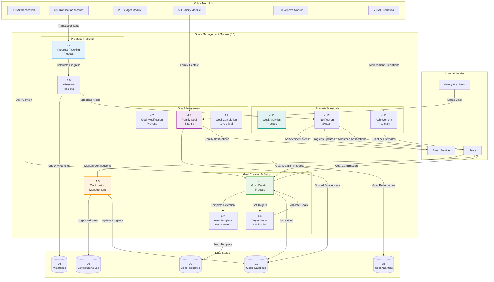

# DFD - Goals Management Module (4.0): BudgetMe Financial Management System

## Overview
This Data Flow Diagram details the Goals Management Module (Process 4.0) located at `src/components/goals/`. This module handles financial goal creation, tracking, progress monitoring, and achievement management for both individual and family financial objectives.

## Goals Management Module Data Flow Diagram

## Key Processes

### 4.1 Goal Creation Process
- **Purpose**: Create and configure new financial goals
- **Inputs**: Goal parameters, target amounts, timelines
- **Processing**: Validate SMART goal criteria, set up tracking, initialize progress
- **Outputs**: New goal records, progress tracking setup, user confirmations

### 4.2 Goal Template Management
- **Purpose**: Provide pre-configured goal templates
- **Inputs**: Template selection, customization parameters
- **Processing**: Load templates, customize for user profile, apply defaults
- **Outputs**: Customized goal configurations, template usage analytics

### 4.3 Target Setting & Validation
- **Purpose**: Set and validate realistic goal targets
- **Inputs**: Target amounts, timelines, user financial capacity
- **Processing**: Validate achievability, suggest adjustments, set milestones
- **Outputs**: Validated targets, milestone schedules, feasibility assessments

### 4.4 Progress Tracking Process
- **Purpose**: Track goal progress through automated and manual inputs
- **Inputs**: Transaction data, manual contributions, progress updates
- **Processing**: Calculate progress percentages, update timelines, assess trends
- **Outputs**: Progress reports, updated goal status, trend analysis

### 4.5 Contribution Management
- **Purpose**: Handle manual goal contributions and deposits
- **Inputs**: Contribution amounts, allocation preferences, payment methods
- **Processing**: Process contributions, update goal balances, log transactions
- **Outputs**: Updated goal progress, contribution confirmations, transaction records

### 4.6 Milestone Tracking
- **Purpose**: Track and celebrate goal milestones
- **Inputs**: Milestone definitions, progress data, achievement triggers
- **Processing**: Monitor milestone achievement, generate celebrations, update status
- **Outputs**: Milestone notifications, achievement records, progress celebrations

### 4.7 Goal Modification Process
- **Purpose**: Handle goal updates and modifications
- **Inputs**: Modification requests, updated parameters, approval workflows
- **Processing**: Validate changes, update tracking, recalculate timelines
- **Outputs**: Updated goal configurations, revised timelines, change confirmations

### 4.8 Family Goal Sharing
- **Purpose**: Enable family collaboration on shared goals
- **Inputs**: Sharing requests, family permissions, collaboration rules
- **Processing**: Set up shared access, coordinate contributions, manage permissions
- **Outputs**: Shared goal access, family notifications, collaboration tools

### 4.9 Goal Completion & Archival
- **Purpose**: Handle goal completion and archival
- **Inputs**: Completion triggers, achievement confirmations, archival parameters
- **Processing**: Mark goals complete, celebrate achievements, archive data
- **Outputs**: Completion certificates, achievement records, archived goals

### 4.10 Goal Analytics Process
- **Purpose**: Analyze goal performance and patterns
- **Inputs**: Goal performance data, user behavior, achievement patterns
- **Processing**: Generate insights, identify trends, provide recommendations
- **Outputs**: Performance analytics, improvement suggestions, success patterns

### 4.11 Achievement Prediction
- **Purpose**: Predict goal achievement timelines
- **Inputs**: Current progress, contribution patterns, historical data
- **Processing**: Apply AI models, calculate probabilities, generate forecasts
- **Outputs**: Achievement predictions, timeline estimates, success probabilities

### 4.12 Notification System
- **Purpose**: Manage goal-related notifications and alerts
- **Inputs**: Achievement triggers, milestone events, progress updates
- **Processing**: Generate notifications, schedule alerts, customize messaging
- **Outputs**: Email notifications, in-app alerts, progress updates

## Data Store Specifications

### D1 - Goals Database
- Goal records with targets, timelines, and progress
- User and family goal associations
- Goal status and achievement tracking
- Progress history and trend data

### D2 - Goal Templates
- Pre-configured goal templates
- Template customization parameters
- Usage statistics and effectiveness metrics
- Template categories and recommendations

### D3 - Contributions Log
- Manual and automatic contribution records
- Contribution sources and methods
- Allocation tracking and optimization
- Contribution pattern analysis

### D4 - Milestones
- Milestone definitions and progress
- Achievement triggers and celebrations
- Milestone-based rewards and incentives
- Progress visualization data

### D5 - Goal Analytics
- Goal performance metrics
- Achievement pattern analysis
- Success rate statistics
- Predictive modeling data

## Integration Points

- **Transaction Module**: Automatic progress tracking from spending/saving transactions
- **Budget Module**: Goal-aligned budget allocation and tracking
- **Family Module**: Shared family goal coordination and collaboration
- **AI Prediction**: Goal achievement forecasting and optimization recommendations
- **Reports Module**: Goal performance reporting and analytics
- **Authentication**: User-based goal access and family permission management

## Business Rules

- Goals must follow SMART criteria (Specific, Measurable, Achievable, Relevant, Time-bound)
- Maximum 20 active goals per user
- Family goals require approval from primary account holder
- Goal modifications above 50% of target require confirmation
- Achievement celebrations triggered at 25%, 50%, 75%, and 100% milestones
- Inactive goals (no progress for 90 days) automatically archived