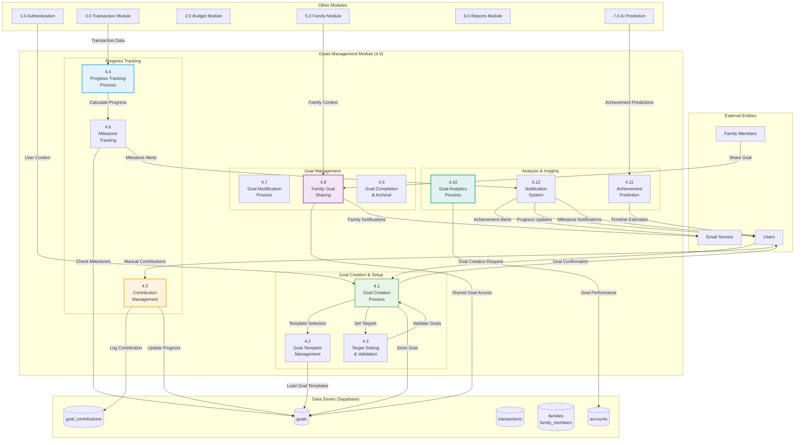

# DFD - Goals Management Module (4.0): BudgetMe Financial Management System

## Overview

The Goals Management Module (Process 4.0) enables users to define, track, and achieve their financial objectives through a structured goal-setting framework, implemented in `src/components/goals/`. This module supports both individual savings goals and collaborative family goals with comprehensive contribution tracking and progress visualization.

### Core Responsibilities

- **Goal Definition**: Create financial goals with target amounts, deadlines, priority levels, and linked savings accounts
- **Contribution Tracking**: Record and monitor contributions from transactions, manual entries, and automatic transfers
- **Progress Visualization**: Real-time progress bars, milestone tracking, and achievement celebrations
- **Family Goals**: Shared goal creation and contribution management within family groups with role-based permissions
- **Smart Predictions**: Integration with AI Prediction module for goal achievement forecasting and recommendations
- **Milestone System**: Define and track intermediate milestones with notifications upon completion

### Key Database Tables

| Table | Purpose |
|-------|---------|
| `goals` | Goal definitions with targets, deadlines, status, and linked account references |
| `goal_contributions` | Individual contributions linked to transactions with contributor tracking |
| `transactions` | Transactions linked to goals via `goal_id` for automatic contribution tracking |
| `families` / `family_members` | Family context for shared goal management with permission control |

## Goals Management Module Data Flow Diagram

## Key Processes

### 4.1 Goal Creation Process
- **Purpose**: Create and configure new financial goals
- **Inputs**: Goal parameters, target amounts, timelines
- **Processing**: Validate SMART goal criteria, set up tracking, initialize progress
- **Outputs**: New goal records, progress tracking setup, user confirmations

### 4.2 Goal Template Management
- **Purpose**: Provide pre-configured goal templates
- **Inputs**: Template selection, customization parameters
- **Processing**: Load templates, customize for user profile, apply defaults
- **Outputs**: Customized goal configurations, template usage analytics

### 4.3 Target Setting & Validation
- **Purpose**: Set and validate realistic goal targets
- **Inputs**: Target amounts, timelines, user financial capacity
- **Processing**: Validate achievability, suggest adjustments, set milestones
- **Outputs**: Validated targets, milestone schedules, feasibility assessments

### 4.4 Progress Tracking Process
- **Purpose**: Track goal progress through automated and manual inputs
- **Inputs**: Transaction data, manual contributions, progress updates
- **Processing**: Calculate progress percentages, update timelines, assess trends
- **Outputs**: Progress reports, updated goal status, trend analysis

### 4.5 Contribution Management
- **Purpose**: Handle manual goal contributions and deposits
- **Inputs**: Contribution amounts, allocation preferences, payment methods
- **Processing**: Process contributions, update goal balances, log transactions
- **Outputs**: Updated goal progress, contribution confirmations, transaction records

### 4.6 Milestone Tracking
- **Purpose**: Track and celebrate goal milestones
- **Inputs**: Milestone definitions, progress data, achievement triggers
- **Processing**: Monitor milestone achievement, generate celebrations, update status
- **Outputs**: Milestone notifications, achievement records, progress celebrations

### 4.7 Goal Modification Process
- **Purpose**: Handle goal updates and modifications
- **Inputs**: Modification requests, updated parameters, approval workflows
- **Processing**: Validate changes, update tracking, recalculate timelines
- **Outputs**: Updated goal configurations, revised timelines, change confirmations

### 4.8 Family Goal Sharing
- **Purpose**: Enable family collaboration on shared goals
- **Inputs**: Sharing requests, family permissions, collaboration rules
- **Processing**: Set up shared access, coordinate contributions, manage permissions
- **Outputs**: Shared goal access, family notifications, collaboration tools

### 4.9 Goal Completion & Archival
- **Purpose**: Handle goal completion and archival
- **Inputs**: Completion triggers, achievement confirmations, archival parameters
- **Processing**: Mark goals complete, celebrate achievements, archive data
- **Outputs**: Completion certificates, achievement records, archived goals

### 4.10 Goal Analytics Process
- **Purpose**: Analyze goal performance and patterns
- **Inputs**: Goal performance data, user behavior, achievement patterns
- **Processing**: Generate insights, identify trends, provide recommendations
- **Outputs**: Performance analytics, improvement suggestions, success patterns

### 4.11 Achievement Prediction
- **Purpose**: Predict goal achievement timelines
- **Inputs**: Current progress, contribution patterns, historical data
- **Processing**: Apply AI models, calculate probabilities, generate forecasts
- **Outputs**: Achievement predictions, timeline estimates, success probabilities

### 4.12 Notification System
- **Purpose**: Manage goal-related notifications and alerts
- **Inputs**: Achievement triggers, milestone events, progress updates
- **Processing**: Generate notifications, schedule alerts, customize messaging
- **Outputs**: Email notifications, in-app alerts, progress updates

## Data Store Specifications (Actual Supabase Tables)

### D1 - goals
| Column | Type | Nullable | Default | Description |
|--------|------|----------|---------|-------------|
| `id` | uuid | NO | uuid_generate_v4() | Primary key |
| `user_id` | uuid | NO | - | FK to auth.users |
| `goal_name` | text | NO | - | Name of the goal |
| `description` | text | YES | - | Goal description |
| `target_amount` | numeric | NO | - | Target amount to save |
| `current_amount` | numeric | NO | 0 | Current saved amount |
| `currency` | text | NO | 'PHP' | Currency code |
| `target_date` | date | YES | - | Target completion date |
| `created_date` | date | NO | CURRENT_DATE | Date goal was created |
| `completed_date` | date | YES | - | Date goal was completed |
| `priority` | text | NO | 'medium' | Priority level (low/medium/high) |
| `category` | text | YES | 'general' | Goal category |
| `status` | text | NO | 'in_progress' | Status (in_progress/completed/archived) |
| `family_id` | uuid | YES | - | FK to families (for shared goals) |
| `is_family_goal` | boolean | YES | false | Whether this is a family goal |
| `is_public` | boolean | YES | false | Public visibility flag |
| `auto_contribute` | boolean | YES | false | Enable auto contributions |
| `auto_contribute_amount` | numeric | YES | 0 | Auto contribution amount |
| `auto_contribute_frequency` | text | YES | 'monthly' | Auto contribution frequency |
| `notes` | text | YES | - | Additional notes |
| `image_url` | text | YES | - | Goal image URL |
| `milestones` | jsonb | YES | '[]' | Milestone tracking data |
| `created_at` | timestamptz | NO | now() | Timestamp created |
| `updated_at` | timestamptz | NO | now() | Timestamp updated |

### D2 - goal_contributions
| Column | Type | Nullable | Default | Description |
|--------|------|----------|---------|-------------|
| `id` | uuid | NO | uuid_generate_v4() | Primary key |
| `goal_id` | uuid | NO | - | FK to goals |
| `user_id` | uuid | NO | - | FK to auth.users (contributor) |
| `transaction_id` | uuid | YES | - | FK to transactions (optional) |
| `amount` | numeric | NO | - | Contribution amount |
| `contribution_date` | date | NO | CURRENT_DATE | Date of contribution |
| `source_account_id` | uuid | YES | - | FK to accounts (source) |
| `contribution_type` | text | YES | 'manual' | Type (manual/automatic/transfer) |
| `notes` | text | YES | - | Contribution notes |
| `created_at` | timestamptz | NO | now() | Timestamp created |

### D3 - transactions
| Column | Type | Nullable | Default | Description |
|--------|------|----------|---------|-------------|
| `id` | uuid | NO | uuid_generate_v4() | Primary key |
| `user_id` | uuid | NO | - | FK to auth.users |
| `date` | date | NO | CURRENT_DATE | Transaction date |
| `amount` | numeric | NO | - | Transaction amount |
| `description` | text | YES | - | Transaction description |
| `notes` | text | YES | - | Additional notes |
| `type` | text | NO | - | Transaction type (income/expense/contribution) |
| `category` | text | YES | - | Category text |
| `account_id` | uuid | YES | - | FK to accounts |
| `income_category_id` | uuid | YES | - | FK to income_categories |
| `expense_category_id` | uuid | YES | - | FK to expense_categories |
| `goal_id` | uuid | YES | - | FK to goals (for contributions) |
| `transfer_account_id` | uuid | YES | - | FK to accounts (transfer target) |
| `linked_transaction_id` | uuid | YES | - | FK to transactions (linked pair) |
| `tags` | text[] | YES | - | Transaction tags array |
| `receipt_url` | text | YES | - | Receipt image URL |
| `is_recurring` | boolean | YES | false | Recurring transaction flag |
| `recurring_pattern` | jsonb | YES | - | Recurring pattern config |
| `status` | text | YES | 'completed' | Transaction status |
| `is_verified` | boolean | YES | false | Verification status |
| `created_at` | timestamptz | NO | now() | Timestamp created |
| `updated_at` | timestamptz | NO | now() | Timestamp updated |

### D4 - families
| Column | Type | Nullable | Default | Description |
|--------|------|----------|---------|-------------|
| `id` | uuid | NO | uuid_generate_v4() | Primary key |
| `family_name` | varchar | NO | - | Family group name |
| `description` | text | YES | - | Family description |
| `currency_pref` | varchar | NO | 'PHP' | Currency preference |
| `is_public` | boolean | YES | false | Public visibility |
| `max_members` | integer | YES | 10 | Maximum member count |
| `allow_goal_sharing` | boolean | YES | true | Enable goal sharing |
| `allow_budget_sharing` | boolean | YES | true | Enable budget sharing |
| `created_by` | uuid | NO | - | FK to auth.users (creator) |
| `status` | text | NO | 'active' | Status (active/inactive) |
| `created_at` | timestamptz | YES | now() | Timestamp created |
| `updated_at` | timestamptz | YES | now() | Timestamp updated |

### D5 - family_members
| Column | Type | Nullable | Default | Description |
|--------|------|----------|---------|-------------|
| `id` | uuid | NO | uuid_generate_v4() | Primary key |
| `family_id` | uuid | NO | - | FK to families |
| `user_id` | uuid | NO | - | FK to auth.users |
| `role` | varchar | NO | - | Role (admin/member/viewer) |
| `status` | varchar | NO | - | Status (active/pending/inactive/removed) |
| `can_create_goals` | boolean | YES | false | Permission: create goals |
| `can_view_budgets` | boolean | YES | true | Permission: view budgets |
| `can_contribute_goals` | boolean | YES | true | Permission: contribute to goals |
| `invited_by` | uuid | YES | - | FK to auth.users (inviter) |
| `invited_at` | timestamptz | YES | - | Invitation timestamp |
| `joined_at` | timestamptz | YES | - | Join timestamp |
| `created_at` | timestamptz | YES | now() | Timestamp created |
| `updated_at` | timestamptz | YES | now() | Timestamp updated |

### D6 - accounts
| Column | Type | Nullable | Default | Description |
|--------|------|----------|---------|-------------|
| `id` | uuid | NO | uuid_generate_v4() | Primary key |
| `user_id` | uuid | NO | - | FK to auth.users |
| `account_name` | text | NO | - | Account name |
| `account_type` | text | NO | - | Account type (checking/savings/credit/cash) |
| `balance` | numeric | NO | 0.00 | Current balance |
| `initial_balance` | numeric | NO | 0.00 | Starting balance |
| `currency` | text | NO | 'PHP' | Currency code |
| `status` | text | NO | 'active' | Account status |
| `is_default` | boolean | YES | false | Default account flag |
| `color` | varchar | YES | - | Display color |
| `description` | text | YES | - | Account description |
| `institution_name` | text | YES | - | Bank/institution name |
| `account_number_masked` | text | YES | - | Masked account number |
| `created_at` | timestamptz | NO | now() | Timestamp created |
| `updated_at` | timestamptz | NO | now() | Timestamp updated |

## Integration Points

- **Transaction Module**: Automatic progress tracking from spending/saving transactions
- **Budget Module**: Goal-aligned budget allocation and tracking
- **Family Module**: Shared family goal coordination and collaboration
- **AI Prediction**: Goal achievement forecasting and optimization recommendations
- **Reports Module**: Goal performance reporting and analytics
- **Authentication**: User-based goal access and family permission management

## Business Rules

- Goals must follow SMART criteria (Specific, Measurable, Achievable, Relevant, Time-bound)
- Maximum 20 active goals per user
- Family goals require approval from primary account holder
- Goal modifications above 50% of target require confirmation
- Achievement celebrations triggered at 25%, 50%, 75%, and 100% milestones
- Inactive goals (no progress for 90 days) automatically archived