# DFD Level 0 - Context Diagram: BudgetMe Financial Management System

## Overview

This Level 0 Data Flow Diagram (Context Diagram) presents the BudgetMe Financial Management System as a unified process boundary, illustrating its comprehensive interactions with all external entities in the system ecosystem. The context diagram serves as the foundational architectural view, establishing clear boundaries between internal system functionality and external actors, services, and data sources.

### Purpose of This Diagram

The Context Diagram provides stakeholders with:
- **System Scope Definition**: Clear delineation of what functionality resides within BudgetMe versus external dependencies
- **Integration Map**: Visualization of all external entity touchpoints requiring interface design and maintenance
- **Data Flow Overview**: High-level understanding of information exchange patterns between the system and its environment
- **Security Boundary**: Identification of trust boundaries for security architecture decisions

### System Positioning

BudgetMe operates as a **centralized personal and family finance management platform**, receiving financial data from users and external sources, processing it through intelligent algorithms, and delivering actionable insights back to stakeholders. The system maintains a clear separation between:

## Database Overview (Supabase)

The BudgetMe system uses Supabase (PostgreSQL) with **40+ tables** organized across modules:

| Module | Primary Tables | Key Columns |
|--------|---------------|-------------|
| **Authentication** | `profiles`, `user_sessions`, `verification_tokens` | id, user_id, email, role, is_active, session_token, token_type |
| **Budget** | `budgets` | id, user_id, budget_name, amount, spent, period, start_date, end_date, category_id, alert_threshold |
| **Transaction** | `transactions`, `accounts`, `income_categories`, `expense_categories` | id, user_id, date, amount, type, account_id, goal_id, category_id |
| **Goals** | `goals`, `goal_contributions` | id, user_id, goal_name, target_amount, current_amount, family_id, is_family_goal, milestones |
| **Family** | `families`, `family_members`, `family_invitations`, `family_join_requests` | id, family_id, user_id, role, status, can_create_goals, can_contribute_goals, invitation_token |
| **Reports** | `ai_reports`, `dashboard_layouts`, `dashboard_insights`, `widget_data_cache` | id, user_id, report_type, timeframe, insights, widget_config, cached_data |
| **AI Prediction** | `prediction_requests`, `prophet_predictions`, `ai_insights`, `prediction_usage_limits` | id, user_id, predictions, confidence_score, expires_at, tier, daily_limit |
| **Chatbot** | `chat_sessions`, `chat_messages`, `user_chat_preferences` | id, session_id, user_id, message_text, message_type, response_style, context_data |
| **Admin** | `admin_settings`, `admin_notifications`, `admin_anomalies`, `admin_actions`, `backup_logs`, `feature_flags`, `system_activity_log` | id, admin_id, action_type, severity, setting_key, feature_key, is_enabled |

### Database Statistics
- **Total Tables**: 40+ across all modules
- **Active Users**: 60+ registered profiles
- **AI Reports**: 27+ cached reports with 7-day expiration
- **Prediction Cache**: 30-minute insight cache, 24-hour prediction cache

## Context Diagram

```mermaid
graph TB
    subgraph "External Entities"
        A[Individual Users]
        B[Family Members]
        C[System Administrators]
        D[Bank/Financial Institutions]
        E[Email Service Provider]
        F[AI Service Providers<br/>OpenRouter API]
        G[Mobile Devices]
        H[Web Browsers]
        I[Prophet Prediction API]
    end
    
    subgraph "BudgetMe Financial Management System"
        SYSTEM[BudgetMe System<br/>Process 0]
    end
    
    %% Data Flows from External Entities to System
    A -->|User Registration/Login| SYSTEM
    A -->|Transaction Data| SYSTEM
    A -->|Budget Information| SYSTEM
    A -->|Financial Goals| SYSTEM
    A -->|Settings & Preferences| SYSTEM
    A -->|Chat Messages| SYSTEM
    
    B -->|Family Join Requests| SYSTEM
    B -->|Shared Transaction Data| SYSTEM
    B -->|Family Budget Contributions| SYSTEM
    B -->|Shared Goals Data| SYSTEM
    
    C -->|Administrative Commands| SYSTEM
    C -->|System Configuration| SYSTEM
    C -->|User Management Requests| SYSTEM
    
    D -->|Bank Transaction Data| SYSTEM
    D -->|Account Balance Information| SYSTEM
    
    F -->|AI Model Responses| SYSTEM
    F -->|Prediction Model Data| SYSTEM
    
    G -->|Mobile App Requests| SYSTEM
    H -->|Web Application Requests| SYSTEM
    
    %% Data Flows from System to External Entities
    SYSTEM -->|Financial Reports| A
    SYSTEM -->|Budget Alerts| A
    SYSTEM -->|Goal Progress Updates| A
    SYSTEM -->|AI Predictions| A
    SYSTEM -->|Spending Insights| A
    SYSTEM -->|Chatbot Responses| A
    SYSTEM -->|Account Notifications| A
    
    SYSTEM -->|Family Dashboard Data| B
    SYSTEM -->|Shared Reports| B
    SYSTEM -->|Family Notifications| B
    SYSTEM -->|Invitation Links| B
    
    SYSTEM -->|System Status Reports| C
    SYSTEM -->|User Analytics| C
    SYSTEM -->|Administrative Dashboards| C
    SYSTEM -->|System Health Data| C
    
    SYSTEM -->|API Requests| D
    SYSTEM -->|Transaction Verification| D
    
    SYSTEM -->|Email Notifications| E
    SYSTEM -->|Verification Emails| E
    SYSTEM -->|Password Reset Emails| E
    SYSTEM -->|Report Emails| E
    
    SYSTEM -->|AI Analysis Requests| F
    SYSTEM -->|Prediction Requests| F
    SYSTEM -->|Chat Context Data| F
    
    SYSTEM -->|Mobile App Responses| G
    SYSTEM -->|Push Notifications| G
    
    SYSTEM -->|Web Application Responses| H
    SYSTEM -->|Real-time Updates| H
    
    style SYSTEM fill:#e1f5fe,stroke:#01579b,stroke-width:3px
    style A fill:#f3e5f5,stroke:#4a148c,stroke-width:2px
    style B fill:#f3e5f5,stroke:#4a148c,stroke-width:2px
    style C fill:#fff3e0,stroke:#e65100,stroke-width:2px
    style D fill:#e8f5e8,stroke:#1b5e20,stroke-width:2px
    style E fill:#fff9c4,stroke:#f57f17,stroke-width:2px
    style F fill:#fce4ec,stroke:#880e4f,stroke-width:2px
    style G fill:#e0f2f1,stroke:#00695c,stroke-width:2px
    style H fill:#e0f2f1,stroke:#00695c,stroke-width:2px
```

## External Entities Description

### 1. Individual Users
**Description**: Primary users of the BudgetMe system who manage their personal finances.

**Data Flows To System**:
- User registration and authentication credentials
- Personal transaction data (income, expenses, transfers)
- Budget creation and modification requests
- Financial goal definitions and updates
- Personal settings and preferences
- Chat messages to BudgetSense AI assistant
- Report generation requests

**Data Flows From System**:
- Personalized financial reports and analytics
- Budget alerts and overspending notifications
- Goal progress tracking and achievement notifications
- AI-powered financial predictions and insights
- Spending pattern analysis and recommendations
- Chatbot responses and financial guidance
- Account security and system notifications

### 2. Family Members
**Description**: Users who participate in shared family financial management.

**Data Flows To System**:
- Family group join requests and invitations
- Shared transaction data and family expenses
- Contributions to family budgets and shared goals
- Family-specific settings and permissions
- Inter-family communication and coordination data

**Data Flows From System**:
- Family financial dashboard with shared insights
- Collaborative budget reports and spending summaries
- Shared goal progress and achievement notifications
- Family member activity notifications
- Invitation links and family management tools

### 3. System Administrators
**Description**: Technical and business administrators who manage the BudgetMe system.

**Data Flows To System**:
- Administrative commands and system configuration
- User management requests (activation, suspension, deletion)
- System monitoring and maintenance instructions
- Security policy updates and access control changes
- Feature configuration and system optimization settings

**Data Flows From System**:
- Comprehensive system status and health reports
- User behavior analytics and system usage statistics
- Administrative dashboards with key metrics
- System performance data and error logs
- Security audit trails and compliance reports

### 4. Bank/Financial Institutions
**Description**: External financial service providers that may integrate with BudgetMe.

**Data Flows To System**:
- Bank transaction data through secure APIs
- Account balance information and updates
- Transaction categorization data from bank systems
- Account verification and validation responses

**Data Flows From System**:
- API requests for transaction data retrieval
- Transaction verification and reconciliation requests
- Account linking and authentication requests
- Data synchronization and update requests

### 5. Email Service Provider
**Description**: External email services used for system notifications and communications.

**Data Flows To System**:
- Email delivery status and bounce notifications
- Unsubscribe requests and email preferences
- Email service availability and quota information

**Data Flows From System**:
- User verification and welcome emails
- Password reset and security notification emails
- Financial reports and scheduled summaries
- Budget alerts and goal achievement notifications
- System maintenance and update announcements

### 6. AI Service Providers
**Description**: External AI/ML services that power prediction and chatbot capabilities.

**Data Flows To System**:
- AI model responses and generated insights
- Prediction model outputs and confidence scores
- Natural language processing results
- Machine learning model performance metrics

**Data Flows From System**:
- Financial data for AI analysis and prediction generation
- User transaction patterns for trend analysis
- Chat context and conversation history
- Model training requests and parameter updates

### 7. Mobile Devices
**Description**: Mobile platforms (iOS/Android) accessing BudgetMe through mobile browsers.

**Data Flows To System**:
- Mobile-optimized application requests
- Touch and gesture input data
- Device-specific preferences and settings
- Location data for transaction context (if enabled)

**Data Flows From System**:
- Mobile-responsive application interfaces
- Push notifications for important alerts
- Offline data synchronization
- Mobile-optimized reports and visualizations

### 8. Web Browsers
**Description**: Desktop and laptop browsers accessing the BudgetMe web application.

**Data Flows To System**:
- Web application requests and user interactions
- Browser-specific preferences and settings
- Session management and authentication tokens
- File uploads for transaction imports

**Data Flows From System**:
- Web application responses and interface updates
- Real-time data updates via WebSocket connections
- Downloadable reports and data exports
- Interactive charts and visualizations

## System Boundary
The BudgetMe Financial Management System boundary encompasses:

**Included Components**:
- User authentication and authorization
- Transaction management and categorization
- Budget creation and monitoring
- Financial goal tracking and management
- Family finance coordination
- AI-powered predictions and insights
- Intelligent chatbot assistant (BudgetSense)
- Comprehensive reporting and analytics
- Administrative management and monitoring

**Excluded Components**:
- External banking systems and APIs
- Third-party email delivery services
- AI/ML model training infrastructure
- Mobile device operating systems
- Web browser implementations
- External payment processing systems

## Data Flow Summary

### Primary Input Flows
1. **Financial Data**: Transaction records, budget information, and goal definitions
2. **User Interactions**: System usage, preferences, and configuration changes
3. **External Data**: Bank feeds, AI responses, and service notifications
4. **Administrative Data**: System configuration and management commands

### Primary Output Flows
1. **Financial Intelligence**: Reports, predictions, insights, and recommendations
2. **Notifications**: Alerts, reminders, and system communications
3. **User Interfaces**: Application responses and interactive elements
4. **Administrative Information**: System status, analytics, and audit data

## Security Considerations
- All data flows are secured with encryption in transit (HTTPS/TLS)
- User authentication required for all personal financial data access
- Role-based access control for administrative functions
- Data privacy compliance for all external service integrations
- Audit logging for all critical system interactions

## Compliance and Privacy
- Personal financial data handled according to privacy regulations
- Data minimization principles applied to external service interactions
- User consent required for data sharing with external entities
- Right to data portability and deletion supported
- Regular security audits and compliance assessments conducted