# DFD Level 1 - System Overview: BudgetMe Financial Management System

## Overview

This Level 1 Data Flow Diagram decomposes the BudgetMe Financial Management System into its **10 major functional modules**, illustrating the complex data flow relationships between modules, external entities, and persistent data stores. This architectural view serves as the primary reference for understanding system integration patterns and module responsibilities.

### System Architecture Summary

The BudgetMe system follows a **modular monolith architecture** with clear separation of concerns:

| Layer | Modules | Responsibility |
|-------|---------|----------------|
| **Core Application** | Authentication (1.0), Budget (2.0), Transaction (3.0), Goals (4.0), Family (5.0), Reports (6.0) | Primary user-facing financial management features |
| **AI/ML Services** | AI Prediction (7.0), Chatbot (8.0), AI Insights (10.0) | Intelligent analysis, forecasting, and conversational assistance |
| **System Management** | Admin (9.0) | Administrative operations, monitoring, and configuration |

### Inter-Module Communication Patterns

- **Synchronous**: Direct function calls for real-time data (e.g., Budget ↔ Transaction spending updates)
- **Event-Driven**: Supabase realtime subscriptions for live updates (e.g., Family member notifications)
- **Batch Processing**: Scheduled jobs for predictions, reports, and data aggregation
- **Context Sharing**: Authentication context propagated to all modules via React Context API

## Level 1 System Diagram

```mermaid
graph TB
    subgraph "External Entities"
        USER[Users]
        FAMILY[Family Members]
        ADMIN[Administrators]
        BANK[Banks/Financial Institutions]
        EMAIL[Email Service]
        AI_EXT[AI Service Providers]
        MOBILE[Mobile Devices]
        WEB[Web Browsers]
    end
    
    subgraph "BudgetMe Financial Management System"
        subgraph "Core Application Modules"
            AUTH[1.0<br/>Authentication<br/>Module]
            BUDGET[2.0<br/>Budget Management<br/>Module]
            TRANS[3.0<br/>Transaction<br/>Module]
            GOALS[4.0<br/>Goal Management<br/>Module]
            FAM[5.0<br/>Family Management<br/>Module]
            REPORTS[6.0<br/>Reporting & Analysis<br/>Module]
        end
        
        subgraph "AI/ML Services"
            PREDICT[7.0<br/>AI Prediction<br/>Module]
            CHATBOT[8.0<br/>Chatbot BudgetSense<br/>Module]
        end
        
        subgraph "System Management"
            ADMIN_MOD[9.0<br/>Admin Management<br/>Module]
        end
        
        subgraph "AI Intelligence"
            AI_INSIGHTS[10.0<br/>AI Insights<br/>Module]
        end
        
        subgraph "Data Stores (Supabase)"
            D1[(auth.users<br/>profiles<br/>user_roles)]
            D2[(transactions<br/>accounts<br/>categories)]
            D3[(budgets<br/>budget_alerts)]
            D4[(goals<br/>goal_contributions)]
            D5[(families<br/>family_members<br/>invitations)]
            D6[(prophet_predictions<br/>ai_insights<br/>ai_reports)]
            D7[(admin_settings<br/>feature_flags<br/>backup_logs)]
            D8[(chat_sessions<br/>chat_messages)]
        end
    end
    
    %% External Entity Connections
    USER -->|Login Credentials| AUTH
    USER -->|Transaction Data| TRANS
    USER -->|Budget Requests| BUDGET
    USER -->|Goal Data| GOALS
    USER -->|Chat Messages| CHATBOT
    
    FAMILY -->|Family Requests| FAM
    ADMIN -->|Admin Commands| ADMIN_MOD
    BANK -->|Bank Data| TRANS
    AI_EXT -->|AI Responses| PREDICT
    AI_EXT -->|Chat Responses| CHATBOT
    
    MOBILE -->|Mobile Requests| AUTH
    WEB -->|Web Requests| AUTH
    
    %% Return flows to users
    AUTH -->|Auth Status| USER
    BUDGET -->|Budget Reports| USER
    TRANS -->|Transaction Lists| USER
    GOALS -->|Goal Progress| USER
    REPORTS -->|Financial Reports| USER
    PREDICT -->|Predictions| USER
    CHATBOT -->|Chat Responses| USER
    
    FAM -->|Family Data| FAMILY
    ADMIN_MOD -->|Admin Reports| ADMIN
    
    EMAIL <-->|Notifications| AUTH
    EMAIL <-->|Reports| REPORTS
    
    %% Inter-module Data Flows
    AUTH -->|User Session| TRANS
    AUTH -->|User Session| BUDGET
    AUTH -->|User Session| GOALS
    AUTH -->|User Session| FAM
    AUTH -->|User Session| REPORTS
    AUTH -->|User Session| PREDICT
    AUTH -->|User Session| CHATBOT
    AUTH -->|User Session| ADMIN_MOD
    
    TRANS -->|Transaction Data| BUDGET
    TRANS -->|Transaction Data| REPORTS
    TRANS -->|Transaction Data| PREDICT
    TRANS -->|Spending Context| CHATBOT
    
    BUDGET -->|Budget Status| REPORTS
    BUDGET -->|Budget Alerts| AUTH
    BUDGET -->|Budget Data| PREDICT
    
    GOALS -->|Goal Progress| REPORTS
    GOALS -->|Goal Data| PREDICT
    GOALS -->|Achievement Alerts| AUTH
    
    FAM -->|Family Transactions| TRANS
    FAM -->|Family Budgets| BUDGET
    FAM -->|Family Goals| GOALS
    FAM -->|Family Reports| REPORTS
    
    REPORTS -->|Analytics| PREDICT
    PREDICT -->|Insights| REPORTS
    PREDICT -->|Forecasts| CHATBOT
    
    %% AI Insights Module Connections
    TRANS -->|Transaction History| AI_INSIGHTS
    BUDGET -->|Budget Performance| AI_INSIGHTS
    GOALS -->|Goal Progress| AI_INSIGHTS
    PREDICT -->|Predictions| AI_INSIGHTS
    AI_INSIGHTS -->|Insights| REPORTS
    AI_INSIGHTS -->|Recommendations| USER
    AI_EXT -->|AI Analysis| AI_INSIGHTS
    AUTH -->|User Session| AI_INSIGHTS
    
    %% Database Connections
    AUTH <-->|User Data| D1
    TRANS <-->|Transaction Records| D2
    BUDGET <-->|Budget Data| D3
    GOALS <-->|Goal Records| D4
    FAM <-->|Family Data| D5
    PREDICT <-->|Prediction Data| D6
    ADMIN_MOD <-->|Config Data| D7
    CHATBOT <-->|Chat Data| D8
    AI_INSIGHTS <-->|Insight Data| D6
    
    REPORTS -->|Read All Data| D1
    REPORTS -->|Read All Data| D2
    REPORTS -->|Read All Data| D3
    REPORTS -->|Read All Data| D4
    REPORTS -->|Read All Data| D5
    
    style AUTH fill:#e8eaf6,stroke:#3f51b5,stroke-width:2px
    style BUDGET fill:#e0f2f1,stroke:#009688,stroke-width:2px
    style TRANS fill:#fff3e0,stroke:#ff9800,stroke-width:2px
    style GOALS fill:#f3e5f5,stroke:#9c27b0,stroke-width:2px
    style FAM fill:#e1f5fe,stroke:#03a9f4,stroke-width:2px
    style REPORTS fill:#f1f8e9,stroke:#8bc34a,stroke-width:2px
    style PREDICT fill:#fce4ec,stroke:#e91e63,stroke-width:2px
    style CHATBOT fill:#fff8e1,stroke:#ffc107,stroke-width:2px
    style ADMIN_MOD fill:#efebe9,stroke:#795548,stroke-width:2px
    style AI_INSIGHTS fill:#e8f5e9,stroke:#43a047,stroke-width:2px
```

## Module Descriptions

### 1.0 Authentication Module
**Purpose**: Manages user authentication, authorization, and session handling.

**Key Functions**:
- User registration and login
- Email verification and password reset
- Session management and token refresh
- Role-based access control
- Security audit logging

**Input Data Flows**:
- Login credentials from users
- Registration information
- Password reset requests
- Session validation requests

**Output Data Flows**:
- Authentication status to all modules
- User session data
- Security notifications
- Email verification triggers

### 2.0 Budget Management Module
**Purpose**: Handles budget creation, monitoring, and management functionality.

**Key Functions**:
- Budget creation and editing
- Category-based budget allocation
- Spending tracking and alerts
- Budget performance analysis
- Budget sharing for families

**Input Data Flows**:
- Budget creation/modification requests
- Transaction data for spending tracking
- User preferences and settings
- Family budget sharing requests

**Output Data Flows**:
- Budget reports and summaries
- Overspending alerts
- Budget performance data
- Spending recommendations

### 3.0 Transaction Module
**Purpose**: Manages all financial transaction processing and categorization.

**Key Functions**:
- Transaction entry and editing
- Automated categorization
- Transaction validation
- Bulk operations and imports
- Transaction search and filtering

**Input Data Flows**:
- Manual transaction entries
- Bank transaction feeds
- Transaction modifications
- Categorization rules
- Import files

**Output Data Flows**:
- Transaction lists and details
- Categorized spending data
- Transaction summaries
- Spending patterns

### 4.0 Goal Management Module
**Purpose**: Handles financial goal creation, tracking, and progress monitoring.

**Key Functions**:
- Goal creation and configuration
- Progress tracking and updates
- Achievement notifications
- Goal sharing within families
- Contribution management

**Input Data Flows**:
- Goal creation/modification requests
- Contribution records
- Goal progress updates
- Target adjustments

**Output Data Flows**:
- Goal progress reports
- Achievement notifications
- Goal recommendations
- Milestone alerts

### 5.0 Family Management Module
**Purpose**: Manages family financial collaboration and shared resources.

**Key Functions**:
- Family group creation and management
- Member invitation and role assignment
- Shared budget and goal coordination
- Permission management
- Family financial dashboard

**Input Data Flows**:
- Family creation requests
- Member invitation data
- Permission changes
- Shared resource updates

**Output Data Flows**:
- Family dashboard data
- Member activity notifications
- Shared financial summaries
- Collaboration tools

### 6.0 Reporting and Analysis Module
**Purpose**: Generates comprehensive financial reports and analytics.

**Key Functions**:
- Interactive dashboard creation
- Trend analysis and visualization
- Comparative reporting
- Export functionality
- Custom report generation

**Input Data Flows**:
- Transaction data from all sources
- Budget performance metrics
- Goal progress information
- User preferences for reporting

**Output Data Flows**:
- Financial reports and dashboards
- Trend analysis results
- Comparative studies
- Export files (PDF, CSV, Excel)

### 7.0 AI Prediction Module
**Purpose**: Provides AI-powered financial forecasting and insights.

**Key Functions**:
- Prophet-based financial forecasting
- Spending pattern analysis
- Risk assessment and alerts
- Opportunity identification
- Goal achievement predictions

**Input Data Flows**:
- Historical transaction data
- Budget and goal information
- User financial profiles
- External economic indicators

**Output Data Flows**:
- Financial predictions and forecasts
- AI-generated insights
- Risk assessments
- Optimization recommendations

### 8.0 Chatbot (BudgetSense) Module
**Purpose**: Provides intelligent financial assistance and guidance.

**Key Functions**:
- Natural language conversation
- Financial advice and guidance
- Feature explanation and help
- Personalized recommendations
- Educational content delivery

**Input Data Flows**:
- User chat messages
- Financial context data
- User preferences and history
- System feature information

**Output Data Flows**:
- Conversational responses
- Financial advice and tips
- Feature guidance
- Educational content

### 9.0 Admin Management Module
**Purpose**: Provides system administration and monitoring capabilities.

**Key Functions**:
- User management and administration
- System monitoring and health checks
- Configuration management
- Security audit and compliance
- Performance analytics

**Input Data Flows**:
- Administrative commands
- System configuration changes
- User management requests
- Monitoring data

**Output Data Flows**:
- Administrative reports
- System health status
- User analytics
- Security audit logs

### 10.0 AI Insights Module
**Purpose**: Generates AI-powered financial insights, risk assessments, and personalized recommendations based on user transaction data and predictions.

**Key Functions**:
- AI-generated spending insights and analysis
- Risk assessment for financial health
- Personalized recommendations and opportunities
- Anomaly detection in spending patterns
- Integration with Prophet predictions for enhanced insights
- Caching and rate limiting for AI service optimization

**Input Data Flows**:
- Transaction history from Transaction Module
- Budget performance data from Budget Module
- Goal progress from Goals Module
- Prophet predictions from AI Prediction Module
- User financial profile data
- Historical spending patterns

**Output Data Flows**:
- AI-generated financial insights (jsonb)
- Risk assessments and alerts
- Personalized recommendations
- Opportunity identification
- Spending pattern analysis
- Anomaly notifications

**Key Database Tables**:
- `ai_insights` - Generated insights with 30-minute cache
- `ai_reports` - Comprehensive reports with 7-day cache
- `prediction_usage_limits` - Rate limiting per user

**AI Service Integration**:
- Primary: OpenRouter API (`openai/gpt-oss-120b:free`)
- Fallback: Alternative models for high-demand periods
- Rate Limits: 5 AI insights per day (free tier)

## Data Store Descriptions (Actual Supabase Schema)

### D1 - Authentication & User Data

#### profiles
| Column | Type | Nullable | Default | Description |
|--------|------|----------|---------|-------------|
| `id` | uuid | NO | - | Primary key (FK to auth.users) |
| `email` | text | YES | - | User email (unique) |
| `role` | text | YES | 'user' | Role (user/admin/moderator) |
| `full_name` | text | YES | - | User's full name |
| `avatar_url` | text | YES | - | Profile picture URL |
| `date_of_birth` | date | YES | - | Date of birth |
| `phone` | text | YES | - | Phone number |
| `timezone` | text | YES | 'UTC' | User timezone |
| `language` | text | YES | 'en' | Preferred language |
| `is_active` | boolean | YES | true | Account active status |
| `last_login` | timestamptz | YES | - | Last login timestamp |
| `email_verified` | boolean | YES | false | Email verification status |
| `currency_preference` | text | YES | 'USD' | Preferred currency |
| `account_setup_completed` | boolean | YES | false | Setup wizard completed |
| `skip_setup_until` | timestamptz | YES | - | Skip setup until date |

#### user_sessions
| Column | Type | Nullable | Default | Description |
|--------|------|----------|---------|-------------|
| `id` | uuid | NO | uuid_generate_v4() | Primary key |
| `user_id` | uuid | YES | - | FK to auth.users |
| `session_token` | text | YES | - | Unique session token |
| `device_info` | jsonb | YES | '{}' | Device metadata |
| `ip_address` | inet | YES | - | Client IP address |
| `user_agent` | text | YES | - | Browser user agent |
| `login_at` | timestamptz | YES | now() | Login timestamp |
| `logout_at` | timestamptz | YES | - | Logout timestamp |
| `expires_at` | timestamptz | YES | - | Session expiration |
| `is_active` | boolean | YES | true | Active session flag |
| `login_method` | text | YES | 'email' | Method (email/google/github/apple) |
| `is_suspicious` | boolean | YES | false | Suspicious activity flag |
| `failure_count` | integer | YES | 0 | Failed login attempts |

#### verification_tokens
| Column | Type | Nullable | Default | Description |
|--------|------|----------|---------|-------------|
| `id` | uuid | NO | uuid_generate_v4() | Primary key |
| `user_id` | uuid | YES | - | FK to auth.users |
| `token` | text | NO | - | Verification token (unique) |
| `token_type` | text | NO | - | Type (email_verification/password_reset/email_change) |
| `email` | text | NO | - | Target email address |
| `expires_at` | timestamptz | NO | - | Token expiration |
| `used_at` | timestamptz | YES | - | When token was used |
| `created_at` | timestamptz | YES | now() | Created timestamp |

---

### D2 - Transaction & Account Data

#### transactions
| Column | Type | Nullable | Default | Description |
|--------|------|----------|---------|-------------|
| `id` | uuid | NO | uuid_generate_v4() | Primary key |
| `user_id` | uuid | NO | - | FK to auth.users |
| `date` | date | NO | CURRENT_DATE | Transaction date |
| `amount` | numeric | NO | - | Transaction amount |
| `description` | text | YES | - | Transaction description |
| `notes` | text | YES | - | Additional notes |
| `type` | text | NO | - | Type (income/expense/contribution) |
| `category` | text | YES | - | Category text |
| `account_id` | uuid | YES | - | FK to accounts |
| `income_category_id` | uuid | YES | - | FK to income_categories |
| `expense_category_id` | uuid | YES | - | FK to expense_categories |
| `goal_id` | uuid | YES | - | FK to goals (for contributions) |
| `transfer_account_id` | uuid | YES | - | FK to accounts (transfer target) |
| `linked_transaction_id` | uuid | YES | - | FK to transactions (linked pair) |
| `tags` | text[] | YES | - | Transaction tags array |
| `receipt_url` | text | YES | - | Receipt image URL |
| `is_recurring` | boolean | YES | false | Recurring flag |
| `recurring_pattern` | jsonb | YES | - | Recurring config |
| `status` | text | YES | 'completed' | Transaction status |
| `is_verified` | boolean | YES | false | Verification status |

#### accounts
| Column | Type | Nullable | Default | Description |
|--------|------|----------|---------|-------------|
| `id` | uuid | NO | uuid_generate_v4() | Primary key |
| `user_id` | uuid | NO | - | FK to auth.users |
| `account_name` | text | NO | - | Account name |
| `account_type` | text | NO | - | Type (checking/savings/credit/cash) |
| `balance` | numeric | NO | 0.00 | Current balance |
| `initial_balance` | numeric | NO | 0.00 | Starting balance |
| `currency` | text | NO | 'PHP' | Currency code |
| `status` | text | NO | 'active' | Account status |
| `is_default` | boolean | YES | false | Default account flag |
| `color` | varchar | YES | - | Display color |
| `institution_name` | text | YES | - | Bank/institution name |
| `account_number_masked` | text | YES | - | Masked account number |

#### income_categories / expense_categories
| Column | Type | Nullable | Default | Description |
|--------|------|----------|---------|-------------|
| `id` | uuid | NO | uuid_generate_v4() | Primary key |
| `user_id` | uuid | NO | - | FK to auth.users |
| `category_name` | text | NO | - | Category name |
| `description` | text | YES | - | Category description |
| `icon` | text | YES | - | Icon identifier |
| `color` | text | YES | '#4CAF50'/'#F44336' | Display color |
| `is_default` | boolean | YES | false | Default category flag |
| `is_active` | boolean | YES | true | Active status |
| `monthly_budget` | numeric | YES | 0 | (expense only) Monthly budget |

---

### D3 - Budget Data

#### budgets
| Column | Type | Nullable | Default | Description |
|--------|------|----------|---------|-------------|
| `id` | uuid | NO | uuid_generate_v4() | Primary key |
| `user_id` | uuid | NO | - | FK to auth.users |
| `budget_name` | text | NO | - | Budget name |
| `description` | text | YES | - | Budget description |
| `amount` | numeric | NO | - | Budget amount |
| `spent` | numeric | NO | 0 | Amount spent |
| `currency` | text | NO | 'PHP' | Currency code |
| `period` | text | NO | - | Budget period type |
| `start_date` | date | NO | - | Period start date |
| `end_date` | date | NO | - | Period end date |
| `category_id` | uuid | YES | - | FK to expense_categories |
| `category_name` | text | YES | - | Category name cache |
| `status` | text | YES | 'active' | Budget status |
| `is_recurring` | boolean | YES | false | Recurring budget flag |
| `recurring_pattern` | jsonb | YES | '{}' | Recurring config |
| `alert_threshold` | numeric | YES | 0.80 | Alert threshold (80%) |
| `alert_enabled` | boolean | YES | true | Enable alerts |
| `last_alert_sent` | timestamptz | YES | - | Last alert timestamp |
| `rollover_enabled` | boolean | YES | false | Enable rollover |
| `rollover_amount` | numeric | YES | 0 | Rollover amount |

---

### D4 - Goals Data

#### goals
| Column | Type | Nullable | Default | Description |
|--------|------|----------|---------|-------------|
| `id` | uuid | NO | uuid_generate_v4() | Primary key |
| `user_id` | uuid | NO | - | FK to auth.users |
| `goal_name` | text | NO | - | Goal name |
| `description` | text | YES | - | Goal description |
| `target_amount` | numeric | NO | - | Target amount |
| `current_amount` | numeric | NO | 0 | Current saved amount |
| `currency` | text | NO | 'PHP' | Currency code |
| `target_date` | date | YES | - | Target completion date |
| `created_date` | date | NO | CURRENT_DATE | Creation date |
| `completed_date` | date | YES | - | Completion date |
| `priority` | text | NO | 'medium' | Priority (low/medium/high) |
| `category` | text | YES | 'general' | Goal category |
| `status` | text | NO | 'in_progress' | Status |
| `family_id` | uuid | YES | - | FK to families |
| `is_family_goal` | boolean | YES | false | Family goal flag |
| `is_public` | boolean | YES | false | Public visibility |
| `auto_contribute` | boolean | YES | false | Auto contribution |
| `auto_contribute_amount` | numeric | YES | 0 | Auto amount |
| `auto_contribute_frequency` | text | YES | 'monthly' | Auto frequency |
| `milestones` | jsonb | YES | '[]' | Milestone data |

#### goal_contributions
| Column | Type | Nullable | Default | Description |
|--------|------|----------|---------|-------------|
| `id` | uuid | NO | uuid_generate_v4() | Primary key |
| `goal_id` | uuid | NO | - | FK to goals |
| `user_id` | uuid | NO | - | FK to auth.users (contributor) |
| `transaction_id` | uuid | YES | - | FK to transactions |
| `amount` | numeric | NO | - | Contribution amount |
| `contribution_date` | date | NO | CURRENT_DATE | Contribution date |
| `source_account_id` | uuid | YES | - | FK to accounts |
| `contribution_type` | text | YES | 'manual' | Type (manual/automatic/transfer) |
| `notes` | text | YES | - | Contribution notes |

---

### D5 - Family Data

#### families
| Column | Type | Nullable | Default | Description |
|--------|------|----------|---------|-------------|
| `id` | uuid | NO | uuid_generate_v4() | Primary key |
| `family_name` | varchar | NO | - | Family group name |
| `description` | text | YES | - | Family description |
| `currency_pref` | varchar | NO | 'PHP' | Currency preference |
| `is_public` | boolean | YES | false | Public visibility |
| `max_members` | integer | YES | 10 | Maximum members |
| `allow_goal_sharing` | boolean | YES | true | Enable goal sharing |
| `allow_budget_sharing` | boolean | YES | true | Enable budget sharing |
| `created_by` | uuid | NO | - | FK to auth.users (creator) |
| `status` | text | NO | 'active' | Status (active/inactive) |

#### family_members
| Column | Type | Nullable | Default | Description |
|--------|------|----------|---------|-------------|
| `id` | uuid | NO | uuid_generate_v4() | Primary key |
| `family_id` | uuid | NO | - | FK to families |
| `user_id` | uuid | NO | - | FK to auth.users |
| `role` | varchar | NO | - | Role (admin/member/viewer) |
| `status` | varchar | NO | - | Status (active/pending/inactive/removed) |
| `can_create_goals` | boolean | YES | false | Permission: create goals |
| `can_view_budgets` | boolean | YES | true | Permission: view budgets |
| `can_contribute_goals` | boolean | YES | true | Permission: contribute to goals |
| `invited_by` | uuid | YES | - | FK to auth.users |
| `invited_at` | timestamptz | YES | - | Invitation timestamp |
| `joined_at` | timestamptz | YES | - | Join timestamp |

#### family_invitations
| Column | Type | Nullable | Default | Description |
|--------|------|----------|---------|-------------|
| `id` | uuid | NO | uuid_generate_v4() | Primary key |
| `family_id` | uuid | NO | - | FK to families |
| `invited_by` | uuid | NO | - | FK to auth.users |
| `email` | text | NO | - | Invited email |
| `role` | varchar | NO | 'member' | Assigned role |
| `invitation_token` | text | NO | - | Unique token |
| `message` | text | YES | - | Invitation message |
| `status` | varchar | NO | 'pending' | Status |
| `expires_at` | timestamptz | YES | now() + 7 days | Expiration |
| `responded_at` | timestamptz | YES | - | Response timestamp |

#### family_join_requests
| Column | Type | Nullable | Default | Description |
|--------|------|----------|---------|-------------|
| `id` | uuid | NO | uuid_generate_v4() | Primary key |
| `family_id` | uuid | NO | - | FK to families |
| `user_id` | uuid | NO | - | FK to auth.users |
| `message` | text | YES | - | Request message |
| `status` | varchar | NO | 'pending' | Status |
| `reviewed_by` | uuid | YES | - | FK to auth.users |
| `reviewed_at` | timestamptz | YES | - | Review timestamp |
| `review_message` | text | YES | - | Review response |

---

### D6 - AI & Prediction Data

#### prediction_requests
| Column | Type | Nullable | Default | Description |
|--------|------|----------|---------|-------------|
| `id` | uuid | NO | gen_random_uuid() | Primary key |
| `user_id` | uuid | NO | - | FK to auth.users |
| `external_request_id` | text | YES | - | External API request ID |
| `api_endpoint` | text | NO | - | API endpoint called |
| `request_method` | text | YES | 'POST' | HTTP method |
| `timeframe` | text | NO | - | Prediction timeframe |
| `prediction_type` | text | YES | 'expense' | Type (expense/income) |
| `seasonality_mode` | text | YES | 'additive' | Prophet seasonality |
| `include_categories` | boolean | YES | true | Include category breakdown |
| `include_insights` | boolean | YES | true | Include AI insights |
| `days_ahead` | integer | YES | - | Prediction days |
| `input_data` | jsonb | NO | - | Request input data |
| `transaction_count` | integer | YES | - | Transaction count used |
| `status` | text | YES | 'pending' | Status (pending/completed/failed) |
| `response_data` | jsonb | YES | - | API response |
| `error_details` | jsonb | YES | - | Error information |
| `api_response_time_ms` | integer | YES | - | API response time |
| `cache_hit` | boolean | YES | false | Cache hit flag |

#### prophet_predictions
| Column | Type | Nullable | Default | Description |
|--------|------|----------|---------|-------------|
| `id` | uuid | NO | gen_random_uuid() | Primary key |
| `user_id` | uuid | NO | - | FK to auth.users |
| `request_id` | uuid | YES | - | FK to prediction_requests |
| `timeframe` | text | NO | - | Prediction timeframe |
| `model_version` | text | YES | '1.0' | Prophet model version |
| `seasonality_mode` | text | YES | 'additive' | Seasonality mode |
| `predictions` | jsonb | NO | - | Prediction data |
| `category_forecasts` | jsonb | YES | '{}' | Category breakdowns |
| `model_accuracy` | jsonb | YES | - | MAE, MAPE, RMSE metrics |
| `confidence_score` | numeric | YES | 0.75 | Confidence level |
| `user_profile` | jsonb | YES | - | User financial profile |
| `generated_at` | timestamptz | NO | now() | Generation timestamp |
| `expires_at` | timestamptz | NO | now() + 24h | Cache expiration |
| `flagged_for_review` | boolean | YES | false | Admin review flag |
| `data_quality_score` | numeric | YES | 0.85 | Data quality score |

#### ai_insights
| Column | Type | Nullable | Default | Description |
|--------|------|----------|---------|-------------|
| `id` | uuid | NO | gen_random_uuid() | Primary key |
| `user_id` | uuid | NO | - | FK to auth.users |
| `prediction_id` | uuid | YES | - | FK to prophet_predictions |
| `ai_service` | text | YES | 'openrouter' | AI service used |
| `model_used` | text | YES | 'openai/gpt-oss-120b:free' | AI model |
| `insights` | jsonb | NO | - | Generated insights |
| `risk_assessment` | jsonb | YES | - | Risk analysis |
| `recommendations` | jsonb | YES | - | Recommendations |
| `opportunity_areas` | jsonb | YES | - | Opportunities |
| `generation_time_ms` | integer | YES | - | Generation time |
| `token_usage` | jsonb | YES | - | Token consumption |
| `confidence_level` | numeric | YES | 0.8 | Confidence score |
| `generated_at` | timestamptz | NO | now() | Generation time |
| `expires_at` | timestamptz | NO | now() + 30min | Cache expiration |
| `anomaly_detected` | boolean | YES | false | Anomaly flag |

#### ai_reports
| Column | Type | Nullable | Default | Description |
|--------|------|----------|---------|-------------|
| `id` | uuid | NO | gen_random_uuid() | Primary key |
| `user_id` | uuid | NO | - | FK to auth.users |
| `report_type` | text | NO | - | Type (spending/income-expense/savings/trends/goals/predictions) |
| `timeframe` | text | NO | - | Timeframe (week/month/quarter/year/custom) |
| `insights` | jsonb | NO | - | Report insights |
| `recommendations` | jsonb | YES | - | Recommendations |
| `summary` | text | YES | - | Brief summary |
| `ai_service` | text | YES | 'openrouter' | AI service |
| `ai_model` | text | YES | 'anthropic/claude-3.5-sonnet' | AI model |
| `generation_time_ms` | integer | YES | - | Generation time |
| `confidence_level` | numeric | YES | 0.8 | Confidence score |
| `expires_at` | timestamptz | YES | now() + 7 days | Cache expiration |
| `access_count` | integer | YES | 0 | Access count |

#### prediction_usage_limits
| Column | Type | Nullable | Default | Description |
|--------|------|----------|---------|-------------|
| `id` | uuid | NO | gen_random_uuid() | Primary key |
| `user_id` | uuid | NO | - | FK to auth.users |
| `prophet_daily_count` | integer | YES | 0 | Prophet requests today |
| `ai_insights_daily_count` | integer | YES | 0 | AI insights today |
| `total_requests_today` | integer | YES | 0 | Total requests today |
| `tier` | text | YES | 'free' | User tier |
| `prophet_daily_limit` | integer | YES | 10 | Prophet daily limit |
| `ai_insights_daily_limit` | integer | YES | 5 | AI insights limit |
| `total_daily_limit` | integer | YES | 20 | Total daily limit |
| `last_reset_date` | date | YES | CURRENT_DATE | Last reset |
| `rate_limit_remaining` | integer | YES | 60 | Rate limit remaining |
| `is_suspended` | boolean | YES | false | Suspension flag |

---

### D7 - Admin & System Data

#### admin_settings
| Column | Type | Nullable | Default | Description |
|--------|------|----------|---------|-------------|
| `id` | uuid | NO | uuid_generate_v4() | Primary key |
| `setting_key` | text | NO | - | Unique setting key |
| `setting_value` | jsonb | NO | - | Setting value |
| `setting_type` | text | NO | - | Value type |
| `description` | text | YES | - | Setting description |
| `category` | text | YES | 'general' | Setting category |
| `is_public` | boolean | YES | false | Public visibility |
| `requires_admin` | boolean | YES | true | Admin only |
| `created_by` | uuid | YES | - | FK to auth.users |

#### admin_notifications
| Column | Type | Nullable | Default | Description |
|--------|------|----------|---------|-------------|
| `id` | uuid | NO | uuid_generate_v4() | Primary key |
| `title` | text | NO | - | Notification title |
| `message` | text | NO | - | Notification message |
| `notification_type` | text | NO | - | Notification type |
| `priority` | text | YES | 'medium' | Priority level |
| `target_users` | uuid[] | YES | - | Target user IDs |
| `target_roles` | text[] | YES | ['admin'] | Target roles |
| `is_read` | boolean | YES | false | Read status |
| `is_dismissed` | boolean | YES | false | Dismissed status |
| `auto_dismiss_at` | timestamptz | YES | - | Auto dismiss time |

#### admin_anomalies
| Column | Type | Nullable | Default | Description |
|--------|------|----------|---------|-------------|
| `id` | uuid | NO | gen_random_uuid() | Primary key |
| `user_id` | uuid | YES | - | FK to auth.users |
| `anomaly_type` | text | NO | - | Type (spending_spike/income_drop/prediction_variance/etc.) |
| `severity` | text | NO | - | Severity (low/medium/high/critical) |
| `detected_at` | timestamptz | YES | now() | Detection time |
| `data_source` | text | NO | - | Source (transactions/predictions/ai_insights/etc.) |
| `anomaly_data` | jsonb | NO | '{}' | Anomaly details |
| `detection_method` | text | YES | 'automated' | Detection method |
| `resolution_status` | text | YES | 'open' | Status (open/investigating/resolved/false_positive/escalated) |
| `assigned_admin` | uuid | YES | - | FK to auth.users |
| `confidence_score` | numeric | YES | 0.8 | Confidence score |
| `impact_level` | text | YES | 'medium' | Impact level |

#### admin_actions
| Column | Type | Nullable | Default | Description |
|--------|------|----------|---------|-------------|
| `id` | uuid | NO | gen_random_uuid() | Primary key |
| `admin_id` | uuid | NO | - | FK to auth.users |
| `action_type` | text | NO | - | Action type (create/read/update/delete/approve/reject/etc.) |
| `target_module` | text | NO | - | Target module |
| `target_id` | uuid | YES | - | Target record ID |
| `action_data` | jsonb | YES | '{}' | Action details |
| `previous_values` | jsonb | YES | '{}' | Previous state |
| `new_values` | jsonb | YES | '{}' | New state |
| `reason` | text | YES | - | Action reason |
| `ip_address` | inet | YES | - | Client IP |
| `user_agent` | text | YES | - | Browser user agent |
| `session_id` | text | YES | - | Session ID |
| `metadata` | jsonb | YES | '{}' | Additional data |
| `severity` | text | YES | 'info' | Severity level |
| `execution_time_ms` | integer | YES | - | Execution time |
| `stack_trace` | text | YES | - | Error stack trace |

#### feature_flags
| Column | Type | Nullable | Default | Description |
|--------|------|----------|---------|-------------|
| `id` | uuid | NO | uuid_generate_v4() | Primary key |
| `feature_name` | text | NO | - | Feature name |
| `feature_key` | text | NO | - | Unique feature key |
| `description` | text | YES | - | Feature description |
| `is_enabled` | boolean | YES | false | Enabled status |
| `rollout_percentage` | integer | YES | 0 | Rollout percentage |
| `target_user_ids` | uuid[] | YES | - | Target users |
| `target_user_roles` | text[] | YES | - | Target roles |
| `target_conditions` | jsonb | YES | '{}' | Targeting conditions |
| `feature_type` | text | YES | 'toggle' | Feature type |
| `environment` | text | YES | 'production' | Environment |
| `start_date` | timestamptz | YES | - | Start date |
| `end_date` | timestamptz | YES | - | End date |

#### backup_logs
| Column | Type | Nullable | Default | Description |
|--------|------|----------|---------|-------------|
| `id` | uuid | NO | gen_random_uuid() | Primary key |
| `backup_type` | text | NO | - | Backup type |
| `status` | text | NO | - | Backup status |
| `backup_size_bytes` | bigint | YES | - | Backup size |
| `backup_duration_ms` | integer | YES | - | Duration |
| `tables_backed_up` | text[] | YES | - | Tables included |
| `error_message` | text | YES | - | Error details |
| `backup_location` | text | YES | - | Storage location |
| `checksum` | text | YES | - | File checksum |
| `created_by` | uuid | YES | - | FK to auth.users |
| `metadata` | jsonb | YES | '{}' | Additional metadata |

#### system_activity_log
| Column | Type | Nullable | Default | Description |
|--------|------|----------|---------|-------------|
| `id` | uuid | NO | uuid_generate_v4() | Primary key |
| `user_id` | uuid | YES | - | FK to auth.users |
| `activity_type` | text | NO | - | Activity type |
| `activity_description` | text | NO | - | Activity description |
| `ip_address` | inet | YES | - | Client IP |
| `user_agent` | text | YES | - | Browser user agent |
| `session_id` | text | YES | - | Session ID |
| `metadata` | jsonb | YES | '{}' | Additional data |
| `severity` | text | YES | 'info' | Severity level |
| `execution_time_ms` | integer | YES | - | Execution time |
| `stack_trace` | text | YES | - | Error stack trace |

---

### D8 - Chatbot Data

#### chat_sessions
| Column | Type | Nullable | Default | Description |
|--------|------|----------|---------|-------------|
| `id` | uuid | NO | uuid_generate_v4() | Primary key |
| `user_id` | uuid | YES | - | FK to auth.users |
| `session_title` | text | YES | - | Session title |
| `session_type` | text | YES | 'general' | Session type |
| `start_time` | timestamptz | NO | now() | Session start |
| `end_time` | timestamptz | YES | - | Session end |
| `is_active` | boolean | YES | true | Active flag |
| `context_data` | jsonb | YES | '{}' | Session context |
| `session_summary` | text | YES | - | AI-generated summary |
| `message_count` | integer | YES | 0 | Message count |
| `user_satisfaction_rating` | integer | YES | - | User rating (1-5) |
| `ai_model_version` | text | YES | '1.0' | AI model version |
| `language` | text | YES | 'en' | Session language |
| `auto_save_enabled` | boolean | YES | true | Auto-save enabled |
| `privacy_mode` | boolean | YES | false | Privacy mode enabled |

#### chat_messages
| Column | Type | Nullable | Default | Description |
|--------|------|----------|---------|-------------|
| `id` | uuid | NO | uuid_generate_v4() | Primary key |
| `session_id` | uuid | NO | - | FK to chat_sessions |
| `user_id` | uuid | YES | - | FK to auth.users |
| `message_text` | text | NO | - | Message content |
| `message_type` | text | NO | - | Type (user/assistant/system) |
| `message_order` | integer | NO | - | Message sequence |
| `parent_message_id` | uuid | YES | - | FK to chat_messages (thread) |
| `response_time_ms` | integer | YES | - | Response time |
| `confidence_score` | numeric | YES | - | AI confidence |
| `intent_classification` | text | YES | - | Detected intent |
| `contains_financial_data` | boolean | YES | false | Contains financial info |
| `contains_sensitive_info` | boolean | YES | false | Contains sensitive info |
| `message_sentiment` | text | YES | - | Sentiment analysis |
| `user_feedback` | text | YES | - | User feedback (helpful/not helpful) |
| `processed_by_ai` | boolean | YES | false | AI processed flag |
| `requires_human_review` | boolean | YES | false | Human review flag |
| `attachments` | jsonb | YES | '[]' | File attachments |
| `context_references` | jsonb | YES | '{}' | Referenced data |

#### user_chat_preferences
| Column | Type | Nullable | Default | Description |
|--------|------|----------|---------|-------------|
| `user_id` | uuid | NO | - | Primary key (FK to auth.users) |
| `response_style` | text | YES | 'balanced' | Response style (concise/balanced/detailed) |
| `formality_level` | text | YES | 'casual' | Formality (formal/casual/professional) |
| `financial_advice_level` | text | YES | 'basic' | Advice level (basic/intermediate/advanced) |
| `enable_auto_suggestions` | boolean | YES | true | Auto suggestions |
| `enable_context_memory` | boolean | YES | true | Context memory |
| `enable_proactive_tips` | boolean | YES | false | Proactive tips |
| `save_conversation_history` | boolean | YES | true | Save history |
| `share_anonymized_data` | boolean | YES | false | Data sharing consent |
| `notify_on_new_features` | boolean | YES | true | Feature notifications |
| `weekly_ai_insights` | boolean | YES | false | Weekly insights email |
| `preferred_language` | text | YES | 'en' | Preferred language |
| `enable_voice_responses` | boolean | YES | false | Voice responses |
| `text_size_preference` | text | YES | 'medium' | Text size |
| `custom_prompts` | jsonb | YES | '[]' | Custom prompts |
| `blocked_topics` | text[] | YES | '{}' | Blocked topics |

---

### D9 - Reports & Dashboard Data

#### dashboard_layouts
| Column | Type | Nullable | Default | Description |
|--------|------|----------|---------|-------------|
| `id` | uuid | NO | uuid_generate_v4() | Primary key |
| `user_id` | uuid | NO | - | FK to auth.users |
| `layout_name` | text | NO | - | Layout name |
| `is_default` | boolean | YES | false | Default layout |
| `is_active` | boolean | YES | true | Active status |
| `grid_columns` | integer | YES | 12 | Grid column count |
| `layout_type` | text | YES | 'responsive' | Layout type |
| `widget_config` | jsonb | NO | '[]' | Widget configuration |
| `theme_variant` | text | YES | 'default' | Theme variant |
| `show_borders` | boolean | YES | true | Show borders |
| `compact_mode` | boolean | YES | false | Compact mode |
| `is_template` | boolean | YES | false | Template flag |
| `is_public` | boolean | YES | false | Public template |
| `template_category` | text | YES | - | Template category |

#### dashboard_insights
| Column | Type | Nullable | Default | Description |
|--------|------|----------|---------|-------------|
| `id` | uuid | NO | uuid_generate_v4() | Primary key |
| `user_id` | uuid | NO | - | FK to auth.users |
| `insight_type` | text | NO | - | Insight type |
| `insight_category` | text | NO | - | Insight category |
| `title` | text | NO | - | Insight title |
| `message` | text | NO | - | Insight message |
| `action_text` | text | YES | - | Action button text |
| `action_url` | text | YES | - | Action URL |
| `priority` | text | YES | 'medium' | Priority level |
| `severity` | text | YES | 'info' | Severity (info/warning/error) |
| `display_conditions` | jsonb | YES | '{}' | Display conditions |
| `target_widgets` | text[] | YES | - | Target widgets |
| `is_read` | boolean | YES | false | Read status |
| `is_dismissed` | boolean | YES | false | Dismissed status |
| `is_acted_upon` | boolean | YES | false | Action taken |
| `impression_count` | integer | YES | 0 | View count |
| `click_count` | integer | YES | 0 | Click count |

#### widget_data_cache
| Column | Type | Nullable | Default | Description |
|--------|------|----------|---------|-------------|
| `id` | uuid | NO | uuid_generate_v4() | Primary key |
| `user_id` | uuid | NO | - | FK to auth.users |
| `widget_key` | text | NO | - | Widget identifier |
| `cache_key` | text | NO | - | Unique cache key |
| `cached_data` | jsonb | NO | - | Cached widget data |
| `data_hash` | text | YES | - | Data hash |
| `generated_at` | timestamptz | NO | now() | Cache generation |
| `expires_at` | timestamptz | NO | - | Cache expiration |
| `hit_count` | integer | YES | 0 | Cache hits |
| `source_tables` | text[] | YES | - | Source tables |
| `dependency_hash` | text | YES | - | Dependency hash |
| `is_valid` | boolean | YES | true | Validity flag |
| `invalidation_reason` | text | YES | - | Invalidation reason |

## Inter-Module Communication Patterns

### 1. Authentication Flow
Authentication Module validates users and provides session context to all other modules, ensuring secure access control throughout the system.

### 2. Data Processing Flow
Transaction data flows from the Transaction Module to Budget, Reports, and Prediction modules for analysis and insights generation.

### 3. Notification Flow
Various modules trigger notifications through the Authentication Module's email service integration for user communications.

### 4. Family Coordination Flow
Family Module coordinates shared data access across Transaction, Budget, and Goals modules for collaborative financial management.

### 5. AI Integration Flow
Prediction Module consumes data from multiple sources and provides insights to Reports and Chatbot modules for enhanced user experience.

## System Integration Points

### External Service Integration
- **Banking APIs**: Transaction Module integrates with bank feeds
- **Email Services**: Authentication Module handles all email communications
- **AI Services**: Prediction and Chatbot modules leverage external AI capabilities

### Real-Time Data Flow
- WebSocket connections for live dashboard updates
- Event-driven notifications for budget alerts and goal achievements
- Real-time chat responses from BudgetSense assistant

### Data Consistency
- Transactional integrity across all database operations
- Event sourcing for audit trail maintenance
- Eventual consistency for non-critical data synchronization