# DFD Level 0 - Context Diagram: Manual Financial Tracking System

## Overview

This Level 0 Data Flow Diagram (Context Diagram) presents a **Manual Financial Tracking System** as a unified process boundary, illustrating its interactions with all external entities. Unlike automated systems with AI and ML capabilities, a manual financial tracking system relies on user-driven data entry, manual categorization, and traditional reporting methods.

### Purpose of This Diagram

The Context Diagram provides stakeholders with:
- **System Scope Definition**: Clear delineation of what functionality resides within the manual tracking system
- **User Interaction Map**: Visualization of all user touchpoints for data entry and retrieval
- **Data Flow Overview**: High-level understanding of information exchange patterns
- **Process Boundaries**: Identification of manual vs. potential automated processes

### Manual System Characteristics

A Manual Financial Tracking System differs from automated systems in these key aspects:

| Aspect | Manual System | Automated System (e.g., BudgetMe) |
|--------|---------------|-----------------------------------|
| **Data Entry** | User manually inputs all transactions | Bank feeds, OCR receipts, auto-import |
| **Categorization** | User selects categories manually | AI-powered auto-categorization |
| **Budget Tracking** | Manual calculation and comparison | Real-time automated tracking |
| **Predictions** | None or user estimates | AI/ML-powered forecasting |
| **Reports** | Manually generated or template-based | Dynamic, AI-generated insights |
| **Alerts** | Manual review required | Automated threshold notifications |

## Context Diagram

```mermaid
graph TB
    subgraph "External Entities"
        USER[Individual User]
        FAMILY[Family Members]
        BANK[Bank Statements<br/>Paper/Digital]
        RECEIPTS[Receipts &<br/>Invoices]
        REPORTS_OUT[Report Recipients<br/>Accountants/Advisors]
        BACKUP[Backup Storage<br/>Cloud/Local]
    end
    
    subgraph "Manual Financial Tracking System"
        SYSTEM[Manual Financial<br/>Tracking System<br/>Process 0]
    end
    
    %% Data Flows from External Entities to System
    USER -->|Personal Information| SYSTEM
    USER -->|Transaction Data<br/>Manual Entry| SYSTEM
    USER -->|Budget Definitions| SYSTEM
    USER -->|Financial Goals| SYSTEM
    USER -->|Category Setup| SYSTEM
    USER -->|Account Information| SYSTEM
    USER -->|Report Requests| SYSTEM
    
    FAMILY -->|Shared Expense Data| SYSTEM
    FAMILY -->|Family Budget Input| SYSTEM
    FAMILY -->|Joint Goal Contributions| SYSTEM
    
    BANK -->|Statement Data<br/>Manual Entry| SYSTEM
    BANK -->|Account Balances| SYSTEM
    
    RECEIPTS -->|Purchase Details<br/>Manual Entry| SYSTEM
    RECEIPTS -->|Expense Verification| SYSTEM
    
    %% Data Flows from System to External Entities
    SYSTEM -->|Financial Reports| USER
    SYSTEM -->|Budget Status| USER
    SYSTEM -->|Goal Progress| USER
    SYSTEM -->|Spending Summaries| USER
    SYSTEM -->|Category Analysis| USER
    SYSTEM -->|Account Balances| USER
    
    SYSTEM -->|Family Expense Reports| FAMILY
    SYSTEM -->|Shared Budget Status| FAMILY
    SYSTEM -->|Joint Goal Progress| FAMILY
    
    SYSTEM -->|Tax Reports| REPORTS_OUT
    SYSTEM -->|Financial Statements| REPORTS_OUT
    SYSTEM -->|Audit Trail| REPORTS_OUT
    
    SYSTEM -->|Data Export| BACKUP
    SYSTEM -->|Database Backup| BACKUP
    
    BACKUP -->|Data Restore| SYSTEM
    
    style SYSTEM fill:#e8f5e8,stroke:#2e7d32,stroke-width:3px
    style USER fill:#e3f2fd,stroke:#1565c0,stroke-width:2px
    style FAMILY fill:#f3e5f5,stroke:#7b1fa2,stroke-width:2px
    style BANK fill:#fff3e0,stroke:#ef6c00,stroke-width:2px
    style RECEIPTS fill:#fff3e0,stroke:#ef6c00,stroke-width:2px
    style REPORTS_OUT fill:#e0f2f1,stroke:#00695c,stroke-width:2px
    style BACKUP fill:#fafafa,stroke:#616161,stroke-width:2px
```



## External Entities Description

### 1. Individual User (Primary Actor)
**Description**: The primary user who manually manages their personal finances using the system.

**Data Flows TO System**:
| Data Flow | Description | Frequency |
|-----------|-------------|-----------|
| Personal Information | User profile, contact details, preferences | One-time setup, occasional updates |
| Transaction Data | Income/expense entries with date, amount, description | Daily/Weekly manual entry |
| Budget Definitions | Monthly/yearly budget allocations by category | Monthly setup |
| Financial Goals | Savings targets, debt payoff goals, milestones | As needed |
| Category Setup | Custom income/expense categories | Initial setup, occasional updates |
| Account Information | Bank accounts, credit cards, cash accounts | Initial setup |
| Report Requests | Request for specific financial reports | As needed |

**Data Flows FROM System**:
| Data Flow | Description | Format |
|-----------|-------------|--------|
| Financial Reports | Income/expense summaries, trends | PDF, Excel, Screen |
| Budget Status | Current spending vs. budget allocation | Dashboard, Report |
| Goal Progress | Progress toward savings goals | Progress bars, Charts |
| Spending Summaries | Category-wise spending breakdown | Charts, Tables |
| Category Analysis | Spending patterns by category | Pie charts, Bar graphs |
| Account Balances | Current balance across all accounts | Summary view |

### 2. Family Members
**Description**: Household members who share financial data and collaborate on budgets and goals.

**Data Flows TO System**:
| Data Flow | Description | Access Level |
|-----------|-------------|--------------|
| Shared Expense Data | Family-related expenses (groceries, utilities, etc.) | Member-specific entry |
| Family Budget Input | Contributions to shared budget categories | Based on permissions |
| Joint Goal Contributions | Savings toward shared family goals | Tracked per member |

**Data Flows FROM System**:
| Data Flow | Description | Visibility |
|-----------|-------------|------------|
| Family Expense Reports | Aggregated family spending summaries | All family members |
| Shared Budget Status | Family budget utilization | Based on permissions |
| Joint Goal Progress | Progress toward shared savings goals | All contributors |

### 3. Bank Statements (Paper/Digital)
**Description**: Source documents containing transaction history from financial institutions.

**Data Flows TO System**:
| Data Flow | Description | Entry Method |
|-----------|-------------|--------------|
| Statement Data | Transactions from bank statements | Manual entry from paper/PDF |
| Account Balances | Opening/closing balances | Manual verification |

**Notes**: 
- In a manual system, bank data is entered by hand from statements
- User must reconcile entries with actual bank records
- No automatic bank feed integration

### 4. Receipts & Invoices
**Description**: Physical or digital proof of purchase documents.

**Data Flows TO System**:
| Data Flow | Description | Processing |
|-----------|-------------|------------|
| Purchase Details | Item descriptions, amounts, dates, vendors | Manual transcription |
| Expense Verification | Supporting documentation for expenses | Manual attachment/filing |

**Notes**:
- Receipts are manually reviewed and entered
- No OCR or automated receipt scanning
- Physical filing system may be maintained separately

### 5. Report Recipients (Accountants/Advisors)
**Description**: External parties who receive financial reports for tax, audit, or advisory purposes.

**Data Flows FROM System**:
| Data Flow | Description | Format |
|-----------|-------------|--------|
| Tax Reports | Annual income/expense summaries for tax filing | PDF, CSV |
| Financial Statements | Balance sheets, income statements | PDF, Excel |
| Audit Trail | Complete transaction history with categories | CSV, PDF |

### 6. Backup Storage (Cloud/Local)
**Description**: Storage systems for data backup and recovery.

**Data Flows**:
| Direction | Data Flow | Description |
|-----------|-----------|-------------|
| TO Backup | Data Export | Exported transaction data, reports |
| TO Backup | Database Backup | Complete system data backup |
| FROM Backup | Data Restore | Recovery of lost or corrupted data |

## System Boundary Definition

### Included Within System Boundary

**Core Manual Processes**:
1. **Transaction Entry** - Manual input of income and expenses
2. **Account Management** - Setup and tracking of financial accounts
3. **Budget Management** - Definition and monitoring of budgets
4. **Goal Tracking** - Setting and tracking financial goals
5. **Category Management** - Creating and organizing transaction categories
6. **Report Generation** - Creating financial reports and summaries
7. **Data Export/Import** - Manual data backup and restoration

**Data Storage**:
- Transaction records
- Account balances
- Budget allocations
- Goal definitions
- Category definitions
- User preferences

### Excluded From System Boundary

**Not Included in Manual System**:
- Automatic bank feed integration
- AI/ML-powered predictions and insights
- Automated categorization
- Real-time notifications and alerts
- Third-party API integrations
- Intelligent chatbot assistance
- Machine learning forecasting
- Automated anomaly detection

## Data Flow Specifications

### Input Data Flows

| ID | Flow Name | Source | Description | Data Elements |
|----|-----------|--------|-------------|---------------|
| I1 | Transaction Entry | User | Manual transaction input | date, amount, description, category, account, type |
| I2 | Budget Setup | User | Budget allocation definitions | category, amount, period, start_date |
| I3 | Goal Definition | User | Financial goal setup | name, target_amount, target_date, priority |
| I4 | Account Setup | User | Financial account registration | name, type, initial_balance, currency |
| I5 | Category Setup | User | Income/expense category creation | name, type, parent_category, icon |
| I6 | Statement Entry | Bank | Transaction data from statements | transactions[], reconciliation_data |
| I7 | Receipt Entry | Receipts | Purchase documentation | vendor, items[], amounts[], date |
| I8 | Family Data | Family | Shared financial information | expenses[], contributions[], permissions |
| I9 | Data Restore | Backup | Recovery data import | backup_file, restore_options |

### Output Data Flows

| ID | Flow Name | Destination | Description | Data Elements |
|----|-----------|-------------|-------------|---------------|
| O1 | Transaction Report | User | Transaction history and summaries | transactions[], totals, filters |
| O2 | Budget Report | User | Budget status and utilization | budgets[], spent[], remaining[] |
| O3 | Goal Progress | User | Progress toward financial goals | goals[], current_amounts[], percentages[] |
| O4 | Spending Analysis | User | Category-wise spending breakdown | categories[], amounts[], percentages[] |
| O5 | Account Summary | User | All account balances and details | accounts[], balances[], net_worth |
| O6 | Family Report | Family | Shared financial summaries | shared_expenses[], family_budgets[] |
| O7 | Tax Report | Reports Out | Tax-relevant financial data | income_total, deductible_expenses[], categories[] |
| O8 | Financial Statement | Reports Out | Formal financial statements | income_statement, balance_sheet |
| O9 | Data Export | Backup | System data for backup | database_export, report_exports[] |

## Process Description

### Process 0: Manual Financial Tracking System

**Purpose**: Enable users to manually track, categorize, and analyze their personal and family finances through structured data entry and reporting.

**Key Functions**:
1. Accept and store manual transaction entries
2. Maintain multiple financial account records
3. Track spending against budget allocations
4. Monitor progress toward savings goals
5. Generate financial reports and summaries
6. Support data export for backup and external use
7. Enable family financial collaboration

**Processing Logic**:
```
INPUT: User-entered financial data
PROCESS:
  1. Validate transaction data
  2. Categorize based on user selection
  3. Update account balances
  4. Calculate budget utilization
  5. Track goal progress
  6. Store for historical analysis
OUTPUT: Reports, summaries, status updates
```

## Comparison: Manual vs. BudgetMe Automated System

| Feature | Manual System | BudgetMe (Automated) |
|---------|--------------|----------------------|
| **Transaction Entry** | Manual only | Manual + Bank feeds + OCR |
| **Categorization** | User-selected | AI auto-categorization |
| **Budget Alerts** | Manual check | Automated notifications |
| **Predictions** | None | Prophet ML forecasting |
| **Insights** | Basic reports | AI-generated insights |
| **Family Sharing** | Basic permissions | Real-time collaboration |
| **Chatbot** | None | BudgetSense AI assistant |
| **Data Sources** | Manual entry only | Multiple automated sources |
| **Report Generation** | On-demand manual | Real-time dashboards |
| **Anomaly Detection** | Manual review | Automated ML detection |

## Use Cases for Manual System

### When Manual Tracking is Preferred

1. **Privacy Concerns**: Users who prefer not to link bank accounts
2. **Simple Finances**: Limited number of transactions
3. **Cash-Heavy Users**: Significant cash transactions
4. **Learning Tool**: Teaching financial literacy
5. **Offline Access**: Need for offline-capable solution
6. **Small Business**: Basic expense tracking needs
7. **Cost Sensitivity**: Avoiding subscription-based tools

### Limitations of Manual System

1. **Time-Consuming**: Requires regular manual entry
2. **Error-Prone**: Manual entry increases mistake risk
3. **No Real-Time Data**: Information is only as current as last entry
4. **Limited Analysis**: No AI-powered insights
5. **No Predictions**: Cannot forecast future spending
6. **Reconciliation Burden**: Manual bank statement matching

## Security Considerations

- User authentication for system access
- Role-based access for family members
- Data encryption for stored financial information
- Secure backup procedures
- Audit trail for all transactions
- No external data transmission (offline-capable)

## Summary

This Level 0 Context Diagram illustrates a **Manual Financial Tracking System** that relies on user-driven processes for all financial data management. While lacking the automated features of modern AI-powered systems like BudgetMe, it provides:

- **Complete User Control**: All data entry and categorization is user-controlled
- **Privacy by Design**: No external bank connections or third-party data sharing
- **Simplicity**: Straightforward input-process-output model
- **Transparency**: Clear understanding of all data flows
- **Foundation for Automation**: Can serve as a baseline for understanding automated system enhancements

The diagram serves as a reference point for understanding what processes would be automated in a system like BudgetMe, highlighting the value added by AI/ML capabilities, real-time integrations, and intelligent assistance.
