# DFD - Reports and Analysis Module (6.0): BudgetMe Financial Management System

## Overview
This Data Flow Diagram details the Reports and Analysis Module (Process 6.0) located at `src/components/reports/`. This module provides comprehensive financial reporting, analytics, visualization, and export capabilities for individual and family financial data.

## Reports and Analysis Module Data Flow Diagram

```mermaid
graph TB
    subgraph "External Entities"
        USER[Users]
        FAMILY_MEMBERS[Family Members]
        EMAIL[Email Service]
        EXPORT_SERVICES[Export Services<br/>PDF/Excel/CSV]
    end
    
    subgraph "Reports and Analysis Module (6.0)"
        subgraph "Report Generation"
            DASHBOARD[6.1<br/>Dashboard<br/>Generation]
            CUSTOM[6.2<br/>Custom Report<br/>Builder]
            SCHEDULED[6.3<br/>Scheduled<br/>Reports]
            TEMPLATES[6.4<br/>Report Template<br/>Management]
        end
        
        subgraph "Data Analysis"
            TRENDS[6.5<br/>Trend Analysis<br/>Engine]
            COMPARISON[6.6<br/>Comparative<br/>Analysis]
            FORECASTING[6.7<br/>Financial<br/>Forecasting]
            INSIGHTS[6.8<br/>Automated<br/>Insights]
        end
        
        subgraph "Visualization"
            CHARTS[6.9<br/>Chart<br/>Generation]
            INTERACTIVE[6.10<br/>Interactive<br/>Visualizations]
            MOBILE[6.11<br/>Mobile<br/>Dashboards]
        end
        
        subgraph "Export & Sharing"
            EXPORT[6.12<br/>Export<br/>Management]
            SHARE[6.13<br/>Report<br/>Sharing]
            PRINT[6.14<br/>Print<br/>Formatting]
        end
    end
    
    subgraph "Other Modules"
        TRANS[3.0 Transaction Module]
        BUDGET[2.0 Budget Module]
        GOALS[4.0 Goals Module]
        FAMILY[5.0 Family Module]
        AI_PREDICT[7.0 AI Prediction]
        AUTH[1.0 Authentication]
    end
    
    subgraph "Data Stores"
        D1[(D1<br/>Report Cache)]
        D2[(D2<br/>Report Templates)]
        D3[(D3<br/>Analytics Cache)]
        D4[(D4<br/>Export History)]
        D5[(D5<br/>Visualization Config)]
        D6[(D6<br/>Scheduled Jobs)]
    end
    
    %% Data Collection
    TRANS -->|Transaction Data| DASHBOARD
    BUDGET -->|Budget Performance| DASHBOARD
    GOALS -->|Goal Progress| DASHBOARD
    FAMILY -->|Family Data| DASHBOARD
    AI_PREDICT -->|Predictions & Insights| INSIGHTS
    
    %% Dashboard Generation
    USER -->|Dashboard Request| DASHBOARD
    AUTH -->|User Context| DASHBOARD
    DASHBOARD -->|Aggregate Data| TRENDS
    DASHBOARD -->|Cache Results| D1
    DASHBOARD -->|Dashboard Display| USER
    
    %% Custom Reports
    USER -->|Custom Report Request| CUSTOM
    CUSTOM -->|Load Templates| D2
    CUSTOM -->|Build Report| TRENDS
    CUSTOM -->|Generate Visualization| CHARTS
    CUSTOM -->|Custom Report| USER
    
    %% Analysis Engines
    TRENDS -->|Historical Analysis| D3
    COMPARISON -->|Comparative Data| TRENDS
    FORECASTING -->|Forecast Models| AI_PREDICT
    INSIGHTS -->|Auto-Generated Insights| USER
    
    %% Visualization
    CHARTS -->|Chart Configuration| D5
    INTERACTIVE -->|Interactive Elements| USER
    MOBILE -->|Mobile-Optimized Views| USER
    
    %% Export and Sharing
    USER -->|Export Request| EXPORT
    EXPORT -->|Format Data| EXPORT_SERVICES
    EXPORT_SERVICES -->|Export File| USER
    EXPORT -->|Track Export| D4
    
    FAMILY_MEMBERS -->|Share Report| SHARE
    SHARE -->|Family Permissions| FAMILY
    SHARE -->|Shared Report Access| FAMILY_MEMBERS
    
    %% Scheduled Reports
    SCHEDULED -->|Schedule Jobs| D6
    SCHEDULED -->|Generate Reports| EMAIL
    EMAIL -->|Email Reports| USER
    
    style DASHBOARD fill:#e8f5e8,stroke:#4caf50,stroke-width:2px
    style CUSTOM fill:#e3f2fd,stroke:#2196f3,stroke-width:2px
    style TRENDS fill:#fff3e0,stroke:#ff9800,stroke-width:2px
    style CHARTS fill:#f3e5f5,stroke:#9c27b0,stroke-width:2px
    style EXPORT fill:#e0f2f1,stroke:#009688,stroke-width:2px
    style INSIGHTS fill:#e1f5fe,stroke:#03a9f4,stroke-width:2px
```

## Key Processes

### 6.1 Dashboard Generation
- **Purpose**: Generate real-time financial dashboards
- **Inputs**: User preferences, financial data from all modules, timeframe selections
- **Processing**: Aggregate data, calculate metrics, generate widgets, apply personalization
- **Outputs**: Interactive dashboards, key performance indicators, visual summaries

### 6.2 Custom Report Builder
- **Purpose**: Enable users to create custom financial reports
- **Inputs**: Report parameters, data selection criteria, formatting preferences
- **Processing**: Query data sources, apply filters, format output, generate visualizations
- **Outputs**: Custom reports, formatted data presentations, exportable documents

### 6.3 Scheduled Reports
- **Purpose**: Automate regular report generation and delivery
- **Inputs**: Report schedules, delivery preferences, recipient lists
- **Processing**: Execute scheduled jobs, generate reports, format for delivery
- **Outputs**: Automated report delivery, email notifications, delivery confirmations

### 6.4 Report Template Management
- **Purpose**: Manage pre-built report templates
- **Inputs**: Template definitions, customization parameters, usage patterns
- **Processing**: Store templates, enable customization, track usage, optimize performance
- **Outputs**: Template library, customized reports, usage analytics

### 6.5 Trend Analysis Engine
- **Purpose**: Analyze financial trends and patterns
- **Inputs**: Historical financial data, analysis parameters, trend detection algorithms
- **Processing**: Statistical analysis, pattern recognition, trend calculation, anomaly detection
- **Outputs**: Trend reports, pattern insights, anomaly alerts, statistical summaries

### 6.6 Comparative Analysis
- **Purpose**: Compare financial performance across periods and categories
- **Inputs**: Comparison criteria, time periods, financial data sets
- **Processing**: Calculate variances, perform statistical comparisons, generate insights
- **Outputs**: Comparison reports, variance analysis, performance benchmarks

### 6.7 Financial Forecasting
- **Purpose**: Generate financial forecasts and projections
- **Inputs**: Historical data, forecasting models, projection parameters
- **Processing**: Apply predictive models, generate forecasts, calculate confidence intervals
- **Outputs**: Financial projections, forecast accuracy metrics, scenario analysis

### 6.8 Automated Insights
- **Purpose**: Generate automated financial insights and recommendations
- **Inputs**: Analysis results, AI predictions, user financial goals
- **Processing**: Pattern recognition, insight generation, recommendation algorithms
- **Outputs**: Automated insights, actionable recommendations, financial advice

### 6.9 Chart Generation
- **Purpose**: Create financial charts and visualizations
- **Inputs**: Data sets, chart types, styling preferences, interactive requirements
- **Processing**: Data formatting, chart rendering, styling application, optimization
- **Outputs**: Interactive charts, static visualizations, embedded graphics

### 6.10 Interactive Visualizations
- **Purpose**: Create interactive financial visualizations
- **Inputs**: Data sources, interaction requirements, user preferences
- **Processing**: Build interactive elements, enable drill-down, optimize performance
- **Outputs**: Interactive dashboards, clickable charts, dynamic data exploration

### 6.11 Mobile Dashboards
- **Purpose**: Optimize reports and dashboards for mobile devices
- **Inputs**: Desktop reports, mobile screen constraints, touch interface requirements
- **Processing**: Responsive design, touch optimization, performance tuning
- **Outputs**: Mobile-optimized dashboards, touch-friendly interfaces, fast-loading views

### 6.12 Export Management
- **Purpose**: Handle data export in multiple formats
- **Inputs**: Export requests, format specifications, data selection criteria
- **Processing**: Format conversion, file generation, delivery management
- **Outputs**: Export files (PDF, Excel, CSV), download links, delivery confirmations

### 6.13 Report Sharing
- **Purpose**: Enable secure report sharing within families and external parties
- **Inputs**: Sharing requests, permission settings, recipient information
- **Processing**: Apply privacy controls, generate secure links, manage access
- **Outputs**: Shared report access, secure links, access control enforcement

### 6.14 Print Formatting
- **Purpose**: Format reports for print output
- **Inputs**: Report data, print specifications, layout requirements
- **Processing**: Print layout optimization, page formatting, quality assurance
- **Outputs**: Print-ready reports, optimized layouts, high-quality output

## Data Store Specifications

### D1 - Report Cache
- Cached report results for performance optimization
- User-specific cached dashboards and reports
- Cache expiration and refresh management
- Performance metrics and optimization data

### D2 - Report Templates
- Pre-built report template definitions
- Template customization parameters
- Template usage statistics and effectiveness
- Template versioning and update history

### D3 - Analytics Cache
- Cached analysis results and calculations
- Statistical computation results
- Trend analysis cache for performance
- Analytical model outputs and predictions

### D4 - Export History
- Export request logs and history
- File generation tracking and status
- Export performance metrics
- User export preferences and patterns

### D5 - Visualization Config
- Chart and visualization configurations
- User customization preferences
- Visualization performance settings
- Mobile optimization parameters

### D6 - Scheduled Jobs
- Scheduled report definitions and parameters
- Job execution history and status
- Delivery tracking and confirmations
- Schedule optimization and management

## Integration Points

- **Transaction Module**: Core transaction data for all reporting
- **Budget Module**: Budget performance and variance analysis
- **Goals Module**: Goal progress tracking and achievement reporting
- **Family Module**: Family-wide reporting and collaborative analytics
- **AI Prediction**: Predictive analytics and forecasting integration
- **Authentication**: User-based report access and personalization

## Business Rules

- Real-time data refresh for critical dashboards
- Maximum 50 custom reports per user
- Scheduled reports limited to daily frequency for free users
- Export files expire after 30 days
- Family reports require appropriate permissions
- Print-optimized formats for regulatory compliance
- Mobile dashboards prioritize essential metrics