# DFD - Transaction Module (3.0): BudgetMe Financial Management System

## Overview

The Transaction Module (Process 3.0) is the central data hub of the BudgetMe system, implemented in `src/components/transactions/` with comprehensive services in `src/services/`. This module processes all financial transactions—income, expenses, and contributions—serving as the foundational data layer for budgeting, reporting, goal tracking, and AI-powered financial analysis.

### Core Responsibilities

- **Transaction Entry**: Manual entry with validation, auto-categorization, and account balance updates
- **Bulk Operations**: CSV/Excel import with duplicate detection, bank statement parsing, and batch processing
- **Categorization Engine**: AI-assisted auto-categorization using historical patterns and merchant recognition
- **Account Management**: Multi-account support (checking, savings, credit, cash, investment) with real-time balance tracking
- **Goal Integration**: Contribution transactions linked to financial goals with progress tracking
- **Family Transactions**: Shared transaction visibility and family expense coordination
- **Audit Trail**: Complete transaction history with edit tracking for compliance and reconciliation

### Key Database Tables

| Table | Purpose |
|-------|---------|
| `transactions` | Core transaction records with amounts, dates, descriptions, and category references |
| `accounts` | Financial account definitions with balances and account types |
| `income_categories` | User and system-defined income categorization |
| `expense_categories` | User and system-defined expense categorization |
| `goal_contributions` | Transactions linked to financial goal funding |

## Transaction Module Data Flow Diagram

```mermaid
graph TB
    subgraph "External Entities"
        USER[Users]
        FAMILY_USERS[Family Members]
        BANK_API[Bank APIs<br/>Financial Institutions]
        FILE_IMPORT[CSV/Excel Files]
        MOBILE[Mobile Devices]
        WEB[Web Browsers]
    end
    
    subgraph "Transaction Module (3.0)"
        subgraph "Transaction Entry & Import"
            MANUAL[3.1<br/>Manual Transaction<br/>Entry Process]
            IMPORT[3.2<br/>Bulk Import<br/>Process]
            BANK_SYNC[3.3<br/>Bank Synchronization<br/>Process]
            DUPLICATE[3.4<br/>Duplicate Detection<br/>& Prevention]
        end
        
        subgraph "Transaction Processing"
            VALIDATE[3.5<br/>Transaction Validation<br/>Process]
            CATEGORIZE[3.6<br/>Auto-Categorization<br/>Process]
            SPLIT[3.7<br/>Transaction Splitting<br/>Process]
            RECONCILE[3.8<br/>Reconciliation<br/>Process]
        end
        
        subgraph "Transaction Management"
            EDIT[3.9<br/>Transaction Editing<br/>Process]
            DELETE[3.10<br/>Transaction Deletion<br/>Process]
            SEARCH[3.11<br/>Search & Filtering<br/>Process]
            BULK_OPS[3.12<br/>Bulk Operations<br/>Process]
        end
        
        subgraph "Analysis & Reporting"
            ANALYZE[3.13<br/>Spending Analysis<br/>Process]
            EXPORT[3.14<br/>Export & Backup<br/>Process]
            AUDIT[3.15<br/>Audit Trail<br/>Process]
        end
    end
    
    subgraph "Other System Modules"
        AUTH[1.0 Authentication]
        BUDGET[2.0 Budget Module]
        GOALS[4.0 Goals Module]
        FAMILY[5.0 Family Module]
        REPORTS[6.0 Reports Module]
        PREDICT[7.0 AI Prediction]
        CHATBOT[8.0 Chatbot]
    end
    
    subgraph "Data Stores (Supabase)"
        D1[(transactions)]
        D2[(income_categories<br/>expense_categories)]
        D3[(accounts)]
        D4[(profiles<br/>user_settings)]
        D5[(system_activity_log)]
        D6[(goals<br/>goal_contributions)]
    end
    
    %% Manual Transaction Entry
    USER -->|Transaction Details| MANUAL
    MOBILE -->|Mobile Entry| MANUAL
    WEB -->|Web Entry| MANUAL
    AUTH -->|User Context| MANUAL
    MANUAL -->|Validate Transaction| VALIDATE
    VALIDATE -->|Store Transaction| D1
    VALIDATE -->|Auto-Categorize| CATEGORIZE
    CATEGORIZE -->|Category Rules| D2
    CATEGORIZE -->|Update Transaction| D1
    MANUAL -->|Transaction Confirmation| USER
    
    %% Bulk Import Process
    USER -->|Upload Files| IMPORT
    FILE_IMPORT -->|CSV/Excel Data| IMPORT
    IMPORT -->|Parse File Data| IMPORT
    IMPORT -->|Validate Batch| VALIDATE
    IMPORT -->|Check Duplicates| DUPLICATE
    DUPLICATE -->|Duplicate Rules| D1
    DUPLICATE -->|Clean Data| VALIDATE
    IMPORT -->|Store Import Log| D4
    IMPORT -->|Bulk Insert| D1
    IMPORT -->|Import Summary| USER
    
    %% Bank Synchronization
    BANK_API -->|Transaction Feed| BANK_SYNC
    BANK_SYNC -->|Fetch Transactions| BANK_API
    BANK_SYNC -->|Process Bank Data| VALIDATE
    BANK_SYNC -->|Auto-Categorize| CATEGORIZE
    BANK_SYNC -->|Check Duplicates| DUPLICATE
    BANK_SYNC -->|Store Transactions| D1
    BANK_SYNC -->|Sync Status| USER
    
    %% Transaction Processing
    VALIDATE -->|Validation Rules| VALIDATE
    VALIDATE -->|Error Handling| USER
    CATEGORIZE -->|Apply Categories| D1
    CATEGORIZE -->|Learn Patterns| D2
    SPLIT -->|Split Request| USER
    SPLIT -->|Create Sub-transactions| D1
    SPLIT -->|Split Confirmation| USER
    
    %% Transaction Management
    USER -->|Edit Request| EDIT
    EDIT -->|Update Transaction| D1
    EDIT -->|Log Changes| AUDIT
    AUDIT -->|Audit Record| D5
    EDIT -->|Edit Confirmation| USER
    
    USER -->|Delete Request| DELETE
    DELETE -->|Soft Delete| D1
    DELETE -->|Audit Log| AUDIT
    DELETE -->|Delete Confirmation| USER
    
    USER -->|Search Query| SEARCH
    SEARCH -->|Query Database| D1
    SEARCH -->|Filter Results| SEARCH
    SEARCH -->|Search Results| USER
    
    USER -->|Bulk Operations| BULK_OPS
    BULK_OPS -->|Process Batch| D1
    BULK_OPS -->|Update Categories| D2
    BULK_OPS -->|Operation Results| USER
    
    %% Family Integration
    FAMILY_USERS -->|Shared Transactions| MANUAL
    FAMILY -->|Family Context| VALIDATE
    VALIDATE -->|Share with Family| FAMILY
    
    %% Analysis and Export
    USER -->|Analysis Request| ANALYZE
    ANALYZE -->|Transaction Data| D1
    ANALYZE -->|Spending Patterns| USER
    ANALYZE -->|Provide Insights| REPORTS
    
    USER -->|Export Request| EXPORT
    EXPORT -->|Extract Data| D1
    EXPORT -->|Format Export| EXPORT
    EXPORT -->|Download File| USER
    
    %% Integration with Other Modules
    BUDGET -->|Budget Context| CATEGORIZE
    BUDGET <-->|Spending Updates| D1
    GOALS <-->|Goal Tracking| D1
    REPORTS -->|Report Data| D1
    PREDICT -->|Prediction Data| D1
    CHATBOT -->|Transaction Context| D1
    
    %% Reconciliation
    RECONCILE -->|Bank Statements| BANK_API
    RECONCILE -->|Match Transactions| D1
    RECONCILE -->|Reconciliation Report| D6
    RECONCILE -->|Status Update| USER
    
    style MANUAL fill:#e8f5e8,stroke:#4caf50,stroke-width:2px
    style IMPORT fill:#e3f2fd,stroke:#2196f3,stroke-width:2px
    style BANK_SYNC fill:#fff3e0,stroke:#ff9800,stroke-width:2px
    style DUPLICATE fill:#f3e5f5,stroke:#9c27b0,stroke-width:2px
    style VALIDATE fill:#ffebee,stroke:#f44336,stroke-width:2px
    style CATEGORIZE fill:#e0f2f1,stroke:#009688,stroke-width:2px
    style SPLIT fill:#fafafa,stroke:#757575,stroke-width:2px
    style RECONCILE fill:#e1f5fe,stroke:#03a9f4,stroke-width:2px
    style EDIT fill:#fff8e1,stroke:#ffc107,stroke-width:2px
    style DELETE fill:#f1f8e9,stroke:#8bc34a,stroke-width:2px
    style SEARCH fill:#fce4ec,stroke:#e91e63,stroke-width:2px
    style BULK_OPS fill:#e8eaf6,stroke:#673ab7,stroke-width:2px
    style ANALYZE fill:#efebe9,stroke:#795548,stroke-width:2px
    style EXPORT fill:#e0f7fa,stroke:#00bcd4,stroke-width:2px
    style AUDIT fill:#fff3e0,stroke:#ff6f00,stroke-width:2px
```

## Process Specifications

### 3.1 Manual Transaction Entry Process
**Purpose**: Handle user-initiated transaction entry through web and mobile interfaces.

**Input Data Flows**:
- Transaction details from users (amount, description, date, category)
- Mobile app transaction entries
- Web interface transaction submissions
- Receipt photo uploads and OCR data

**Processing Logic**:
1. Validate user authentication and permissions
2. Parse and validate transaction data fields
3. Apply default values and user preferences
4. Generate unique transaction identifier
5. Set transaction status and metadata
6. Trigger auto-categorization process
7. Store transaction in database

**Output Data Flows**:
- New transaction records in database
- Transaction confirmation to user
- Categorization suggestions
- Budget impact notifications

**Business Rules**:
- Amount must be non-zero and within reasonable limits
- Date cannot be more than 1 year in the future
- Description required (minimum 3 characters)
- Category assignment optional (auto-categorization available)

### 3.2 Bulk Import Process
**Purpose**: Import multiple transactions from CSV, Excel, or other financial data files.

**Input Data Flows**:
- Uploaded CSV/Excel files from users
- File format specifications
- Column mapping configurations
- Import validation parameters

**Processing Logic**:
1. Parse uploaded file and validate format
2. Map columns to transaction fields
3. Validate data types and constraints
4. Check for duplicate transactions
5. Apply batch validation rules
6. Process transactions in batches
7. Generate import summary report

**Output Data Flows**:
- Batch transaction inserts to database
- Import success/failure reports
- Duplicate detection results
- Data validation error logs

**Business Rules**:
- Maximum 1000 transactions per import
- CSV files must include amount, date, and description
- Duplicate detection based on amount, date, and description
- Invalid rows skipped with detailed error reporting

### 3.3 Bank Synchronization Process
**Purpose**: Automatically synchronize transactions from connected bank accounts.

**Input Data Flows**:
- Bank API transaction feeds
- Account synchronization schedules
- Bank authentication credentials
- Transaction mapping rules

**Processing Logic**:
1. Authenticate with bank APIs securely
2. Fetch new transactions since last sync
3. Parse bank-specific transaction formats
4. Map bank categories to system categories
5. Apply duplicate detection algorithms
6. Validate transaction data integrity
7. Store synchronized transactions

**Output Data Flows**:
- Synchronized transaction records
- Bank account balance updates
- Synchronization status reports
- Error notifications for failed syncs

**Business Rules**:
- Sync frequency: Daily for active accounts
- Bank connections expire after 90 days without refresh
- Encrypted storage of bank credentials
- Automatic retry for temporary API failures

### 3.4 Duplicate Detection & Prevention Process
**Purpose**: Identify and prevent duplicate transaction entries across all input methods.

**Input Data Flows**:
- New transaction data for validation
- Existing transaction database
- Duplicate detection criteria
- User confirmation for potential duplicates

**Processing Logic**:
1. Compare new transactions against existing records
2. Apply fuzzy matching algorithms for amounts and descriptions
3. Check date ranges and account information
4. Calculate similarity scores for potential matches
5. Flag high-confidence duplicates for review
6. Allow user override for false positives
7. Update duplicate prevention rules based on patterns

**Output Data Flows**:
- Duplicate detection results
- User confirmation requests
- Clean transaction data for storage
- Duplicate prevention rule updates

**Business Rules**:
- Exact matches (amount, date, description) automatically blocked
- Fuzzy matches above 85% similarity flagged for review
- User can override duplicate detection
- Duplicate rules improve with user feedback

### 3.5 Transaction Validation Process
**Purpose**: Validate transaction data integrity and business rule compliance.

**Input Data Flows**:
- Raw transaction data from all sources
- Validation rules and constraints
- User account information
- Business rule configurations

**Processing Logic**:
1. Validate required fields and data types
2. Check amount ranges and currency formats
3. Validate date formats and logical constraints
4. Verify account ownership and permissions
5. Apply business-specific validation rules
6. Generate detailed validation error reports
7. Store validated transactions

**Output Data Flows**:
- Validated transaction records
- Validation error reports
- Data quality metrics
- Corrected transaction suggestions

**Business Rules**:
- Amount must be between -$1M and +$1M
- Date cannot be more than 5 years old or 1 year in future
- Description maximum 500 characters
- Category must exist in user's category list

### 3.6 Auto-Categorization Process
**Purpose**: Automatically categorize transactions based on patterns and rules.

**Input Data Flows**:
- Uncategorized transaction data
- Category assignment rules
- Historical categorization patterns
- Merchant database information

**Processing Logic**:
1. Analyze transaction description and merchant
2. Apply rule-based categorization logic
3. Use machine learning for pattern recognition
4. Match against merchant database
5. Calculate confidence scores for categories
6. Learn from user category corrections
7. Update categorization rules automatically

**Output Data Flows**:
- Category assignments with confidence scores
- Categorization rule updates
- User confirmation requests for low confidence
- Learning algorithm improvements

**Business Rules**:
- High confidence (>90%) auto-assigned
- Medium confidence (70-90%) suggested to user
- Low confidence (<70%) requires manual assignment
- User corrections improve future categorization

### 3.7 Transaction Splitting Process
**Purpose**: Split single transactions into multiple categorized sub-transactions.

**Input Data Flows**:
- Transaction splitting requests from users
- Split amount and category allocations
- Parent transaction information
- Splitting rule configurations

**Processing Logic**:
1. Validate split amounts equal original amount
2. Create sub-transaction records
3. Link sub-transactions to parent transaction
4. Update parent transaction status
5. Apply categories to each sub-transaction
6. Maintain transaction hierarchy integrity
7. Update related budget and goal tracking

**Output Data Flows**:
- Sub-transaction records
- Updated parent transaction status
- Budget allocation updates
- Transaction hierarchy mappings

**Business Rules**:
- Split amounts must sum to original amount
- Minimum split amount: $0.01
- Maximum 10 splits per transaction
- Split categories cannot be the same as parent

### 3.8 Reconciliation Process
**Purpose**: Reconcile transactions with bank statements and external sources.

**Input Data Flows**:
- Bank statement data
- Recorded transaction data
- Reconciliation parameters
- Manual reconciliation adjustments

**Processing Logic**:
1. Compare recorded transactions with bank statements
2. Identify unmatched transactions
3. Apply automatic matching algorithms
4. Flag discrepancies for manual review
5. Generate reconciliation reports
6. Update transaction statuses
7. Handle reconciliation adjustments

**Output Data Flows**:
- Reconciliation status updates
- Unmatched transaction reports
- Reconciliation adjustment records
- Account balance confirmations

**Business Rules**:
- Monthly reconciliation required for linked accounts
- Unmatched transactions over $100 require investigation
- Reconciliation discrepancies logged for audit
- Auto-reconciliation for exact matches

### 3.9 Transaction Editing Process
**Purpose**: Handle transaction modifications and updates with audit trail.

**Input Data Flows**:
- Transaction modification requests
- Updated transaction data
- User authorization validation
- Change approval workflows

**Processing Logic**:
1. Validate user permissions for editing
2. Create backup of original transaction
3. Apply requested changes with validation
4. Update related budget and goal calculations
5. Log all changes in audit trail
6. Notify affected family members if applicable
7. Update categorization rules if patterns change

**Output Data Flows**:
- Updated transaction records
- Audit trail entries
- Budget recalculation updates
- Change notification messages

**Business Rules**:
- Original creator can edit within 24 hours
- Family admin can edit any family transaction
- Critical fields (amount, date) require confirmation
- All changes logged with timestamp and user

### 3.10 Transaction Deletion Process
**Purpose**: Handle transaction deletion with data integrity and audit requirements.

**Input Data Flows**:
- Transaction deletion requests
- User authorization validation
- Deletion confirmation
- Cascade deletion parameters

**Processing Logic**:
1. Validate user permissions for deletion
2. Check for dependencies (splits, reconciliations)
3. Perform soft delete to preserve audit trail
4. Update related calculations and balances
5. Log deletion in audit trail
6. Handle cascade deletions for sub-transactions
7. Provide deletion confirmation

**Output Data Flows**:
- Soft-deleted transaction records
- Audit trail deletion entries
- Updated balance calculations
- Dependency resolution reports

**Business Rules**:
- Soft delete preserves data for audit
- Hard delete only after 1-year retention period
- Parent transaction deletion removes all splits
- Deletion confirmation required for amounts >$500

### 3.11 Search & Filtering Process
**Purpose**: Provide comprehensive search and filtering capabilities for transactions.

**Input Data Flows**:
- Search queries and filter criteria
- User access permissions
- Search configuration parameters
- Sort and pagination settings

**Processing Logic**:
1. Parse search queries and filter criteria
2. Apply user permission and family filters
3. Execute optimized database queries
4. Apply advanced filtering (date ranges, amounts, categories)
5. Sort results by user preferences
6. Implement pagination for large result sets
7. Cache frequent searches for performance

**Output Data Flows**:
- Filtered transaction result sets
- Search performance metrics
- Cache optimization data
- Query execution statistics

**Business Rules**:
- Users can only search their own transactions
- Family members can search shared transactions
- Search results limited to 1000 records
- Advanced filters available for premium users

### 3.12 Bulk Operations Process
**Purpose**: Handle bulk operations on multiple transactions efficiently.

**Input Data Flows**:
- Bulk operation requests (categorize, delete, edit)
- Transaction selection criteria
- Bulk operation parameters
- User authorization validation

**Processing Logic**:
1. Validate bulk operation permissions
2. Select transactions based on criteria
3. Apply operations in optimized batches
4. Validate each operation before execution
5. Handle partial failures gracefully
6. Update related calculations in bulk
7. Generate bulk operation summary

**Output Data Flows**:
- Bulk operation results
- Updated transaction records
- Operation summary reports
- Error handling notifications

**Business Rules**:
- Maximum 500 transactions per bulk operation
- Bulk operations require explicit confirmation
- Failed operations rolled back automatically
- Bulk changes logged in audit trail

### 3.13 Spending Analysis Process
**Purpose**: Analyze spending patterns and generate insights from transaction data.

**Input Data Flows**:
- Transaction data for analysis
- Analysis parameters and timeframes
- Category and budget information
- User analysis preferences

**Processing Logic**:
1. Aggregate transactions by various dimensions
2. Calculate spending trends and patterns
3. Identify anomalies and unusual spending
4. Generate comparative analysis reports
5. Provide category-wise breakdowns
6. Calculate velocity and forecasting metrics
7. Generate actionable insights

**Output Data Flows**:
- Spending analysis reports
- Trend and pattern insights
- Anomaly detection results
- Forecasting data for other modules

**Business Rules**:
- Analysis requires minimum 30 days of data
- Spending trends calculated using statistical methods
- Anomaly detection based on standard deviations
- Analysis updates daily with new transactions

### 3.14 Export & Backup Process
**Purpose**: Export transaction data in various formats for backup and external use.

**Input Data Flows**:
- Export requests with format specifications
- Transaction selection criteria
- Export formatting parameters
- User permission validation

**Processing Logic**:
1. Validate export permissions and limits
2. Extract transactions based on criteria
3. Format data according to specifications (CSV, Excel, PDF, QIF)
4. Apply data privacy and masking rules
5. Generate export files with metadata
6. Provide secure download links
7. Log export activities for audit

**Output Data Flows**:
- Formatted export files
- Download links and access codes
- Export activity logs
- Data integrity confirmations

**Business Rules**:
- Export limited to user's own transactions
- Maximum 5000 transactions per export
- Export files expire after 7 days
- Personal financial data encrypted in exports

### 3.15 Audit Trail Process
**Purpose**: Maintain comprehensive audit trail for all transaction-related activities.

**Input Data Flows**:
- All transaction operations and changes
- User activity information
- System event data
- Audit configuration parameters

**Processing Logic**:
1. Log all transaction creation, modification, deletion
2. Record user actions and system events
3. Maintain detailed change history
4. Apply data retention policies
5. Generate audit reports and summaries
6. Ensure audit trail integrity
7. Provide audit search and filtering

**Output Data Flows**:
- Audit trail records
- Audit reports and summaries
- Compliance documentation
- Audit search results

**Business Rules**:
- All transaction changes must be audited
- Audit records immutable after creation
- Audit trail retained for 7 years
- Audit access restricted to authorized users

## Data Store Specifications (Actual Supabase Tables)

### D1 - transactions
| Column | Type | Description |
|--------|------|-------------|
| `id` | UUID PK | Unique transaction identifier |
| `user_id` | UUID FK | References auth.users(id) |
| `account_id` | UUID FK | References accounts(id) |
| `type` | TEXT | "income", "expense", "transfer", "contribution" |
| `amount` | NUMERIC | Transaction amount (positive value) |
| `description` | TEXT | Transaction description/memo |
| `transaction_date` | DATE | Date of transaction |
| `income_category_id` | UUID FK | References income_categories(id) |
| `expense_category_id` | UUID FK | References expense_categories(id) |
| `goal_id` | UUID FK | References goals(id) for contributions |
| `family_id` | UUID FK | References families(id) for shared visibility |
| `is_recurring` | BOOLEAN | Whether transaction repeats |
| `notes` | TEXT | Additional notes |
| `created_at` | TIMESTAMPTZ | Record creation timestamp |
| `updated_at` | TIMESTAMPTZ | Last modification timestamp |

### D2 - accounts
| Column | Type | Description |
|--------|------|-------------|
| `id` | UUID PK | Unique account identifier |
| `user_id` | UUID FK | References auth.users(id) |
| `name` | TEXT | Account display name |
| `type` | TEXT | "checking", "savings", "credit", "cash", "investment" |
| `balance` | NUMERIC | Current account balance |
| `currency` | TEXT | Currency code (USD, PHP, EUR) |
| `institution` | TEXT | Bank/financial institution name |
| `is_active` | BOOLEAN | Whether account is active |
| `created_at` | TIMESTAMPTZ | Account creation timestamp |

### D3 - income_categories / expense_categories
| Column | Type | Description |
|--------|------|-------------|
| `id` | UUID PK | Unique category identifier |
| `user_id` | UUID FK | References auth.users(id), NULL for system categories |
| `name` | TEXT | Category display name |
| `icon` | TEXT | Icon identifier for UI display |
| `color` | TEXT | Hex color code for visualization |
| `is_system` | BOOLEAN | Whether system-provided category |
| `sort_order` | INTEGER | Display ordering preference |
| `created_at` | TIMESTAMPTZ | Category creation timestamp |

### D4 - goal_contributions
| Column | Type | Description |
|--------|------|-------------|
| `id` | UUID PK | Unique contribution identifier |
| `goal_id` | UUID FK | References goals(id) |
| `user_id` | UUID FK | References auth.users(id) |
| `transaction_id` | UUID FK | References transactions(id), optional |
| `amount` | NUMERIC | Contribution amount |
| `notes` | TEXT | Contribution notes |
| `contribution_date` | DATE | Date of contribution |
| `created_at` | TIMESTAMPTZ | Record creation timestamp |

### D5 - system_activity_log (Audit)
| Column | Type | Description |
|--------|------|-------------|
| `id` | UUID PK | Unique log entry identifier |
| `user_id` | UUID FK | User who performed action |
| `activity_type` | TEXT | "create", "update", "delete", "import" |
| `activity_description` | TEXT | Human-readable description |
| `target_table` | TEXT | Affected table name |
| `target_id` | UUID | Affected record ID |
| `previous_values` | JSONB | State before change |
| `new_values` | JSONB | State after change |
| `ip_address` | INET | Client IP address |
| `created_at` | TIMESTAMPTZ | Activity timestamp |

## Integration Points

### Budget Module Integration
- Real-time spending updates
- Budget category mapping
- Overspending alerts
- Budget vs. actual reporting

### Goals Module Integration
- Goal progress tracking
- Savings transaction identification
- Goal contribution calculations
- Achievement milestone updates

### Family Module Integration
- Shared transaction visibility
- Family spending coordination
- Permission-based access control
- Family financial reporting

### AI Prediction Integration
- Historical transaction data feed
- Spending pattern analysis
- Forecasting model training data
- Anomaly detection input

### Reports Module Integration
- Comprehensive transaction data
- Aggregated spending summaries
- Trend analysis data
- Export functionality

## Performance Optimization

### Database Optimization
- Indexed columns for frequent queries
- Partitioning by date for large datasets
- Optimized query execution plans
- Connection pooling and caching

### Bulk Processing
- Batch operations for imports
- Asynchronous processing for large operations
- Optimized transaction batching
- Background processing for non-critical tasks

### Caching Strategy
- Frequent query result caching
- Category rule caching
- User preference caching
- Search result caching

## Security and Privacy

### Data Protection
- Encryption of sensitive financial data
- Secure transmission protocols
- Access logging and monitoring
- Data masking for non-production environments

### Access Control
- User-based transaction isolation
- Family sharing permissions
- Role-based operation restrictions
- Audit trail for all access

### Compliance
- Financial data protection regulations
- Data retention and deletion policies
- Privacy controls and user consent
- Regular security assessments