# 2.2.3 DESIGN PHASE

During this phase, the researchers converted the analyzed requirements into technical specifications and system design blueprints. This includes designing the system's architecture, database structure, and interface layout. Visual tools such as Entity Relationship Diagrams (ERD) were created to represent how the system components would interact. The design also considers user roles such as individual users, family members, and administrative accounts with varying permission levels. This phase ensured that the system would be planned out in detail before the actual development began.

The BudgetMe system design is built on a Supabase PostgreSQL database with forty-five plus (45+) tables organized across nine (9) functional domains, supporting multi-tenant data isolation through Row-Level Security (RLS), AI integration for predictions and insights, and real-time collaborative family finance management.

## Fig 7. Entity Relationship Diagram Structure

```mermaid
graph TB
    subgraph AUTH["Authentication and User Management"]
        auth_users[("auth_users")]
        profiles[("profiles")]
        user_roles[("user_roles")]
        user_sessions[("user_sessions")]
        verification_tokens[("verification_tokens")]
        user_settings[("user_settings")]
    end
    
    subgraph FINANCE["Financial Accounts and Transactions"]
        accounts[("accounts")]
        income_categories[("income_categories")]
        expense_categories[("expense_categories")]
        transactions[("transactions")]
    end
    
    subgraph BUDGET["Budget Management"]
        budgets[("budgets")]
        budget_alerts[("budget_alerts")]
    end
    
    subgraph GOALS["Goals Management"]
        goals[("goals")]
        goal_contributions[("goal_contributions")]
    end
    
    subgraph FAMILY["Family Management"]
        families[("families")]
        family_members[("family_members")]
        family_invitations[("family_invitations")]
        family_join_requests[("family_join_requests")]
    end
    
    subgraph CHAT["Chatbot and Conversations"]
        chat_sessions[("chat_sessions")]
        chat_messages[("chat_messages")]
        user_chat_preferences[("user_chat_preferences")]
    end
    
    subgraph AI["AI Predictions and Insights"]
        prediction_requests[("prediction_requests")]
        prophet_predictions[("prophet_predictions")]
        ai_insights[("ai_insights")]
        prediction_usage_limits[("prediction_usage_limits")]
        ai_reports[("ai_reports")]
    end
    
    subgraph DASHBOARD["Dashboard and Widgets"]
        dashboard_layouts[("dashboard_layouts")]
        dashboard_insights[("dashboard_insights")]
        user_widget_instances[("user_widget_instances")]
        widget_data_cache[("widget_data_cache")]
        user_preferences_cache[("user_preferences_cache")]
    end
    
    subgraph ADMIN["Admin and System Management"]
        admin_settings[("admin_settings")]
        admin_notifications[("admin_notifications")]
        admin_anomalies[("admin_anomalies")]
        admin_actions[("admin_actions")]
        system_activity_log[("system_activity_log")]
        feature_flags[("feature_flags")]
        backup_logs[("backup_logs")]
    end
    
    auth_users -->|"1:1"| profiles
    auth_users -->|"1:N"| user_roles
    auth_users -->|"1:N"| user_sessions
    auth_users -->|"1:N"| verification_tokens
    auth_users -->|"1:1"| user_settings
    
    auth_users -->|"1:N"| accounts
    auth_users -->|"1:N"| income_categories
    auth_users -->|"1:N"| expense_categories
    auth_users -->|"1:N"| transactions
    accounts -->|"1:N"| transactions
    income_categories -.->|"categorizes"| transactions
    expense_categories -.->|"categorizes"| transactions
    
    auth_users -->|"1:N"| budgets
    auth_users -->|"1:N"| budget_alerts
    budgets -->|"1:N"| budget_alerts
    expense_categories -.->|"tracks"| budgets
    
    auth_users -->|"1:N"| goals
    auth_users -->|"1:N"| goal_contributions
    goals -->|"1:N"| goal_contributions
    goals -.->|"linked_to"| transactions
    transactions -.->|"funds"| goal_contributions
    
    auth_users -->|"1:N"| families
    auth_users -->|"1:N"| family_members
    families -->|"1:N"| family_members
    families -->|"1:N"| family_invitations
    families -->|"1:N"| family_join_requests
    families -.->|"shares"| transactions
    families -.->|"shares"| budgets
    families -.->|"shares"| goals
    
    auth_users -->|"1:N"| chat_sessions
    auth_users -->|"1:1"| user_chat_preferences
    chat_sessions -->|"1:N"| chat_messages
    
    auth_users -->|"1:N"| prediction_requests
    auth_users -->|"1:N"| prophet_predictions
    auth_users -->|"1:1"| prediction_usage_limits
    auth_users -->|"1:N"| ai_reports
    prophet_predictions -->|"1:N"| ai_insights
    
    auth_users -->|"1:N"| dashboard_layouts
    auth_users -->|"1:N"| user_widget_instances
    auth_users -->|"1:1"| user_preferences_cache
    
    auth_users -->|"1:N"| admin_actions
    auth_users -->|"1:N"| system_activity_log
```

The BudgetMe database schema forms an interconnected network of entities designed to support comprehensive financial management with AI-powered insights and collaborative family features. The design follows a multi-tenant architecture with data isolation through Row-Level Security (RLS) policies, ensuring users can only access their own data or data explicitly shared with them through family memberships.

### User Identity and Authentication Domain

The User Identity structure consisting of auth.users, profiles, and user_settings tables establishes the foundation of the system by storing essential user information including authentication credentials, personal preferences, and administrative status. Each user profile connects to personalized settings that control interface appearance, notification behaviors, and privacy configurations, creating a tailored user experience.

The auth.users table serves as the central authentication entity managed by Supabase Auth, storing encrypted passwords using bcrypt hashing, email confirmation status, and super admin flags. The profiles table extends this with user-facing information including full name, avatar URL, preferred currency such as USD, PHP, or EUR, timezone settings, and JSONB preferences for flexible customization.

The user_roles table implements Role-Based Access Control (RBAC) supporting four hierarchical roles: user for standard access to personal financial features, moderator for community management capabilities, admin for system configuration and user management, and super_admin for full system access including security settings.

Session management through user_sessions tracks active logins across multiple devices with JWT tokens, device fingerprints, IP addresses, and automatic expiration handling. The verification_tokens table manages email verification and password reset workflows with secure token hashing and expiration tracking.

### Financial Data Domain

The Financial Data structure consisting of accounts, transactions, income_categories, and expense_categories tables forms the core of the system's financial tracking capabilities. The accounts table stores multiple financial accounts per user with support for various account types including checking for standard current accounts, savings for accounts with interest tracking, credit for credit cards with balance and limit tracking, cash for physical cash tracking, and investment for portfolio accounts.

The transactions table serves as the comprehensive financial ledger, recording all monetary activities with amount and type for income, expense, transfer, or contribution transactions, categorization through links to income or expense categories for analysis, goal association for optional linking to financial goals for contribution tracking, family sharing through optional family_id for shared household transactions, recurring support with flags and frequency settings for recurring transactions, and rich metadata including notes, descriptions, and timestamps.

User-defined categories in income_categories and expense_categories tables enable personalized transaction classification with custom icons, colors, and sort ordering. System-provided default categories ensure new users have immediate categorization options while maintaining flexibility for customization.

### Budget Management Domain

The Budget structure consisting of budgets and budget_alerts tables enables comprehensive spending control through category-based budget allocation. Each budget defines category allocation through links to expense categories for focused tracking, amount limits as target spending limits per period, spent tracking for real-time accumulation of actual spending, period configuration with support for weekly, monthly, quarterly, and yearly budgets, date ranges for flexible start and end dates for custom periods, and family sharing through optional family_id for household budget coordination.

The budget_alerts table implements a threshold-based notification system with configurable alert levels at 50%, 75%, 90%, and 100% of budget utilization. Each alert tracks trigger status indicating whether the threshold has been crossed, alert type for warning when approaching limit or exceeded when over budget, notification timestamp for when the alert was triggered, and user acknowledgment indicating whether the user has seen and dismissed the alert. This design enables proactive spending management by alerting users before they exceed their planned limits.

### Goals Management Domain

The Goals structure consisting of goals and goal_contributions tables supports financial goal setting and progress tracking with collaborative family features. Goals are designed with target definition including target amount and deadline date, progress tracking with current amount automatically calculated from contributions, priority levels including low, medium, and high classification, status management with active, completed, paused, or cancelled states, account linking for optional association with specific savings accounts, and family collaboration through optional family_id enabling shared family goals.

The goal_contributions table tracks individual contributions with transaction linking for direct association with funding transactions, contributor attribution for user identification in family goal tracking, amount and notes for contribution details and optional notes, and timestamp for precise contribution date tracking. This design enables both individual savings goals and collaborative family objectives like vacation funds, emergency savings, or education savings.

### Family Management Domain

The Family structure consisting of families, family_members, family_invitations, and family_join_requests tables enables collaborative household finance management with sophisticated permission controls. The families table defines family groups with identity including name, description, and unique invite codes, ownership through creator reference and administrative hierarchy, limits for maximum member capacity per family, and settings through JSONB configuration for family-specific preferences.

The family_members junction table implements granular permission control with three role levels: owner with full control including family deletion and admin assignment, admin with member management, invitation approval, and shared resource editing, and member with view access to shared resources with contribution capabilities. Permission JSONB enables fine-grained control over specific capabilities such as can_view_transactions, can_create_budgets, can_contribute_goals, and can_invite_members settings.

The invitation workflow supports two paths: Email Invitations through family_invitations for admin-initiated invitations sent to specific email addresses with unique codes and expiration dates, and Join Requests through family_join_requests for user-initiated requests using public invite codes, requiring admin approval.

### Chatbot and Conversations Domain

The Chatbot structure consisting of chat_sessions, chat_messages, and user_chat_preferences tables powers the BudgetSense AI Assistant with persistent conversation management. The chat_sessions table manages conversation threads with session types for general, financial, or help-focused conversations, status tracking for active, ended, or expired session states, context JSONB for accumulated financial context for personalized responses, message counting for total messages per session for analytics, and timestamps for session start, last activity, and end times.

The chat_messages table stores individual messages with role classification for user, assistant, or system messages, content storage for full message text with markdown support, model attribution for which AI model generated the response such as GPT-4, Claude, or Llama, token tracking for input and output token counts for usage monitoring, and metadata JSONB for additional context like confidence scores and sources.

User preferences in user_chat_preferences enable customization through preferred model for user's choice of AI model for responses, financial context toggle for including transaction data in AI context, history depth for maximum conversation history to maintain, and custom instructions for personalized guidance for AI behavior.

### AI Predictions and Insights Domain

The AI/ML structure consisting of prediction_requests, prophet_predictions, ai_insights, ai_reports, and prediction_usage_limits tables enables sophisticated financial forecasting and personalized insights. The prediction_requests table tracks user requests with request types for spending, income, goal, or trend predictions, status workflow for pending, processing, completed, or failed states, parameters JSONB for prediction configuration such as timeframe and categories, results JSONB for structured prediction output, and performance metrics for processing time and accuracy measurements.

The prophet_predictions table stores Facebook Prophet model outputs with prediction type for classification of forecast such as spending, income, or savings, timeframe for prediction horizon of 30, 90, 180, or 365 days, predictions JSONB for forecasted values with confidence intervals, model parameters for Prophet configuration used for generation, accuracy scores for historical accuracy metrics for model validation, and expiration for cache validity period typically of 24 hours.

The ai_insights table links LLM-generated analysis to predictions with prediction association through foreign key to source prophet_prediction, AI service for provider identification such as OpenRouter, model used for specific model such as GPT-4 or Claude 3.5 Sonnet, insights JSONB for structured insights with categories, risk assessment for financial health risk analysis, recommendations for actionable advice based on predictions, and confidence level for AI certainty score from 0 to 1.

The ai_reports table caches report-specific insights with report types including spending, income-expense, savings, trends, goals, and predictions, timeframe for week, month, quarter, or year analysis periods, summary for human-readable executive summary, generation metrics for time, token usage, and model information, and access counting for popularity tracking for cache optimization.

Usage limits in prediction_usage_limits enforce subscription tiers where the free tier allows 3 predictions and 5 reports monthly while the premium tier allows unlimited access.

### Dashboard and Widgets Domain

The Dashboard structure consisting of dashboard_layouts, dashboard_insights, user_widget_instances, widget_data_cache, and user_preferences_cache tables enables customizable user interfaces with performance optimization. The dashboard_layouts table stores layout configurations with layout config JSONB for widget positions, sizes, and visibility, default status for primary dashboard designation, and naming for user-friendly layout identification.

Widget instances in user_widget_instances track individual placements with widget types such as chart, summary, goal progress, and recent transactions, position coordinates for X/Y grid placement, dimensions for width and height in grid units, visibility toggle to show or hide without deletion, and configuration JSONB for widget-specific settings.

Caching tables optimize dashboard performance through widget_data_cache for pre-computed widget data with expiration and user_preferences_cache for aggregated preferences for quick access.

### Admin and System Management Domain

The Admin structure provides comprehensive system administration with security and compliance features. Configuration Management through admin_settings includes key-value storage for system-wide settings, category organization for security, features, and limits, and access control flags for sensitive settings.

Communication through admin_notifications includes administrative announcements and alerts, priority levels for info, warning, and critical categories, target audience filtering for all users or specific roles, and scheduling with start and expiration dates.

Anomaly Detection through admin_anomalies includes automated detection of unusual patterns, severity classification for low, medium, high, and critical levels, investigation workflow with admin assignment, and resolution tracking and notes.

Audit Trail through admin_actions and system_activity_log includes complete logging of administrative operations, before/after value snapshots for changes, user attribution with IP addresses, and module-level activity classification.

Feature Management through feature_flags includes gradual feature rollout with percentage control, conditional activation rules in JSONB, and A/B testing support through user targeting.

Backup Operations through backup_logs includes full, incremental, and differential backup tracking, status monitoring for pending, running, completed, and failed states, size, duration, and location recording, and integrity verification with checksums.

### Database Relationship Summary

The database design implements three types of relationships to ensure data integrity and proper associations between entities. One-to-One relationships ensure each user has exactly one record in extension tables including auth.users to profiles for extended user information and preferences, auth.users to user_settings for application customization settings, auth.users to user_chat_preferences for AI assistant personalization, auth.users to prediction_usage_limits for subscription tier enforcement, and auth.users to user_preferences_cache for performance optimization cache.

One-to-Many relationships represent the core data ownership patterns where users and entities create multiple child records including auth.users to transactions, accounts, budgets, and goals for core financial data ownership, auth.users to chat_sessions and chat_messages for conversation history, families to family_members, family_invitations, and family_join_requests for family membership management, goals to goal_contributions for goal progress tracking, chat_sessions to chat_messages for conversation threading, and budgets to budget_alerts for budget monitoring.

Many-to-Many relationships enable complex associations between entities through junction tables including auth.users and families through family_members for family membership with roles, and transactions and goals through goal_contributions for goal funding from transactions.

### Data Integrity and Security Design

The database implements Row-Level Security (RLS) policies on all public schema tables ensuring users access only their own records by default, family members access shared resources based on permissions, administrators have controlled elevated access, and system processes operate with service role bypass.

The database enforces fifty plus (50+) foreign key constraints for referential integrity with appropriate cascade behaviors: ON DELETE CASCADE for child records deleted with parent such as messages deleted with session, ON DELETE SET NULL for optional references preserved such as assigned admin on anomaly resolution, and ON DELETE RESTRICT to prevent deletion of referenced records such as user deletion blocked if transactions exist.

Audit and compliance features include activity logging for all significant operations logged with timestamps, admin actions for complete audit trail with before/after snapshots, soft deletes for financial records archived rather than deleted, and data retention for configurable retention periods per data type.

This comprehensive database design provides the foundation for implementing BudgetMe's full feature set, ensuring data integrity, security, and scalability while supporting advanced AI-powered financial management capabilities.
