# 2.2.3 DESIGN PHASE

During this phase, the researchers will convert the analyzed requirements into technical specifications and system design blueprints. This includes designing the system's architecture, database structure, and interface layout. Visual tools such as Entity Relationship Diagrams (ERD) are created to represent how the system components would interact. The design also considers user roles such as individual users, family members, and administrative accounts with varying permission levels. This phase ensured that the system will be planned out in detail before the actual development began.

The BudgetMe system design is built on a **Supabase PostgreSQL** database with **45+ tables** organized across **9 functional domains**, supporting multi-tenant data isolation through Row-Level Security (RLS), AI integration for predictions and insights, and real-time collaborative family finance management.

---

## Fig 7. Entity Relationship Diagram Structure

```mermaid
graph TB
    subgraph AUTH["🔐 Authentication & User Management"]
        auth_users[("auth_users<br/>─────────<br/>id UUID PK<br/>email VARCHAR UK<br/>encrypted_password<br/>is_super_admin")]
        profiles[("profiles<br/>─────────<br/>id UUID PK/FK<br/>full_name<br/>avatar_url<br/>currency<br/>timezone")]
        user_roles[("user_roles<br/>─────────<br/>id UUID PK<br/>user_id FK<br/>role<br/>granted_by FK")]
        user_sessions[("user_sessions<br/>─────────<br/>id UUID PK<br/>user_id FK<br/>session_token<br/>device_info")]
        verification_tokens[("verification_tokens<br/>─────────<br/>id UUID PK<br/>user_id FK<br/>token_type<br/>token_hash")]
        user_settings[("user_settings<br/>─────────<br/>id UUID PK<br/>user_id FK UK<br/>preferences JSONB")]
    end
    
    subgraph FINANCE["💰 Financial Accounts & Transactions"]
        accounts[("accounts<br/>─────────<br/>id UUID PK<br/>user_id FK<br/>account_type<br/>balance NUMERIC")]
        income_categories[("income_categories<br/>─────────<br/>id UUID PK<br/>user_id FK<br/>name<br/>icon, color")]
        expense_categories[("expense_categories<br/>─────────<br/>id UUID PK<br/>user_id FK<br/>name<br/>icon, color")]
        transactions[("transactions<br/>─────────<br/>id UUID PK<br/>user_id FK<br/>account_id FK<br/>amount, type<br/>goal_id FK")]
    end
    
    subgraph BUDGET["📊 Budget Management"]
        budgets[("budgets<br/>─────────<br/>id UUID PK<br/>user_id FK<br/>category_id FK<br/>amount, spent<br/>period")]
        budget_alerts[("budget_alerts<br/>─────────<br/>id UUID PK<br/>budget_id FK<br/>threshold_%<br/>is_triggered")]
    end
    
    subgraph GOALS["🎯 Goals Management"]
        goals[("goals<br/>─────────<br/>id UUID PK<br/>user_id FK<br/>target_amount<br/>current_amount<br/>family_id FK")]
        goal_contributions[("goal_contributions<br/>─────────<br/>id UUID PK<br/>goal_id FK<br/>user_id FK<br/>transaction_id FK")]
    end
    
    subgraph FAMILY["👨‍👩‍👧‍👦 Family Management"]
        families[("families<br/>─────────<br/>id UUID PK<br/>name<br/>invite_code UK<br/>created_by FK")]
        family_members[("family_members<br/>─────────<br/>id UUID PK<br/>family_id FK<br/>user_id FK<br/>role, permissions")]
        family_invitations[("family_invitations<br/>─────────<br/>id UUID PK<br/>family_id FK<br/>email<br/>invite_code")]
        family_join_requests[("family_join_requests<br/>─────────<br/>id UUID PK<br/>family_id FK<br/>user_id FK<br/>status")]
    end
    
    subgraph CHAT["💬 Chatbot & Conversations"]
        chat_sessions[("chat_sessions<br/>─────────<br/>id UUID PK<br/>user_id FK<br/>session_type<br/>message_count")]
        chat_messages[("chat_messages<br/>─────────<br/>id UUID PK<br/>session_id FK<br/>role<br/>content<br/>model_used")]
        user_chat_preferences[("user_chat_preferences<br/>─────────<br/>id UUID PK<br/>user_id FK UK<br/>preferred_model")]
    end
    
    subgraph AI["🤖 AI Predictions & Insights"]
        prediction_requests[("prediction_requests<br/>─────────<br/>id UUID PK<br/>user_id FK<br/>request_type<br/>status, result")]
        prophet_predictions[("prophet_predictions<br/>─────────<br/>id UUID PK<br/>user_id FK<br/>predictions JSONB<br/>accuracy_score")]
        ai_insights[("ai_insights<br/>─────────<br/>id UUID PK<br/>user_id FK<br/>prediction_id FK<br/>insights JSONB")]
        prediction_usage_limits[("prediction_usage_limits<br/>─────────<br/>id UUID PK<br/>user_id FK UK<br/>monthly_limit<br/>current_usage")]
        ai_reports[("ai_reports<br/>─────────<br/>id UUID PK<br/>user_id FK<br/>report_type<br/>insights JSONB")]
    end
    
    subgraph DASHBOARD["📈 Dashboard & Widgets"]
        dashboard_layouts[("dashboard_layouts<br/>─────────<br/>id UUID PK<br/>user_id FK<br/>layout_config JSONB")]
        dashboard_insights[("dashboard_insights<br/>─────────<br/>id UUID PK<br/>user_id FK<br/>insight_type<br/>priority")]
        user_widget_instances[("user_widget_instances<br/>─────────<br/>id UUID PK<br/>user_id FK<br/>widget_type<br/>position")]
        widget_data_cache[("widget_data_cache<br/>─────────<br/>id UUID PK<br/>user_id FK<br/>cached_data JSONB")]
        user_preferences_cache[("user_preferences_cache<br/>─────────<br/>id UUID PK<br/>user_id FK UK<br/>preferences JSONB")]
    end
    
    subgraph ADMIN["⚙️ Admin & System Management"]
        admin_settings[("admin_settings<br/>─────────<br/>id UUID PK<br/>setting_key UK<br/>setting_value JSONB")]
        admin_notifications[("admin_notifications<br/>─────────<br/>id UUID PK<br/>title, message<br/>priority<br/>target_audience")]
        admin_anomalies[("admin_anomalies<br/>─────────<br/>id UUID PK<br/>user_id FK<br/>anomaly_type<br/>severity")]
        admin_actions[("admin_actions<br/>─────────<br/>id UUID PK<br/>admin_id FK<br/>action_type<br/>previous/new_values")]
        system_activity_log[("system_activity_log<br/>─────────<br/>id UUID PK<br/>user_id FK<br/>activity_type<br/>module")]
        feature_flags[("feature_flags<br/>─────────<br/>id UUID PK<br/>flag_name UK<br/>is_enabled<br/>rollout_%")]
        backup_logs[("backup_logs<br/>─────────<br/>id UUID PK<br/>backup_type<br/>status<br/>backup_size")]
    end
    
    %% USER CORE RELATIONSHIPS
    auth_users -->|"1:1"| profiles
    auth_users -->|"1:N"| user_roles
    auth_users -->|"1:N"| user_sessions
    auth_users -->|"1:N"| verification_tokens
    auth_users -->|"1:1"| user_settings
    
    %% FINANCIAL DATA RELATIONSHIPS
    auth_users -->|"1:N owns"| accounts
    auth_users -->|"1:N creates"| income_categories
    auth_users -->|"1:N creates"| expense_categories
    auth_users -->|"1:N creates"| transactions
    accounts -->|"1:N contains"| transactions
    income_categories -.->|"categorizes"| transactions
    expense_categories -.->|"categorizes"| transactions
    
    %% BUDGET RELATIONSHIPS
    auth_users -->|"1:N creates"| budgets
    auth_users -->|"1:N receives"| budget_alerts
    budgets -->|"1:N triggers"| budget_alerts
    expense_categories -.->|"tracks"| budgets
    
    %% GOALS RELATIONSHIPS
    auth_users -->|"1:N creates"| goals
    auth_users -->|"1:N makes"| goal_contributions
    goals -->|"1:N receives"| goal_contributions
    goals -.->|"linked_to"| transactions
    transactions -.->|"funds"| goal_contributions
    accounts -.->|"funds"| goals
    
    %% FAMILY RELATIONSHIPS
    auth_users -->|"1:N creates"| families
    auth_users -->|"1:N joins"| family_members
    auth_users -->|"1:N sends"| family_invitations
    auth_users -->|"1:N submits"| family_join_requests
    families -->|"1:N has"| family_members
    families -->|"1:N generates"| family_invitations
    families -->|"1:N receives"| family_join_requests
    families -.->|"shares"| transactions
    families -.->|"shares"| budgets
    families -.->|"shares"| goals
    
    %% CHAT RELATIONSHIPS
    auth_users -->|"1:N starts"| chat_sessions
    auth_users -->|"1:N sends"| chat_messages
    auth_users -->|"1:1"| user_chat_preferences
    chat_sessions -->|"1:N contains"| chat_messages
    
    %% AI/PREDICTION RELATIONSHIPS
    auth_users -->|"1:N submits"| prediction_requests
    auth_users -->|"1:N receives"| prophet_predictions
    auth_users -->|"1:N receives"| ai_insights
    auth_users -->|"1:1"| prediction_usage_limits
    auth_users -->|"1:N generates"| ai_reports
    prophet_predictions -->|"1:N generates"| ai_insights
    
    %% DASHBOARD RELATIONSHIPS
    auth_users -->|"1:N creates"| dashboard_layouts
    auth_users -->|"1:N views"| dashboard_insights
    auth_users -->|"1:N configures"| user_widget_instances
    auth_users -->|"1:N caches"| widget_data_cache
    auth_users -->|"1:1"| user_preferences_cache
    
    %% ADMIN RELATIONSHIPS
    auth_users -->|"1:N manages"| admin_settings
    auth_users -->|"1:N creates"| admin_notifications
    auth_users -->|"1:N investigates"| admin_anomalies
    auth_users -->|"1:N performs"| admin_actions
    auth_users -->|"1:N generates"| system_activity_log
    auth_users -->|"1:N manages"| feature_flags
    auth_users -->|"1:N initiates"| backup_logs
    
    %% STYLING
    style AUTH fill:#e8eaf6,stroke:#3f51b5,stroke-width:2px
    style FINANCE fill:#fff3e0,stroke:#ff9800,stroke-width:2px
    style BUDGET fill:#e0f2f1,stroke:#009688,stroke-width:2px
    style GOALS fill:#f3e5f5,stroke:#9c27b0,stroke-width:2px
    style FAMILY fill:#e1f5fe,stroke:#03a9f4,stroke-width:2px
    style CHAT fill:#fff8e1,stroke:#ffc107,stroke-width:2px
    style AI fill:#fce4ec,stroke:#e91e63,stroke-width:2px
    style DASHBOARD fill:#f1f8e9,stroke:#8bc34a,stroke-width:2px
    style ADMIN fill:#efebe9,stroke:#795548,stroke-width:2px
    
    style auth_users fill:#c5cae9,stroke:#3f51b5,stroke-width:3px
```



The BudgetMe database schema forms an interconnected network of entities designed to support comprehensive financial management with AI-powered insights and collaborative family features. The design follows a **multi-tenant architecture** with data isolation through Row-Level Security (RLS) policies, ensuring users can only access their own data or data explicitly shared with them through family memberships.

---

## Database Domain Descriptions

### 🔐 User Identity & Authentication Domain

The **User Identity structure** (`auth.users`, `profiles`, `user_settings`) establishes the foundation of the system by storing essential user information including authentication credentials, personal preferences, and administrative status. Each user profile connects to personalized settings that control interface appearance, notification behaviors, and privacy configurations, creating a tailored user experience.

The `auth.users` table serves as the central authentication entity managed by Supabase Auth, storing encrypted passwords using bcrypt hashing, email confirmation status, and super admin flags. The `profiles` table extends this with user-facing information including full name, avatar URL, preferred currency (USD, PHP, EUR, etc.), timezone settings, and JSONB preferences for flexible customization.

The `user_roles` table implements **Role-Based Access Control (RBAC)** supporting four hierarchical roles:
- **user**: Standard access to personal financial features
- **moderator**: Community management capabilities
- **admin**: System configuration and user management
- **super_admin**: Full system access including security settings

Session management through `user_sessions` tracks active logins across multiple devices with JWT tokens, device fingerprints, IP addresses, and automatic expiration handling. The `verification_tokens` table manages email verification and password reset workflows with secure token hashing and expiration tracking.

---

### 💰 Financial Data Domain

The **Financial Data structure** (`accounts`, `transactions`, `income_categories`, `expense_categories`) forms the core of the system's financial tracking capabilities. The `accounts` table stores multiple financial accounts per user with support for various account types:

| Account Type | Description |
|--------------|-------------|
| `checking` | Standard checking/current accounts |
| `savings` | Savings accounts with interest tracking |
| `credit` | Credit cards with balance and limit tracking |
| `cash` | Physical cash tracking |
| `investment` | Investment portfolio accounts |

The `transactions` table serves as the comprehensive financial ledger, recording all monetary activities with:
- **Amount and Type**: Income, expense, transfer, or contribution transactions
- **Categorization**: Links to income or expense categories for analysis
- **Goal Association**: Optional linking to financial goals for contribution tracking
- **Family Sharing**: Optional family_id for shared household transactions
- **Recurring Support**: Flags and frequency settings for recurring transactions
- **Rich Metadata**: Notes, descriptions, and timestamps

User-defined categories (`income_categories`, `expense_categories`) enable personalized transaction classification with custom icons, colors, and sort ordering. System-provided default categories ensure new users have immediate categorization options while maintaining flexibility for customization.

---

### 📊 Budget Management Domain

The **Budget structure** (`budgets`, `budget_alerts`) enables comprehensive spending control through category-based budget allocation. Each budget defines:

- **Category Allocation**: Links to expense categories for focused tracking
- **Amount Limits**: Target spending limits per period
- **Spent Tracking**: Real-time accumulation of actual spending
- **Period Configuration**: Support for weekly, monthly, quarterly, and yearly budgets
- **Date Ranges**: Flexible start and end dates for custom periods
- **Family Sharing**: Optional family_id for household budget coordination

The `budget_alerts` table implements a **threshold-based notification system** with configurable alert levels at 50%, 75%, 90%, and 100% of budget utilization. Each alert tracks:
- **Trigger Status**: Whether the threshold has been crossed
- **Alert Type**: Warning (approaching limit) or exceeded (over budget)
- **Notification Timestamp**: When the alert was triggered
- **User Acknowledgment**: Whether the user has seen and dismissed the alert

This design enables proactive spending management by alerting users before they exceed their planned limits.

---

### 🎯 Goals Management Domain

The **Goals structure** (`goals`, `goal_contributions`) supports financial goal setting and progress tracking with collaborative family features. Goals are designed with:

- **Target Definition**: Target amount and deadline date
- **Progress Tracking**: Current amount with automatic calculation from contributions
- **Priority Levels**: Low, medium, and high priority classification
- **Status Management**: Active, completed, paused, or cancelled states
- **Account Linking**: Optional association with specific savings accounts
- **Family Collaboration**: Optional family_id enabling shared family goals

The `goal_contributions` table tracks individual contributions with:
- **Transaction Linking**: Direct association with funding transactions
- **Contributor Attribution**: User identification for family goal tracking
- **Amount and Notes**: Contribution details and optional notes
- **Timestamp**: Precise contribution date tracking

This design enables both individual savings goals and collaborative family objectives like vacation funds, emergency savings, or education savings.

---

### 👨‍👩‍👧‍👦 Family Management Domain

The **Family structure** (`families`, `family_members`, `family_invitations`, `family_join_requests`) enables collaborative household finance management with sophisticated permission controls.

The `families` table defines family groups with:
- **Identity**: Name, description, and unique invite codes
- **Ownership**: Creator reference and administrative hierarchy
- **Limits**: Maximum member capacity per family
- **Settings**: JSONB configuration for family-specific preferences

The `family_members` junction table implements **granular permission control** with three role levels:

| Role | Permissions |
|------|-------------|
| `owner` | Full control including family deletion and admin assignment |
| `admin` | Member management, invitation approval, and shared resource editing |
| `member` | View access to shared resources with contribution capabilities |

Permission JSONB enables fine-grained control over specific capabilities:
```json
{
  "can_view_transactions": true,
  "can_create_budgets": false,
  "can_contribute_goals": true,
  "can_invite_members": false
}
```

The invitation workflow supports two paths:
1. **Email Invitations** (`family_invitations`): Admin-initiated invitations sent to specific email addresses with unique codes and expiration dates
2. **Join Requests** (`family_join_requests`): User-initiated requests using public invite codes, requiring admin approval

---

### 💬 Chatbot & Conversations Domain

The **Chatbot structure** (`chat_sessions`, `chat_messages`, `user_chat_preferences`) powers the **BudgetSense AI Assistant** with persistent conversation management.

The `chat_sessions` table manages conversation threads with:
- **Session Types**: General, financial, or help-focused conversations
- **Status Tracking**: Active, ended, or expired session states
- **Context JSONB**: Accumulated financial context for personalized responses
- **Message Counting**: Total messages per session for analytics
- **Timestamps**: Session start, last activity, and end times

The `chat_messages` table stores individual messages with:
- **Role Classification**: User, assistant, or system messages
- **Content Storage**: Full message text with markdown support
- **Model Attribution**: Which AI model generated the response (GPT-4, Claude, Llama)
- **Token Tracking**: Input and output token counts for usage monitoring
- **Metadata JSONB**: Additional context like confidence scores and sources

User preferences (`user_chat_preferences`) enable customization:
- **Preferred Model**: User's choice of AI model for responses
- **Financial Context**: Toggle for including transaction data in AI context
- **History Depth**: Maximum conversation history to maintain
- **Custom Instructions**: Personalized guidance for AI behavior

---

### 🤖 AI Predictions & Insights Domain

The **AI/ML structure** (`prediction_requests`, `prophet_predictions`, `ai_insights`, `ai_reports`, `prediction_usage_limits`) enables sophisticated financial forecasting and personalized insights.

The `prediction_requests` table tracks user requests with:
- **Request Types**: Spending, income, goal, or trend predictions
- **Status Workflow**: Pending, processing, completed, or failed states
- **Parameters JSONB**: Prediction configuration (timeframe, categories, etc.)
- **Results JSONB**: Structured prediction output
- **Performance Metrics**: Processing time and accuracy measurements

The `prophet_predictions` table stores **Facebook Prophet** model outputs with:
- **Prediction Type**: Classification of forecast (spending, income, savings)
- **Timeframe**: Prediction horizon (30, 90, 180, or 365 days)
- **Predictions JSONB**: Forecasted values with confidence intervals
- **Model Parameters**: Prophet configuration used for generation
- **Accuracy Scores**: Historical accuracy metrics for model validation
- **Expiration**: Cache validity period (typically 24 hours)

The `ai_insights` table links LLM-generated analysis to predictions:
- **Prediction Association**: Foreign key to source prophet_prediction
- **AI Service**: Provider identification (OpenRouter)
- **Model Used**: Specific model (GPT-4, Claude 3.5 Sonnet)
- **Insights JSONB**: Structured insights with categories
- **Risk Assessment**: Financial health risk analysis
- **Recommendations**: Actionable advice based on predictions
- **Confidence Level**: AI certainty score (0-1)

The `ai_reports` table caches report-specific insights:
- **Report Types**: Spending, income-expense, savings, trends, goals, predictions
- **Timeframe**: Week, month, quarter, or year analysis periods
- **Summary**: Human-readable executive summary
- **Generation Metrics**: Time, token usage, and model information
- **Access Counting**: Popularity tracking for cache optimization

Usage limits (`prediction_usage_limits`) enforce subscription tiers:

| Tier | Monthly Predictions | AI Reports |
|------|---------------------|------------|
| `free` | 3 predictions | 5 reports |
| `premium` | Unlimited | Unlimited |

---

### 📈 Dashboard & Widgets Domain

The **Dashboard structure** (`dashboard_layouts`, `dashboard_insights`, `user_widget_instances`, `widget_data_cache`, `user_preferences_cache`) enables customizable user interfaces with performance optimization.

The `dashboard_layouts` table stores layout configurations:
- **Layout Config JSONB**: Widget positions, sizes, and visibility
- **Default Status**: Primary dashboard designation
- **Naming**: User-friendly layout identification

Widget instances (`user_widget_instances`) track individual placements:
- **Widget Types**: Chart, summary, goal progress, recent transactions, etc.
- **Position Coordinates**: X/Y grid placement
- **Dimensions**: Width and height in grid units
- **Visibility Toggle**: Show/hide without deletion
- **Configuration JSONB**: Widget-specific settings

Caching tables optimize dashboard performance:
- **widget_data_cache**: Pre-computed widget data with expiration
- **user_preferences_cache**: Aggregated preferences for quick access

---

### ⚙️ Admin & System Management Domain

The **Admin structure** provides comprehensive system administration with security and compliance features.

**Configuration Management** (`admin_settings`):
- Key-value storage for system-wide settings
- Category organization (security, features, limits)
- Access control flags for sensitive settings

**Communication** (`admin_notifications`):
- Administrative announcements and alerts
- Priority levels (info, warning, critical)
- Target audience filtering (all users, specific roles)
- Scheduling with start and expiration dates

**Anomaly Detection** (`admin_anomalies`):
- Automated detection of unusual patterns
- Severity classification (low, medium, high, critical)
- Investigation workflow with admin assignment
- Resolution tracking and notes

**Audit Trail** (`admin_actions`, `system_activity_log`):
- Complete logging of administrative operations
- Before/after value snapshots for changes
- User attribution with IP addresses
- Module-level activity classification

**Feature Management** (`feature_flags`):
- Gradual feature rollout with percentage control
- Conditional activation rules in JSONB
- A/B testing support through user targeting

**Backup Operations** (`backup_logs`):
- Full, incremental, and differential backup tracking
- Status monitoring (pending, running, completed, failed)
- Size, duration, and location recording
- Integrity verification with checksums

---

## Database Relationship Summary

### One-to-One Relationships

| Parent | Child | Purpose |
|--------|-------|---------|
| `auth.users` | `profiles` | Extended user information and preferences |
| `auth.users` | `user_settings` | Application customization settings |
| `auth.users` | `user_chat_preferences` | AI assistant personalization |
| `auth.users` | `prediction_usage_limits` | Subscription tier enforcement |
| `auth.users` | `user_preferences_cache` | Performance optimization cache |

### One-to-Many Relationships

| Parent | Children | Purpose |
|--------|----------|---------|
| `auth.users` | `transactions`, `accounts`, `budgets`, `goals` | Core financial data ownership |
| `auth.users` | `chat_sessions`, `chat_messages` | Conversation history |
| `auth.users` | `prediction_requests`, `prophet_predictions`, `ai_insights` | AI feature usage |
| `families` | `family_members`, `family_invitations`, `family_join_requests` | Family membership management |
| `goals` | `goal_contributions` | Goal progress tracking |
| `chat_sessions` | `chat_messages` | Conversation threading |
| `budgets` | `budget_alerts` | Budget monitoring |

### Many-to-Many Relationships

| Entity 1 | Entity 2 | Junction Table | Purpose |
|----------|----------|----------------|---------|
| `auth.users` | `families` | `family_members` | Family membership with roles |
| `transactions` | `goals` | `goal_contributions` | Goal funding from transactions |

---

## Data Integrity & Security Design

### Row-Level Security (RLS) Policies

All public schema tables implement RLS policies ensuring:
- Users access only their own records by default
- Family members access shared resources based on permissions
- Administrators have controlled elevated access
- System processes operate with service role bypass

### Foreign Key Constraints

**50+ foreign key constraints** enforce referential integrity with appropriate cascade behaviors:

| Behavior | Application | Example |
|----------|-------------|---------|
| `ON DELETE CASCADE` | Child records deleted with parent | Messages deleted with session |
| `ON DELETE SET NULL` | Optional references preserved | Assigned admin on anomaly resolution |
| `ON DELETE RESTRICT` | Prevent deletion of referenced records | User deletion blocked if transactions exist |

### Audit & Compliance

- **Activity Logging**: All significant operations logged with timestamps
- **Admin Actions**: Complete audit trail with before/after snapshots
- **Soft Deletes**: Financial records archived rather than deleted
- **Data Retention**: Configurable retention periods per data type

---

## Design Phase Deliverables Summary

| Deliverable | Description | Tables |
|-------------|-------------|--------|
| Authentication Design | User identity, roles, sessions | 7 tables |
| Financial Data Design | Accounts, transactions, categories | 4 tables |
| Budget Design | Budgets and alert system | 2 tables |
| Goals Design | Goals and contributions | 2 tables |
| Family Design | Collaborative finance management | 4 tables |
| Chatbot Design | BudgetSense conversation storage | 3 tables |
| AI/ML Design | Predictions and insights storage | 5 tables |
| Dashboard Design | Widget and layout management | 5 tables |
| Admin Design | System management and audit | 7 tables |
| **Total** | **Complete Database Schema** | **45+ tables** |

This comprehensive database design provides the foundation for implementing BudgetMe's full feature set, ensuring data integrity, security, and scalability while supporting advanced AI-powered financial management capabilities.
