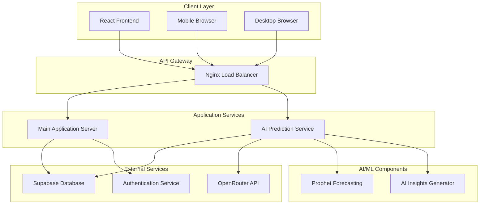
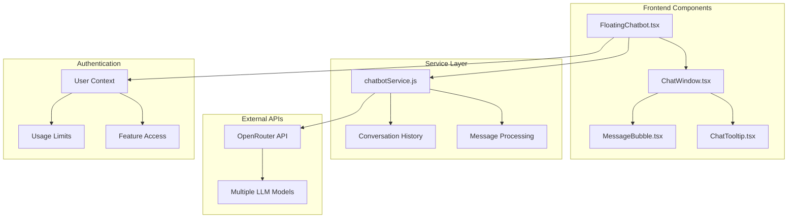

# BudgetMe Financial Management System - Comprehensive Documentation

## Table of Contents
1. [System Overview](#system-overview)
2. [Architecture Overview](#architecture-overview)
3. [Technology Stack](#technology-stack)
4. [Core Modules](#core-modules)
5. [AI System Architecture](#ai-system-architecture)
6. [Chatbot System (BudgetSense)](#chatbot-system-budgetsense)
7. [Security Implementation](#security-implementation)
8. [Database Design](#database-design)
9. [API Architecture](#api-architecture)
10. [Deployment Architecture](#deployment-architecture)
11. [Integration Patterns](#integration-patterns)

---

## System Overview

BudgetMe is a comprehensive personal finance management system designed to help individuals and families track expenses, create budgets, set financial goals, and gain AI-powered insights into their financial behavior. The system combines traditional financial tracking capabilities with advanced AI prediction models and an intelligent chatbot assistant.

### Key Features
- **Expense Tracking**: Real-time transaction monitoring and categorization
- **Smart Budgeting**: Dynamic budget creation and management with alerts
- **Financial Goals**: Goal setting, tracking, and contribution management
- **Family Finance Management**: Shared family financial planning and tracking
- **AI-Powered Predictions**: Facebook Prophet-based financial forecasting
- **Intelligent Chatbot**: BudgetSense AI assistant for financial guidance
- **Comprehensive Reporting**: Detailed financial analytics and insights
- **Administrative Dashboard**: Complete system management interface

### System Architecture Principles
- **Microservices Architecture**: Separate services for core application and AI predictions
- **Event-Driven Design**: Real-time updates and notifications
- **Scalable Infrastructure**: Docker-based containerization for easy scaling
- **Security-First Approach**: Row-level security and comprehensive authentication
- **User-Centric Design**: Responsive interface optimized for all devices

---

## Architecture Overview

The BudgetMe system follows a modern, distributed architecture pattern with clear separation between frontend presentation, backend services, and AI processing components.

### High-Level Architecture



### Component Interaction Patterns

1. **Frontend-Backend Communication**: RESTful APIs with real-time WebSocket connections
2. **Inter-Service Communication**: HTTP/HTTPS with JSON payload
3. **Database Interactions**: SQL with Row-Level Security (RLS)
4. **AI Service Integration**: Asynchronous processing with caching
5. **External API Integration**: OAuth 2.0 and API key authentication

---

## Technology Stack

### Frontend Technologies
- **React 18**: Modern React with hooks and functional components
- **TypeScript**: Type-safe development with enhanced IDE support
- **Tailwind CSS**: Utility-first CSS framework for responsive design
- **React Router**: Client-side routing with lazy loading
- **Context API**: State management for authentication and global state

### Backend Technologies
- **FastAPI**: High-performance Python web framework for AI services
- **Supabase**: PostgreSQL database with built-in authentication
- **Python**: AI/ML processing with Prophet and data analysis
- **Node.js**: JavaScript runtime for build processes

### AI/ML Technologies
- **Facebook Prophet**: Time-series forecasting for financial predictions
- **OpenRouter API**: Access to multiple LLM models for AI insights
- **Pandas**: Data manipulation and analysis
- **NumPy**: Numerical computing for statistical analysis

### Infrastructure Technologies
- **Docker**: Containerization for consistent deployment
- **Nginx**: Reverse proxy and load balancing
- **PostgreSQL**: Relational database with advanced features
- **Git**: Version control with collaborative development

---

## Core Modules

### 1. Authentication Module
**Location**: `src/components/auth/`

The authentication system provides secure user management with email verification, session handling, and role-based access control.

**Key Components**:
- Email verification system with automatic retry mechanisms
- Supabase Auth integration with custom policies
- Role-based access control (User/Admin)
- Session management with automatic refresh
- Protected route guards

**Features**:
- Multi-factor authentication support
- Password strength validation
- Account recovery mechanisms
- Audit trail for security events

### 2. Budget Management Module
**Location**: `src/components/budget/`

Comprehensive budgeting system that allows users to create, monitor, and manage multiple budgets with intelligent categorization and spending alerts.

**Key Components**:
- Budget creation and editing interfaces
- Category-based budget allocation
- Real-time spending tracking
- Budget vs. actual comparison
- Automated alerts and notifications

**Features**:
- Flexible budget periods (monthly, quarterly, yearly)
- Budget templates for common scenarios
- Rollover budget handling
- Integration with transaction categorization

### 3. Transaction Module
**Location**: `src/components/transactions/`

Central transaction management system that handles all financial transactions with automated categorization and detailed tracking.

**Key Components**:
- Transaction entry and editing forms
- Automated categorization engine
- Transaction search and filtering
- Bulk transaction operations
- Transaction validation and verification

**Features**:
- Multi-currency support
- Recurring transaction handling
- Transaction splitting capabilities
- Import/export functionality
- Duplicate detection and prevention

### 4. Goal Management Module
**Location**: `src/components/goals/`

Financial goal setting and tracking system that helps users plan and achieve their financial objectives.

**Key Components**:
- Goal creation and configuration
- Progress tracking and visualization
- Contribution management
- Goal templates and recommendations
- Achievement notifications

**Features**:
- SMART goal framework integration
- Automatic progress calculations
- Goal sharing within families
- Milestone tracking
- Predictive completion estimates

### 5. Family Management Module
**Location**: `src/components/family/`

Collaborative family finance management with shared budgets, goals, and transaction visibility.

**Key Components**:
- Family group creation and management
- Member invitation and role assignment
- Shared budget and goal management
- Permission-based access control
- Family financial dashboard

**Features**:
- Hierarchical permission system
- Family-wide financial reporting
- Individual vs. shared tracking
- Communication tools for financial planning

### 6. Reporting and Analysis Module
**Location**: `src/components/reports/`

Comprehensive financial reporting with interactive charts, trend analysis, and exportable reports.

**Key Components**:
- Interactive dashboard with customizable widgets
- Trend analysis and pattern recognition
- Comparative reporting across time periods
- Export functionality (PDF, CSV, Excel)
- Automated report scheduling

**Features**:
- Real-time data visualization
- Customizable reporting periods
- Drill-down capabilities
- Mobile-optimized charts
- Integration with AI insights

---

## AI System Architecture

The AI system in BudgetMe consists of two primary components: the Prophet-based prediction engine and the AI insights service powered by large language models.

### Prophet Prediction Engine

**Location**: `prediction_api/models/prophet_forecaster.py`

The Prophet forecasting engine provides sophisticated time-series analysis and prediction capabilities for financial data.

#### Core Functionality

**Data Preprocessing Pipeline**:
1. **Transaction Aggregation**: Raw transactions are aggregated by date and category
2. **Data Validation**: Ensures minimum data requirements (7+ transactions)
3. **Outlier Detection**: Statistical outlier removal to improve model accuracy
4. **Seasonality Analysis**: Automatic detection of weekly, monthly, and yearly patterns
5. **Trend Decomposition**: Separation of trend, seasonal, and irregular components

**Model Configuration**:
```python
# Prophet model configuration for financial forecasting
prophet_config = {
    'yearly_seasonality': True,    # Capture annual spending patterns
    'weekly_seasonality': True,    # Weekend vs weekday spending
    'daily_seasonality': False,    # Not relevant for aggregated data
    'changepoint_prior_scale': 0.05,  # Conservative trend changes
    'seasonality_prior_scale': 10.0,  # Strong seasonal patterns
    'holidays_prior_scale': 10.0,     # Holiday spending effects
    'mcmc_samples': 0,                # Faster inference
    'uncertainty_samples': 1000       # Prediction intervals
}
```

**Prediction Generation Process**:
1. **Model Training**: Prophet model trained on historical transaction data
2. **Forecast Generation**: Predictions generated for specified timeframe (30-365 days)
3. **Confidence Intervals**: Upper and lower bounds calculated with 80% confidence
4. **Category Forecasting**: Individual predictions for each spending category
5. **Accuracy Metrics**: Model performance evaluated using MAPE, MAE, and RMSE

#### Advanced Features

**Seasonality Modeling**:
- Automatic detection of spending patterns (paydays, holidays, seasonal events)
- Custom seasonality for user-specific patterns
- Integration of external factors (holidays, economic indicators)

**Model Validation**:
- Cross-validation with multiple time splits
- Accuracy metrics calculation and tracking
- Model performance degradation detection
- Automatic retraining triggers

### AI Insights Service

**Location**: `prediction_api/services/ai_insights_service.py`

The AI insights service leverages large language models through the OpenRouter API to provide intelligent financial analysis and recommendations.

#### Core Functionality

**Insight Generation Pipeline**:
1. **Context Building**: Aggregation of user financial data and model results
2. **Parallel Processing**: Five insight types generated concurrently
3. **Prompt Engineering**: Specialized prompts for each insight category
4. **Response Processing**: JSON parsing and validation of AI responses
5. **Fallback Mechanisms**: Local generation when API is unavailable

**Insight Categories**:

1. **Trend Insights**: Analysis of spending trends and patterns
   - Identification of increasing/decreasing spending categories
   - Seasonal pattern recognition
   - Long-term financial trajectory analysis

2. **Category Insights**: Deep dive into category-specific spending
   - Category performance compared to predictions
   - Spending concentration analysis
   - Category-specific recommendations

3. **Risk Insights**: Financial risk assessment and warnings
   - Overspending risk identification
   - Budget violation predictions
   - Cash flow risk analysis

4. **Opportunity Insights**: Savings and optimization opportunities
   - Cost reduction recommendations
   - Investment opportunity identification
   - Efficiency improvement suggestions

5. **Goal Insights**: Goal-related analysis and recommendations
   - Goal achievability assessment
   - Timeline adjustment suggestions
   - Strategy optimization recommendations

#### Technical Implementation

**OpenRouter Integration**:
```python
# API configuration for AI insights
openrouter_config = {
    'model': 'openai/gpt-oss-20b:free',  # Configurable model selection
    'max_tokens': 500,                # Sufficient for detailed insights
    'temperature': 0.7,               # Balanced creativity and consistency
    'timeout': 30,                    # Request timeout handling
    'retry_attempts': 3               # Automatic retry on failures
}
```

**Parallel Processing Architecture**:
- Asynchronous insight generation for improved performance
- Individual timeout handling for each insight type
- Error isolation to prevent cascade failures
- Caching mechanisms for repeated requests

**Quality Assurance**:
- Response validation and formatting
- Content appropriateness filtering
- Accuracy verification through statistical analysis
- User feedback integration for continuous improvement

### Performance Optimization

**Caching Strategy**:
- **Frontend Caching**: localStorage with expiration timestamps
- **API Caching**: In-memory caching of recent predictions
- **Database Caching**: Materialized views for frequent queries
- **Model Caching**: Trained model persistence to avoid retraining

**Asynchronous Processing**:
- Non-blocking API calls for improved user experience
- Background processing for computationally intensive operations
- Progressive loading with partial results display
- Timeout mechanisms to prevent hanging operations

---

## Chatbot System (BudgetSense)

**Location**: `src/components/chatbot/`

BudgetSense is an intelligent financial assistant chatbot that provides personalized financial advice, answers questions, and guides users through the application features.

### Architecture Overview

The chatbot system consists of several interconnected components that work together to provide a seamless conversational experience.



### Core Components

#### 1. FloatingChatbot Component
**File**: `src/components/chatbot/FloatingChatbot.tsx`

The main chatbot interface that provides an always-accessible chat experience.

**Key Features**:
- Floating action button for easy access
- Minimize/maximize functionality
- Authentication-aware features
- Usage tracking for unauthenticated users
- Tooltip system for user engagement

**State Management**:
```typescript
interface ChatbotState {
  isOpen: boolean;           // Chat window visibility
  isMinimized: boolean;      // Minimization state
  isClosing: boolean;        // Animation state
  messages: ChatMessage[];   // Conversation history
  isLoading: boolean;        // API request state
  messageCount: number;      // Usage tracking
  showLoginPrompt: boolean;  // Authentication prompts
}
```

**Authentication Integration**:
- **Authenticated Users**: Unlimited access to all features
- **Unauthenticated Users**: 3 message limit with login prompts
- **Usage Persistence**: Message count stored in localStorage
- **Feature Gating**: Premium features require authentication

#### 2. ChatWindow Component
**File**: `src/components/chatbot/ChatWindow.tsx`

The main conversation interface with message display and input handling.

**Features**:
- Message history display with timestamps
- Input field with send button
- Suggestion chips for common questions
- Model selection for authenticated users
- Clear conversation functionality
- Responsive design for all screen sizes

**Message Types**:
- User messages with timestamp display
- Assistant responses with model identification
- System messages for notifications
- Error messages with retry options
- Special messages with action buttons

#### 3. MessageBubble Component
**File**: `src/components/MessageBubble.tsx`

Individual message display component with rich content support.

**Content Support**:
- Plain text messages
- Code blocks with syntax highlighting
- Tables with financial data
- Markdown formatting
- Action buttons (sign-in, retry, etc.)
- Timestamp and model information

### Service Layer Architecture

#### ChatBot Service
**File**: `src/utils/chatbotService.js`

The core service that handles all chatbot functionality and API interactions.

**Class Structure**:
```javascript
class ChatbotService {
  constructor() {
    this.apiKey = process.env.REACT_APP_OPENROUTER_API_KEY;
    this.apiUrl = 'https://openrouter.ai/api/v1/chat/completions';
    this.model = 'openai/gpt-oss-20b:free';  // Default free model
    this.conversationHistory = [];
    this.maxHistoryLength = 10;  // Prevent context overflow
  }
}
```

**Core Methods**:

1. **Message Sending**:
   ```javascript
   async sendMessage(userMessage) {
     // Add user message to history
     // Prepare API request with context
     // Send to OpenRouter API
     // Process response and update history
     // Return formatted response
   }
   ```

2. **Model Management**:
   ```javascript
   setModel(modelId) {
     // Validate model availability
     // Update current model
     // Clear history if needed
   }
   
   getAvailableModels() {
     // Return list of available models
     // Filter based on user authentication
   }
   ```

3. **Conversation Management**:
   ```javascript
   clearHistory() {
     // Preserve system prompt
     // Clear user/assistant messages
     // Reset conversation state
   }
   ```

### AI Integration

#### OpenRouter API Integration

The chatbot leverages the OpenRouter API to access multiple large language models, providing flexibility and redundancy.

**API Configuration**:
```javascript
const apiConfig = {
  model: 'openai/gpt-oss-20b:free',  // Default model
  messages: conversationHistory,      // Full context
  max_tokens: 500,                   // Response length limit
  temperature: 0.7,                  // Balanced creativity
  top_p: 1,                         // Token selection strategy
  frequency_penalty: 0,             // Repetition control
  presence_penalty: 0               // Topic diversity
};
```

**Available Models**:
- **Free Models**: `openai/gpt-oss-20b:free` (default for unauthenticated)
- **Premium Models**: Various GPT and Claude models for authenticated users
- **Specialized Models**: Financial-focused models for advanced insights

#### System Prompt Engineering

The chatbot uses a carefully crafted system prompt to ensure appropriate and helpful responses:

```javascript
const SYSTEM_PROMPT = `You are BudgetSense, a friendly and knowledgeable personal finance assistant for BudgetMe, a comprehensive financial management application.

Your primary goals are to:
1. Help users understand personal finance concepts
2. Guide users through BudgetMe features
3. Provide actionable financial advice
4. Answer questions about budgeting, saving, and financial planning

Guidelines:
- Be conversational but professional
- Provide specific, actionable advice
- Reference BudgetMe features when appropriate
- Keep responses concise but informative
- Ask clarifying questions when needed
- Always prioritize financial responsibility

Remember: You are specifically designed to help with personal finance management within the BudgetMe ecosystem.`;
```

### Security and Privacy

#### Data Protection
- **No Data Persistence**: Conversations are not stored on servers
- **Local Storage Only**: Message history kept in browser localStorage
- **API Key Security**: Environment variable protection
- **User Context Isolation**: No cross-user data sharing

#### Usage Controls
- **Rate Limiting**: Message limits for unauthenticated users
- **Content Filtering**: Inappropriate content detection
- **Error Handling**: Graceful failure management
- **Timeout Protection**: Request timeout handling

### User Experience Features

#### Accessibility
- **Keyboard Navigation**: Full keyboard support
- **Screen Reader Support**: ARIA labels and descriptions
- **High Contrast Mode**: Visual accessibility features
- **Responsive Design**: Mobile-optimized interface

#### Engagement Features
- **Auto-suggestions**: Common question suggestions
- **Tooltip System**: Periodic engagement prompts
- **Animation Effects**: Smooth transitions and hover effects
- **Quick Actions**: Pre-defined action buttons

---

## Security Implementation

### Authentication Security
- **Supabase Auth**: Industry-standard authentication with JWT tokens
- **Row-Level Security**: Database-level access control
- **Session Management**: Automatic token refresh and expiration
- **Multi-Factor Authentication**: Optional 2FA for enhanced security

### Data Protection
- **Encryption**: Data encrypted in transit and at rest
- **SQL Injection Prevention**: Parameterized queries and ORM protection
- **XSS Prevention**: Content sanitization and CSP headers
- **CSRF Protection**: CSRF tokens and same-site cookies

### API Security
- **Rate Limiting**: Request throttling to prevent abuse
- **API Key Management**: Secure storage and rotation
- **Input Validation**: Comprehensive input sanitization
- **Error Handling**: Secure error messages without information leakage

---

## Database Design

### Core Tables
- **Users**: User profiles and authentication data
- **Transactions**: Financial transaction records
- **Budgets**: Budget definitions and allocations
- **Goals**: Financial goal tracking
- **Families**: Family group management
- **Predictions**: AI prediction results cache

### Relationships
- **User-centric design**: All data linked to user accounts
- **Family hierarchies**: Shared data with permission controls
- **Audit trails**: Complete change tracking for accountability
- **Data integrity**: Foreign key constraints and validation

---

## API Architecture

### RESTful Design
- **Resource-based URLs**: Clear, predictable endpoint structure
- **HTTP Methods**: Proper use of GET, POST, PUT, DELETE
- **Status Codes**: Appropriate HTTP response codes
- **Content Negotiation**: JSON API with optional formats

### Error Handling
- **Consistent Error Format**: Standardized error response structure
- **Error Codes**: Application-specific error identification
- **Logging**: Comprehensive error logging and monitoring
- **User-Friendly Messages**: Clear error communication

---

## Deployment Architecture

### Containerization
- **Docker Compose**: Multi-service orchestration
- **Service Isolation**: Independent scaling and deployment
- **Health Checks**: Automated service monitoring
- **Volume Management**: Persistent data storage

### Load Balancing
- **Nginx**: Reverse proxy and load balancing
- **SSL Termination**: HTTPS encryption handling
- **Static File Serving**: Optimized asset delivery
- **Caching**: Response caching for improved performance

---

## Integration Patterns

### External Services
- **Supabase**: Database and authentication provider
- **OpenRouter**: AI/ML model access
- **Email Services**: Automated email notifications
- **Payment Gateways**: Future payment processing integration

### Internal Communication
- **Service Discovery**: Automatic service location
- **Circuit Breakers**: Failure isolation and recovery
- **Retry Logic**: Automatic retry with exponential backoff
- **Monitoring**: Comprehensive service health monitoring

---

## Conclusion

BudgetMe represents a modern, comprehensive approach to personal finance management, combining traditional financial tracking with cutting-edge AI capabilities. The system's modular architecture ensures scalability, maintainability, and extensibility while providing users with powerful tools for financial planning and analysis.

The integration of AI-powered predictions and an intelligent chatbot assistant sets BudgetMe apart from traditional finance applications, providing users with proactive insights and guidance to improve their financial health and achieve their goals.