# Entity Relationship Diagram: BudgetMe Financial Management System

## Overview

The BudgetMe Financial Management System is a comprehensive personal and family finance application built on **Supabase (PostgreSQL)**. This Entity Relationship Diagram (ERD) provides a complete visualization of the database architecture, illustrating how data entities interconnect to support budgeting, transaction tracking, goal management, AI-powered predictions, and collaborative family finance features.

### System Architecture Highlights

- **Multi-tenant Design**: Each user has isolated access to their financial data with optional family sharing capabilities
- **Role-Based Access Control**: Hierarchical permission system supporting users, moderators, admins, and super admins
- **AI Integration**: Dedicated tables for storing AI-generated predictions, insights, and chat interactions
- **Real-time Capabilities**: Designed for Supabase real-time subscriptions for live updates
- **Audit Trail**: Comprehensive logging of user activities and administrative actions

## Database Statistics

| Schema | Tables | Description |
|--------|--------|-------------|
| `auth` | 10+ | Supabase-managed authentication infrastructure including users, sessions, refresh tokens, MFA factors, and identity providers |
| `public` | 35+ | Application-specific tables covering financial data, budgets, goals, family management, AI predictions, chatbot conversations, and administrative functions |

### Key Metrics
- **Total Tables**: 45+ across both schemas
- **Foreign Key Relationships**: 50+ constraints ensuring referential integrity
- **Row-Level Security (RLS)**: Enabled on all public tables for data isolation
- **Indexes**: Optimized for common query patterns including user lookups, date ranges, and category filtering

## Complete ERD Diagram

```mermaid
graph TB
    subgraph AUTH["🔐 Authentication & User Management"]
        auth_users[("auth_users<br/>─────────<br/>id UUID PK<br/>email VARCHAR UK<br/>encrypted_password<br/>is_super_admin")]
        profiles[("profiles<br/>─────────<br/>id UUID PK/FK<br/>full_name<br/>avatar_url<br/>currency<br/>timezone")]
        user_roles[("user_roles<br/>─────────<br/>id UUID PK<br/>user_id FK<br/>role<br/>granted_by FK")]
        user_sessions[("user_sessions<br/>─────────<br/>id UUID PK<br/>user_id FK<br/>session_token<br/>device_info")]
        verification_tokens[("verification_tokens<br/>─────────<br/>id UUID PK<br/>user_id FK<br/>token_type<br/>token_hash")]
        user_settings[("user_settings<br/>─────────<br/>id UUID PK<br/>user_id FK UK<br/>preferences JSONB")]
    end
    
    subgraph FINANCE["💰 Financial Accounts & Transactions"]
        accounts[("accounts<br/>─────────<br/>id UUID PK<br/>user_id FK<br/>account_type<br/>balance NUMERIC")]
        income_categories[("income_categories<br/>─────────<br/>id UUID PK<br/>user_id FK<br/>name<br/>icon, color")]
        expense_categories[("expense_categories<br/>─────────<br/>id UUID PK<br/>user_id FK<br/>name<br/>icon, color")]
        transactions[("transactions<br/>─────────<br/>id UUID PK<br/>user_id FK<br/>account_id FK<br/>amount, type<br/>goal_id FK")]
    end
    
    subgraph BUDGET["📊 Budget Management"]
        budgets[("budgets<br/>─────────<br/>id UUID PK<br/>user_id FK<br/>category_id FK<br/>amount, spent<br/>period")]
        budget_alerts[("budget_alerts<br/>─────────<br/>id UUID PK<br/>budget_id FK<br/>threshold_%<br/>is_triggered")]
    end
    
    subgraph GOALS["🎯 Goals Management"]
        goals[("goals<br/>─────────<br/>id UUID PK<br/>user_id FK<br/>target_amount<br/>current_amount<br/>family_id FK")]
        goal_contributions[("goal_contributions<br/>─────────<br/>id UUID PK<br/>goal_id FK<br/>user_id FK<br/>transaction_id FK")]
    end
    
    subgraph FAMILY["👨‍👩‍👧‍👦 Family Management"]
        families[("families<br/>─────────<br/>id UUID PK<br/>name<br/>invite_code UK<br/>created_by FK")]
        family_members[("family_members<br/>─────────<br/>id UUID PK<br/>family_id FK<br/>user_id FK<br/>role, permissions")]
        family_invitations[("family_invitations<br/>─────────<br/>id UUID PK<br/>family_id FK<br/>email<br/>invite_code")]
        family_join_requests[("family_join_requests<br/>─────────<br/>id UUID PK<br/>family_id FK<br/>user_id FK<br/>status")]
    end
    
    subgraph CHAT["💬 Chatbot & Conversations"]
        chat_sessions[("chat_sessions<br/>─────────<br/>id UUID PK<br/>user_id FK<br/>session_type<br/>message_count")]
        chat_messages[("chat_messages<br/>─────────<br/>id UUID PK<br/>session_id FK<br/>role<br/>content<br/>model_used")]
        user_chat_preferences[("user_chat_preferences<br/>─────────<br/>id UUID PK<br/>user_id FK UK<br/>preferred_model")]
    end
    
    subgraph AI["🤖 AI Predictions & Insights"]
        prediction_requests[("prediction_requests<br/>─────────<br/>id UUID PK<br/>user_id FK<br/>request_type<br/>status, result")]
        prophet_predictions[("prophet_predictions<br/>─────────<br/>id UUID PK<br/>user_id FK<br/>predictions JSONB<br/>accuracy_score")]
        ai_insights[("ai_insights<br/>─────────<br/>id UUID PK<br/>user_id FK<br/>prediction_id FK<br/>insights JSONB")]
        prediction_usage_limits[("prediction_usage_limits<br/>─────────<br/>id UUID PK<br/>user_id FK UK<br/>monthly_limit<br/>current_usage")]
        ai_reports[("ai_reports<br/>─────────<br/>id UUID PK<br/>user_id FK<br/>report_type<br/>insights JSONB")]
    end
    
    subgraph DASHBOARD["📈 Dashboard & Widgets"]
        dashboard_layouts[("dashboard_layouts<br/>─────────<br/>id UUID PK<br/>user_id FK<br/>layout_config JSONB")]
        dashboard_insights[("dashboard_insights<br/>─────────<br/>id UUID PK<br/>user_id FK<br/>insight_type<br/>priority")]
        user_widget_instances[("user_widget_instances<br/>─────────<br/>id UUID PK<br/>user_id FK<br/>widget_type<br/>position")]
        widget_data_cache[("widget_data_cache<br/>─────────<br/>id UUID PK<br/>user_id FK<br/>cached_data JSONB")]
        user_preferences_cache[("user_preferences_cache<br/>─────────<br/>id UUID PK<br/>user_id FK UK<br/>preferences JSONB")]
    end
    
    subgraph ADMIN["⚙️ Admin & System Management"]
        admin_settings[("admin_settings<br/>─────────<br/>id UUID PK<br/>setting_key UK<br/>setting_value JSONB")]
        admin_notifications[("admin_notifications<br/>─────────<br/>id UUID PK<br/>title, message<br/>priority<br/>target_audience")]
        admin_anomalies[("admin_anomalies<br/>─────────<br/>id UUID PK<br/>user_id FK<br/>anomaly_type<br/>severity")]
        admin_actions[("admin_actions<br/>─────────<br/>id UUID PK<br/>admin_id FK<br/>action_type<br/>previous/new_values")]
        system_activity_log[("system_activity_log<br/>─────────<br/>id UUID PK<br/>user_id FK<br/>activity_type<br/>module")]
        feature_flags[("feature_flags<br/>─────────<br/>id UUID PK<br/>flag_name UK<br/>is_enabled<br/>rollout_%")]
        backup_logs[("backup_logs<br/>─────────<br/>id UUID PK<br/>backup_type<br/>status<br/>backup_size")]
    end
    
    %% ==========================================
    %% USER CORE RELATIONSHIPS
    %% ==========================================
    auth_users -->|"1:1"| profiles
    auth_users -->|"1:N"| user_roles
    auth_users -->|"1:N"| user_sessions
    auth_users -->|"1:N"| verification_tokens
    auth_users -->|"1:1"| user_settings
    
    %% ==========================================
    %% FINANCIAL DATA RELATIONSHIPS
    %% ==========================================
    auth_users -->|"1:N owns"| accounts
    auth_users -->|"1:N creates"| income_categories
    auth_users -->|"1:N creates"| expense_categories
    auth_users -->|"1:N creates"| transactions
    accounts -->|"1:N contains"| transactions
    income_categories -.->|"categorizes"| transactions
    expense_categories -.->|"categorizes"| transactions
    
    %% ==========================================
    %% BUDGET RELATIONSHIPS
    %% ==========================================
    auth_users -->|"1:N creates"| budgets
    auth_users -->|"1:N receives"| budget_alerts
    budgets -->|"1:N triggers"| budget_alerts
    expense_categories -.->|"tracks"| budgets
    
    %% ==========================================
    %% GOALS RELATIONSHIPS
    %% ==========================================
    auth_users -->|"1:N creates"| goals
    auth_users -->|"1:N makes"| goal_contributions
    goals -->|"1:N receives"| goal_contributions
    goals -.->|"linked_to"| transactions
    transactions -.->|"funds"| goal_contributions
    accounts -.->|"funds"| goals
    
    %% ==========================================
    %% FAMILY RELATIONSHIPS
    %% ==========================================
    auth_users -->|"1:N creates"| families
    auth_users -->|"1:N joins"| family_members
    auth_users -->|"1:N sends"| family_invitations
    auth_users -->|"1:N submits"| family_join_requests
    families -->|"1:N has"| family_members
    families -->|"1:N generates"| family_invitations
    families -->|"1:N receives"| family_join_requests
    families -.->|"shares"| transactions
    families -.->|"shares"| budgets
    families -.->|"shares"| goals
    
    %% ==========================================
    %% CHAT RELATIONSHIPS
    %% ==========================================
    auth_users -->|"1:N starts"| chat_sessions
    auth_users -->|"1:N sends"| chat_messages
    auth_users -->|"1:1"| user_chat_preferences
    chat_sessions -->|"1:N contains"| chat_messages
    
    %% ==========================================
    %% AI/PREDICTION RELATIONSHIPS
    %% ==========================================
    auth_users -->|"1:N submits"| prediction_requests
    auth_users -->|"1:N receives"| prophet_predictions
    auth_users -->|"1:N receives"| ai_insights
    auth_users -->|"1:1"| prediction_usage_limits
    auth_users -->|"1:N generates"| ai_reports
    prophet_predictions -->|"1:N generates"| ai_insights
    
    %% ==========================================
    %% DASHBOARD RELATIONSHIPS
    %% ==========================================
    auth_users -->|"1:N creates"| dashboard_layouts
    auth_users -->|"1:N views"| dashboard_insights
    auth_users -->|"1:N configures"| user_widget_instances
    auth_users -->|"1:N caches"| widget_data_cache
    auth_users -->|"1:1"| user_preferences_cache
    
    %% ==========================================
    %% ADMIN RELATIONSHIPS
    %% ==========================================
    auth_users -->|"1:N manages"| admin_settings
    auth_users -->|"1:N creates"| admin_notifications
    auth_users -->|"1:N investigates"| admin_anomalies
    auth_users -->|"1:N performs"| admin_actions
    auth_users -->|"1:N generates"| system_activity_log
    auth_users -->|"1:N manages"| feature_flags
    auth_users -->|"1:N initiates"| backup_logs
    
    %% ==========================================
    %% STYLING
    %% ==========================================
    style AUTH fill:#e8eaf6,stroke:#3f51b5,stroke-width:2px
    style FINANCE fill:#fff3e0,stroke:#ff9800,stroke-width:2px
    style BUDGET fill:#e0f2f1,stroke:#009688,stroke-width:2px
    style GOALS fill:#f3e5f5,stroke:#9c27b0,stroke-width:2px
    style FAMILY fill:#e1f5fe,stroke:#03a9f4,stroke-width:2px
    style CHAT fill:#fff8e1,stroke:#ffc107,stroke-width:2px
    style AI fill:#fce4ec,stroke:#e91e63,stroke-width:2px
    style DASHBOARD fill:#f1f8e9,stroke:#8bc34a,stroke-width:2px
    style ADMIN fill:#efebe9,stroke:#795548,stroke-width:2px
    
    style auth_users fill:#c5cae9,stroke:#3f51b5,stroke-width:3px
```

## Table Summary by Module

### Authentication Module (7 tables)
Manages user identity, authentication, authorization, and session lifecycle.

| Table | Rows | Description |
|-------|------|-------------|
| `auth.users` | 58 | Core Supabase authentication table storing user credentials, email confirmation status, login timestamps, and SSO identifiers |
| `profiles` | 58 | Extended user profile information including full name, avatar, preferred currency, timezone, and custom preferences as JSONB |
| `user_roles` | - | Role-based access control assignments linking users to roles (user, moderator, admin, super_admin) with expiration support |
| `user_sessions` | - | Active user session tracking with device information, IP addresses, and session expiration management |
| `verification_tokens` | - | Email verification and password reset token storage with expiration and usage tracking |
| `user_settings` | - | User-specific application preferences including notification settings, privacy controls, and display customizations |
| `auth.refresh_tokens` | 65 | JWT refresh token storage for maintaining persistent authentication across sessions |

### Financial Module (4 tables)
Core financial data storage for all monetary transactions and account management.

| Table | Rows | Description |
|-------|------|-------------|
| `accounts` | - | User financial accounts (checking, savings, credit, cash, investment) with balances, currencies, and institution details |
| `transactions` | - | Complete transaction ledger with amounts, dates, descriptions, categorization, recurring flags, and goal/family associations |
| `income_categories` | - | User-defined and system-provided income categorization with icons, colors, and sort ordering |
| `expense_categories` | - | User-defined and system-provided expense categorization enabling detailed spending analysis and budget tracking |

### Budget Module (2 tables)
Budget creation, monitoring, and alert management for spending control.

| Table | Rows | Description |
|-------|------|-------------|
| `budgets` | - | Budget definitions with category allocation, period settings (weekly/monthly/quarterly/yearly), spending limits, and family sharing support |
| `budget_alerts` | - | Threshold-based alert configurations (50%, 75%, 90%, 100%) with trigger timestamps and notification status tracking |

### Goals Module (2 tables)
Financial goal tracking and contribution management for savings objectives.

| Table | Rows | Description |
|-------|------|-------------|
| `goals` | - | Financial goals with target amounts, deadlines, priority levels, status tracking, linked accounts, and family sharing capabilities |
| `goal_contributions` | - | Individual contributions to goals linked to transactions, with amounts, notes, and contributor tracking for family goals |

### Family Module (4 tables)
Collaborative family finance management with invitation and permission workflows.

| Table | Rows | Description |
|-------|------|-------------|
| `families` | - | Family group definitions with names, descriptions, unique invite codes, member limits, and JSONB settings |
| `family_members` | - | Family membership records with roles (owner/admin/member), permission JSONB, status, and invitation tracking |
| `family_invitations` | - | Pending email invitations with unique codes, expiration dates, and delivery status tracking |
| `family_join_requests` | - | User-initiated join requests with status workflow (pending/approved/rejected) and admin review tracking |

### AI & Predictions Module (5 tables)
Machine learning predictions and AI-generated financial insights storage.

| Table | Rows | Description |
|-------|------|-------------|
| `prediction_requests` | - | User prediction requests with parameters, status tracking, processing time metrics, and error handling |
| `prophet_predictions` | - | Facebook Prophet model outputs with forecasted values, confidence intervals, accuracy scores, and expiration for cache management |
| `ai_insights` | - | AI-generated financial insights linked to predictions with risk assessments, opportunity identification, and personalized recommendations |
| `ai_reports` | 26 | Cached AI-generated report insights with report type classification, timeframe, token usage, and access counting |
| `prediction_usage_limits` | - | Per-user usage tracking with monthly limits, current usage counters, and subscription tier enforcement |

### Chatbot Module (3 tables)
BudgetSense AI assistant conversation storage and preference management.

| Table | Rows | Description |
|-------|------|-------------|
| `chat_sessions` | - | Conversation sessions with type classification, status (active/ended/expired), message counts, and context JSONB |
| `chat_messages` | - | Individual messages with role (user/assistant/system), content, model used, token counts, and metadata |
| `user_chat_preferences` | - | User chat customization including preferred AI model, financial context inclusion toggle, and custom instruction prompts |

### Dashboard Module (5 tables)
Dashboard customization, widget management, and data caching for performance.

| Table | Rows | Description |
|-------|------|-------------|
| `dashboard_layouts` | - | User dashboard configurations with layout JSONB, default status, and naming |
| `dashboard_insights` | - | Generated dashboard insights with type classification, priority, dismissal tracking, and validity periods |
| `user_widget_instances` | - | Individual widget placements with position coordinates, dimensions, visibility toggles, and configuration JSONB |
| `widget_data_cache` | - | Cached widget data for performance optimization with expiration-based invalidation |
| `user_preferences_cache` | - | Aggregated user preference cache for quick access during dashboard rendering |

### Admin Module (7 tables)
System administration, monitoring, security, and operational management.

| Table | Rows | Description |
|-------|------|-------------|
| `admin_settings` | - | System-wide configuration with key-value storage, categorization, and access control flags |
| `admin_notifications` | - | Administrative announcements with priority levels, target audience, and read/dismiss tracking |
| `admin_anomalies` | - | Detected financial and system anomalies with severity classification, investigation status, and admin assignment |
| `admin_actions` | - | Complete audit trail of administrative actions with before/after values, timestamps, and success tracking |
| `system_activity_log` | - | Comprehensive system activity logging with user attribution, IP addresses, severity levels, and metadata |
| `feature_flags` | - | Feature toggle management with percentage-based rollout support and conditional activation rules |
| `backup_logs` | - | Database backup operation tracking with type, status, file sizes, locations, and integrity checksums |

## Key Relationships Summary

Understanding entity relationships is crucial for maintaining data integrity and designing efficient queries. Below is a comprehensive breakdown of how tables interconnect within the BudgetMe system.

### One-to-One Relationships
These relationships ensure each user has exactly one record in extension tables, enabling modular data organization:

| Parent | Child | Description |
|--------|-------|-------------|
| `auth.users` | `profiles` | Every authenticated user has exactly one profile containing personal information and display preferences |
| `auth.users` | `user_settings` | Each user maintains a single settings record for application customization and notification preferences |
| `auth.users` | `user_chat_preferences` | Users have one chat preference configuration for BudgetSense AI assistant customization |
| `auth.users` | `prediction_usage_limits` | Each user has a single usage tracking record for subscription limit enforcement |
| `auth.users` | `user_preferences_cache` | Performance optimization through single cached preference record per user |

### One-to-Many Relationships
These relationships represent the core data ownership patterns where users and entities create multiple child records:

| Parent | Child | Description |
|--------|-------|-------------|
| `auth.users` | `transactions` | Users record unlimited financial transactions over time, forming the core financial ledger |
| `auth.users` | `accounts` | Users manage multiple financial accounts (checking, savings, credit cards, cash) |
| `auth.users` | `budgets` | Users create multiple budgets for different spending categories and time periods |
| `auth.users` | `goals` | Users set multiple financial goals with varying targets and timelines |
| `auth.users` | `chat_sessions` | Users can have multiple conversation sessions with the AI assistant over time |
| `families` | `family_members` | Each family group contains multiple member records with role assignments |
| `goals` | `goal_contributions` | Goals receive multiple contributions from users over time, tracking progress |
| `chat_sessions` | `chat_messages` | Each chat session contains multiple messages forming a conversation thread |
| `prophet_predictions` | `ai_insights` | Prophet predictions can generate multiple AI-enhanced insights for different analysis angles |

### Many-to-Many Relationships (via junction tables)
These relationships enable complex associations between entities:

| Entity 1 | Entity 2 | Junction Table | Description |
|----------|----------|----------------|-------------|
| `auth.users` | `families` | `family_members` | Users can belong to multiple families, and families have multiple members |
| `transactions` | `goals` | `goal_contributions` | Transactions can contribute to goals, and goals receive contributions from multiple transactions |

## Foreign Key Constraints Summary

The database enforces **50+ foreign key constraints** to maintain referential integrity across all tables:

### Central Entity References
- **auth.users**: Central authentication entity referenced by 45+ tables as the primary user identifier
- **families**: Referenced by 4 tables (family_members, family_invitations, family_join_requests, shared budgets/goals)
- **goals**: Referenced by goal_contributions and transactions for contribution tracking
- **accounts**: Referenced by transactions and goals for financial account linking
- **chat_sessions**: Referenced by chat_messages for conversation threading
- **prophet_predictions**: Referenced by ai_insights for prediction-insight association

### Cascade Behaviors
- **ON DELETE CASCADE**: Applied to child records (messages, contributions) when parent is deleted
- **ON DELETE SET NULL**: Applied to optional references (assigned_admin, granted_by) preserving history
- **ON DELETE RESTRICT**: Applied to critical references preventing accidental data loss

## Data Integrity Patterns

### Row-Level Security (RLS)
All public schema tables implement RLS policies ensuring users can only access their own data or data shared with them through family memberships.

### Audit Trail
Critical operations are logged through `system_activity_log` and `admin_actions` tables, providing complete traceability of system changes.

### Soft Deletes
Financial records use soft delete patterns (status flags) rather than physical deletion, preserving historical data for reporting and compliance.
