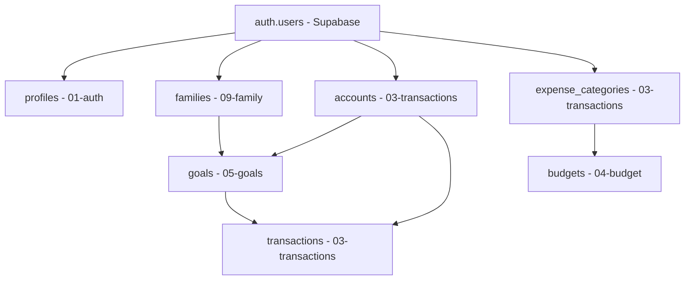

# SQL Schema Dependency Analysis

## Current Dependency Issues Identified

Based on analysis of the SQL schema files, the following dependency issues prevent sequential execution:

### Critical Dependencies Violations

| File | Table | References | Target File | Issue |
|------|-------|------------|-------------|-------|
| `03-transactions-schema.sql` | `transactions` | `public.goals(id)` | `05-goals-schema.sql` | **FORWARD REFERENCE** |
| `04-budget-schema.sql` | `budgets` | `public.expense_categories(id)` | `03-transactions-schema.sql` | OK - Correct order |
| `05-goals-schema.sql` | `goals` | `public.families(id)` | `09-family-schema.sql` | **FORWARD REFERENCE** |
| `05-goals-schema.sql` | `goals` | `public.accounts(id)` | `03-transactions-schema.sql` | OK - Correct order |

### Table Creation Dependencies Map



## Required Execution Order

Based on the dependency analysis, the correct execution order should be:

1. **01-auth-schema.sql** (Foundation - profiles table)
2. **02-shared-schema.sql** (Utility functions)
3. **09-family-schema.sql** (families table - needed by goals)
4. **03-transactions-schema.sql** (accounts, categories - needed by goals and budgets)
5. **05-goals-schema.sql** (goals table - needed by transactions FK)
6. **04-budget-schema.sql** (budgets - depends on expense_categories)
7. **06-admin-schema.sql** (admin features)
8. **07-chatbot-schema.sql** (chatbot features)
9. **08-dashboard-schema.sql** (dashboard views)
10. **10-predictions-schema.sql** (predictions)
11. **11-reports-schema.sql** (reports)
12. **12-settings-schema.sql** (user settings)

## File Renaming Strategy

To implement the correct execution order, the following files need to be renamed:

| Current File | New Position | New Name |
|--------------|--------------|----------|
| `09-family-schema.sql` | 3 | `03-family-schema.sql` |
| `03-transactions-schema.sql` | 4 | `04-transactions-schema.sql` |
| `05-goals-schema.sql` | 5 | `05-goals-schema.sql` (no change) |
| `04-budget-schema.sql` | 6 | `06-budget-schema.sql` |
| `06-admin-schema.sql` | 7 | `07-admin-schema.sql` |
| `07-chatbot-schema.sql` | 8 | `08-chatbot-schema.sql` |
| `08-dashboard-schema.sql` | 9 | `09-dashboard-schema.sql` |
| `10-predictions-schema.sql` | 10 | `10-predictions-schema.sql` (no change) |
| `11-reports-schema.sql` | 11 | `11-reports-schema.sql` (no change) |
| `12-settings-schema.sql` | 12 | `12-settings-schema.sql` (no change) |

## Specific Problems Found

### 1. transactions table references goals table
**File**: `03-transactions-schema.sql`, Line ~123
```sql
goal_id UUID REFERENCES public.goals(id) ON DELETE SET NULL,
```
**Problem**: `goals` table is created in `05-goals-schema.sql`

### 2. goals table references families table
**File**: `05-goals-schema.sql`, Line ~27
```sql
family_id UUID REFERENCES public.families(id) ON DELETE SET NULL,
```
**Problem**: `families` table is created in `09-family-schema.sql`

### 3. budgets table references expense_categories table
**File**: `04-budget-schema.sql`, Line ~29
```sql
category_id UUID REFERENCES public.expense_categories(id) ON DELETE SET NULL,
```
**Problem**: This is OK - `expense_categories` is created in `03-transactions-schema.sql`

## Solution Implementation Steps

1. **Create backup of sql-refactored directory**
2. **Rename files according to new order**
3. **Update internal references and comments**
4. **Test sequential execution**
5. **Validate all foreign key constraints**

## Validation Requirements

After reordering, the following must be verified:
- [ ] All files execute sequentially without errors
- [ ] All foreign key constraints are created successfully
- [ ] All tables, views, and functions are created
- [ ] All RLS policies are applied correctly
- [ ] No circular dependencies exist
- [ ] Performance indexes are created properly