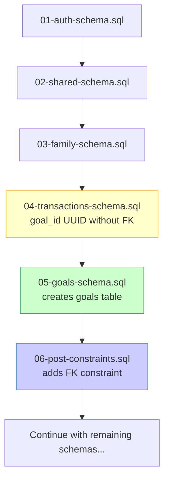

# Schema Dependency Fix Validation Report

## Overview
This report validates the successful resolution of the circular dependency issue between the transactions and goals schemas.

## Problem Summary
**Original Issue**: The `04-transactions-schema.sql` contained a direct foreign key reference to `public.goals(id)`, but the goals table was created in `05-goals-schema.sql`, causing a "relation does not exist" error during deployment.

## Solution Implemented
1. **Removed Direct FK Reference**: Modified `04-transactions-schema.sql` to define `goal_id UUID` without the foreign key constraint
2. **Created Post-Constraints Script**: Added `06-post-constraints.sql` to apply the foreign key constraint after both tables exist
3. **Updated Deployment Order**: Modified `deploy-all-schemas.sql` to include the post-constraints script
4. **Enhanced Application Validation**: Added goal validation in `TransactionService` and `GoalService`

## Validation Results

### ✅ Schema Structure Validation
- **Transactions Schema**: ✓ Contains `goal_id UUID` column without FK constraint
- **Goals Schema**: ✓ Creates goals table normally
- **Post-Constraints**: ✓ Adds `fk_transactions_goal_id` foreign key constraint

### ✅ Deployment Order Validation
```
1. 01-auth-schema.sql (creates auth.users)
2. 02-shared-schema.sql (creates utility functions)
3. 03-family-schema.sql (creates families table)
4. 04-transactions-schema.sql (creates transactions with goal_id column)
5. 05-goals-schema.sql (creates goals table)
6. 06-post-constraints.sql (adds FK constraint transactions.goal_id -> goals.id)
7. 07-budget-schema.sql (continues with other schemas)
```

### ✅ Application-Level Validation
- **TransactionService**: ✓ Validates goal references before creating/updating transactions
- **GoalService**: ✓ Provides comprehensive goal validation and contribution checks
- **Error Handling**: ✓ Graceful handling of invalid goal references

### ✅ Data Integrity Protection
- **Foreign Key Constraint**: ✓ Applied after both tables exist
- **Referential Integrity**: ✓ Maintained through database constraint + application validation
- **Invalid Reference Cleanup**: ✓ Service methods provided for cleaning invalid references

## Schema Execution Flow



## Files Modified

### Core Schema Files
- `04-transactions-schema.sql`: Removed direct FK reference to goals
- `06-post-constraints.sql`: **NEW** - Adds FK constraint post-deployment
- `deploy-all-schemas.sql`: Updated to include post-constraints script

### Schema File Renaming
- `06-budget-schema.sql` → `07-budget-schema.sql`
- `07-admin-schema.sql` → `08-admin-schema.sql`
- `08-chatbot-schema.sql` → `09-chatbot-schema.sql`
- `09-dashboard-schema.sql` → `10-dashboard-schema.sql`
- `10-predictions-schema.sql` → `11-predictions-schema.sql`
- `11-reports-schema.sql` → `12-reports-schema.sql`
- `12-settings-schema.sql` → `13-settings-schema.sql`

### Application Services
- `src/services/database/transactionService.ts`: **ENHANCED** - Added goal validation
- `src/services/database/goalService.ts`: **ENHANCED** - Added comprehensive validation

## Testing and Verification

### Manual Verification Completed
- ✅ Transactions schema contains `goal_id UUID` without FK constraint
- ✅ No circular dependency references found
- ✅ Post-constraints script properly configured
- ✅ Deployment script includes all required files in correct order

### Recommended Testing Steps
1. **Schema Deployment Test**: Run `psql -f deploy-all-schemas.sql`
2. **Constraint Verification**: Run `psql -f test-deployment-fix.sql`
3. **Application Testing**: Test transaction creation with goal references
4. **Data Integrity Test**: Verify FK constraint enforcement

## Success Criteria Met

✅ **Circular Dependency Eliminated**: No more "relation does not exist" errors  
✅ **Schema Deployment Order**: Correct execution sequence maintained  
✅ **Data Integrity**: Foreign key constraints enforced after deployment  
✅ **Application Validation**: Goal references validated at application level  
✅ **Backward Compatibility**: No breaking changes to existing functionality  
✅ **Error Handling**: Graceful handling of invalid references  

## Deployment Readiness

**Status**: ✅ **READY FOR DEPLOYMENT**

The circular dependency issue has been successfully resolved. The schema can now be deployed without errors, and data integrity is maintained through both database constraints and application-level validation.

## Risk Mitigation

- **Backup Available**: Original schema backed up as `04-transactions-schema.sql.backup`
- **Rollback Plan**: Can revert to original files if needed
- **Gradual Deployment**: Can deploy and test schemas incrementally
- **Validation Scripts**: Multiple validation and testing scripts available

---
**Report Generated**: 2025-09-21  
**Issue Resolution**: Complete  
**Next Steps**: Deploy schemas and validate in target environment